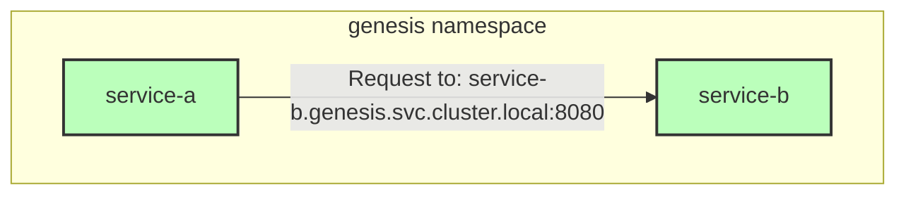
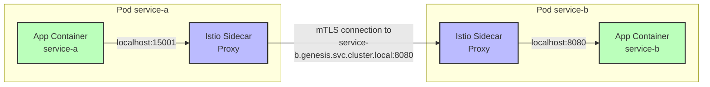
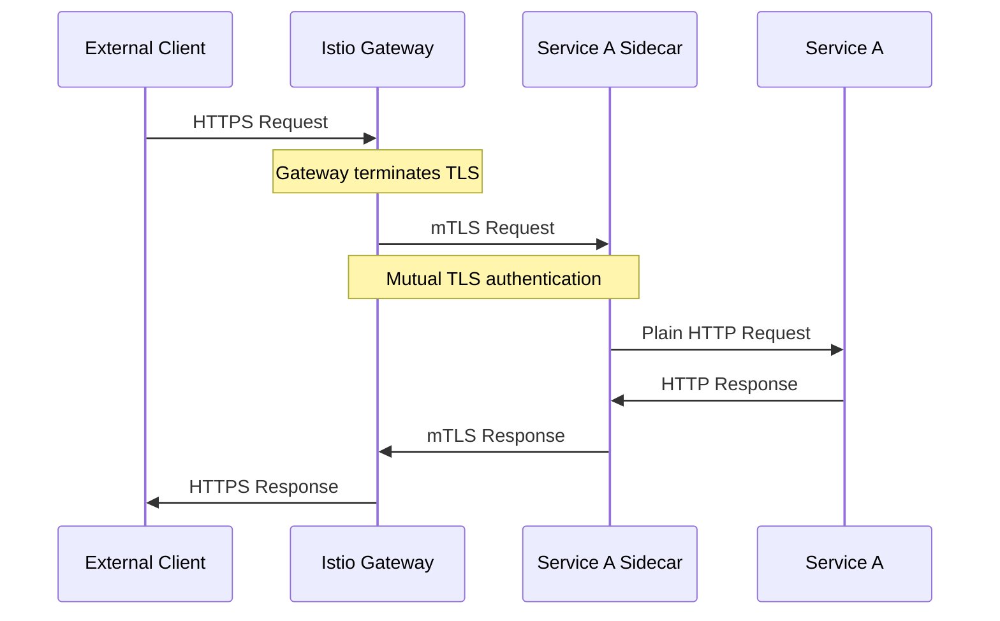
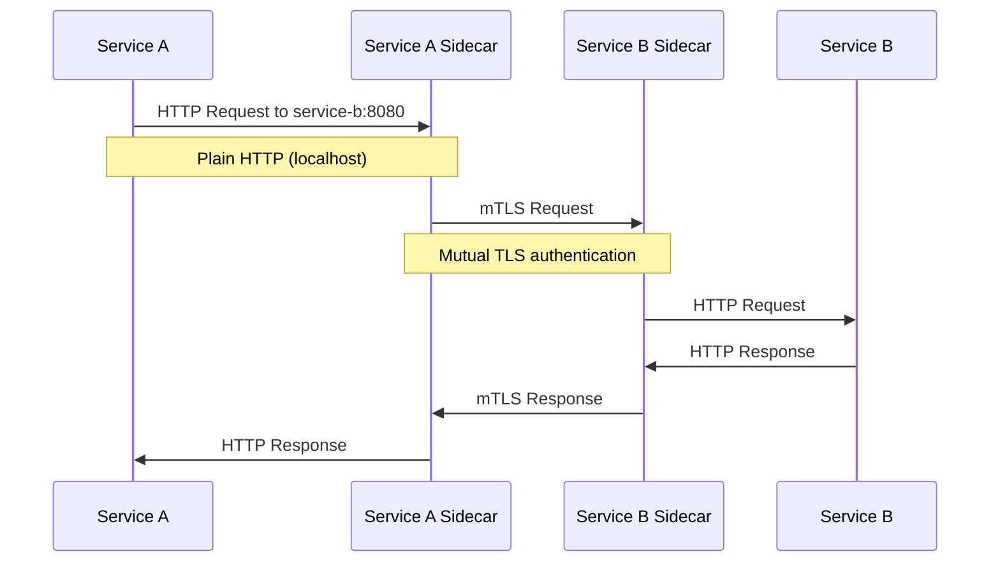
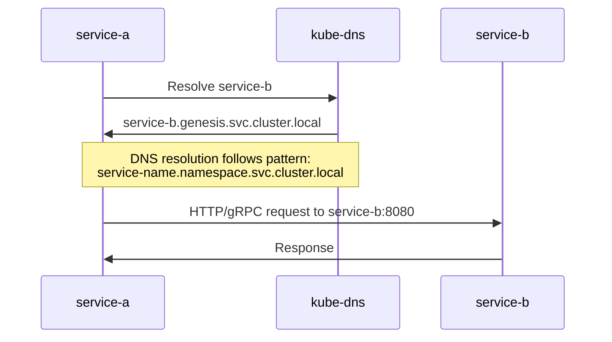

# Service Mesh Communication Patterns

This document illustrates the architecture and communication patterns between services in an Istio service mesh, using service-a and service-b in the genesis namespace as examples.

## Architecture Overview



The diagram above shows the basic DNS-based service discovery in Kubernetes, where service-a communicates with service-b using its fully qualified domain name.

## Service-to-Service Communication with Istio Sidecars



This diagram illustrates how service-to-service communication works with Istio sidecars:

1. The application in service-a makes a request to service-b using the Kubernetes DNS name
2. The request is intercepted by the Istio sidecar proxy in service-a's pod
3. The sidecar establishes an mTLS connection with service-b's sidecar proxy
4. Service-b's sidecar forwards the request to the service-b container
5. All communication between services is secured with mTLS, while the application code uses plain HTTP

## Communication Patterns

### 1. External-to-Service Communication



### 2. Service-to-Service Communication



## Key Components

### 1. Istio Gateway

The Gateway provides entry points for external traffic into the service mesh:

```yaml
apiVersion: gateway.networking.k8s.io/v1
kind: Gateway
metadata:
  name: public-api-gateway
  namespace: gateway
spec:
  gatewayClassName: istio
  listeners:
  - hostname: "api.example.com"
    port: 443
    protocol: HTTPS
    tls:
      certificateRefs:
      - name: api-cert
    allowedRoutes:
      namespaces:
        from: All
```

### 2. HTTPRoute for Service Routing

Routes traffic from the Gateway to services:

```yaml
apiVersion: gateway.networking.k8s.io/v1
kind: HTTPRoute
metadata:
  name: service-a-route
  namespace: genesis
spec:
  parentRefs:
  - name: public-api-gateway
    namespace: gateway
  hostnames:
  - "api.example.com"
  rules:
  - matches:
    - path:
        type: PathPrefix
        value: /service-a
    backendRefs:
    - name: service-a
      port: 8080
```

### 3. DestinationRule for mTLS

Configures mTLS for service-to-service communication:

```yaml
apiVersion: networking.istio.io/v1alpha3
kind: DestinationRule
metadata:
  name: service-b
  namespace: genesis
spec:
  host: service-b.genesis.svc.cluster.local
  trafficPolicy:
    tls:
      mode: ISTIO_MUTUAL
```

### 4. PeerAuthentication for Strict mTLS

Enforces strict mTLS for all services in the namespace:

```yaml
apiVersion: security.istio.io/v1beta1
kind: PeerAuthentication
metadata:
  name: default
  namespace: genesis
spec:
  mtls:
    mode: STRICT
```

## Internal Kubernetes DNS Resolution

When service-a communicates with service-b within Kubernetes, DNS resolution plays a critical role:



The DNS resolution follows this pattern:
- **Short name**: `service-b` (works within same namespace)
- **Namespace qualified**: `service-b.genesis` (works across namespaces)
- **Fully qualified**: `service-b.genesis.svc.cluster.local` (complete DNS name)

With Istio, the application code only needs to use the service name (e.g., `service-b:8080`). The sidecar proxies handle:
1. DNS resolution to find the endpoint
2. Load balancing across service instances
3. mTLS encryption for the connection
4. Traffic policies defined in DestinationRules
5. Retries and circuit breaking

### Example Code for Service-to-Service Call

```java
// In service-a code, calling service-b
ManagedChannel channel = ManagedChannelBuilder
    .forAddress("service-b", 8080)
    .usePlaintext()  // No TLS in code - Istio sidecar handles mTLS
    .build();

// Create gRPC stub
ServiceBGrpc.ServiceBBlockingStub stub = ServiceBGrpc.newBlockingStub(channel);

// Make the call
Response response = stub.someMethod(request);
```

## How Service-to-Service Communication Works

When service-a calls service-b in an Istio mesh with strict mTLS:

1. **Application Makes Request**: The application in service-a makes a standard HTTP request to `http://service-b:8080/endpoint`

2. **Sidecar Intercepts**: The Istio sidecar proxy in service-a intercepts this outbound request

3. **Destination Resolution**: The sidecar resolves `service-b` to `service-b.genesis.svc.cluster.local`

4. **mTLS Establishment**: The sidecar:
   - Applies the DestinationRule for service-b
   - Establishes an mTLS connection with service-b's sidecar
   - Presents its identity certificate (issued by Istio CA)
   - Verifies service-b's sidecar certificate

5. **Request Forwarding**: After successful mTLS handshake, the request is forwarded to service-b's sidecar

6. **Local Delivery**: Service-b's sidecar delivers the request as plain HTTP to the service-b container

7. **Response Path**: The response follows the reverse path, with mTLS between sidecars

## Testing Service-to-Service Communication

From a pod with a sidecar, you can test communication to another service:

```bash
# Simple HTTP request (sidecar handles mTLS)
curl http://service-b:8080/healthcheck/readiness

# For gRPC services
grpcurl service-b:8080 com.example.ServiceB/MethodName
```

The key point is to use the service name and let the sidecar handle the mTLS connection.

## Common Issues and Solutions

### 1. Certificate Verification Errors

If you try to use HTTPS directly:
```bash
curl https://service-b:8080/endpoint
# Error: self-signed certificate in certificate chain
```

**Solution**: Use HTTP and let the sidecar handle mTLS:
```bash
curl http://service-b:8080/endpoint
```

### 2. Authorization Errors

If you see 403 Forbidden errors:

**Solution**: Check AuthorizationPolicies:
```yaml
apiVersion: security.istio.io/v1beta1
kind: AuthorizationPolicy
metadata:
  name: service-b-policy
  namespace: genesis
spec:
  selector:
    matchLabels:
      app: service-b
  rules:
  - from:
    - source:
        principals: ["cluster.local/ns/genesis/sa/service-a"]
```

### 3. Connection Refused

If connections are refused:

**Solution**: Verify the service is running and the port is correct:
```bash
kubectl -n genesis get pods -l app=service-b
kubectl -n genesis get svc service-b
```

## Conclusion

In an Istio service mesh:

1. **Transparent mTLS**: Services communicate using plain HTTP, while sidecars handle mTLS
2. **Simplified Security**: No need to implement TLS in application code
3. **Identity-Based Security**: Each service has a cryptographic identity
4. **Consistent Policy Enforcement**: Security policies are applied uniformly

This architecture provides secure service-to-service communication without requiring changes to application code.
