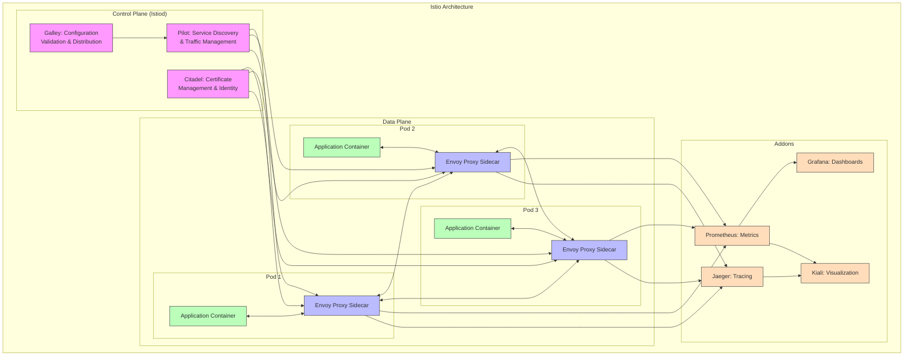
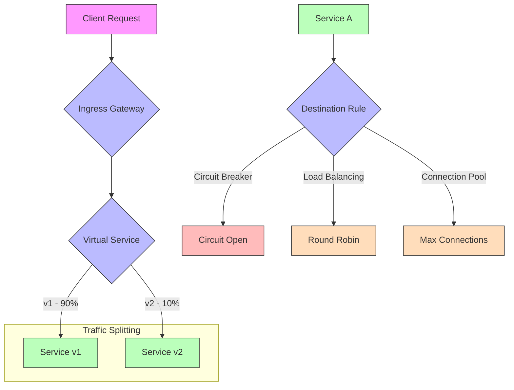
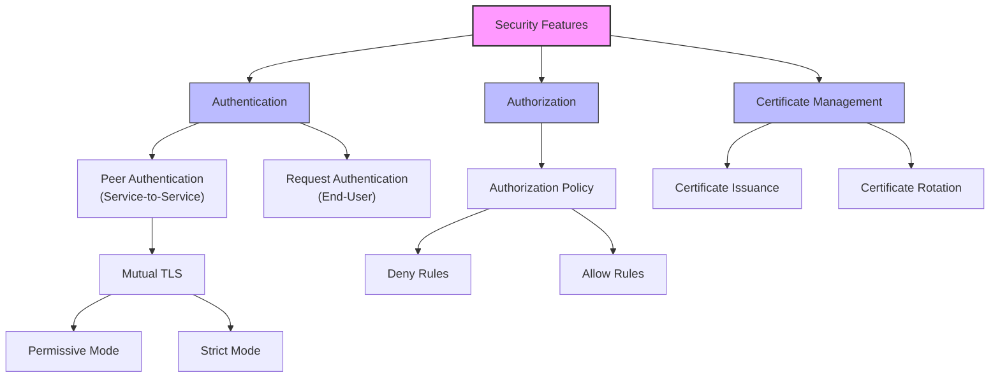
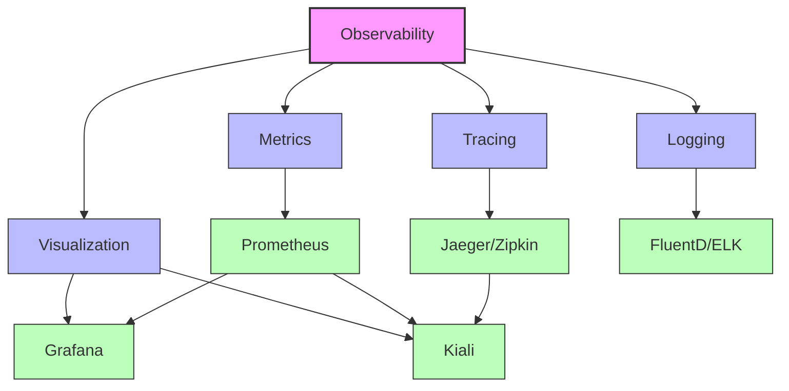
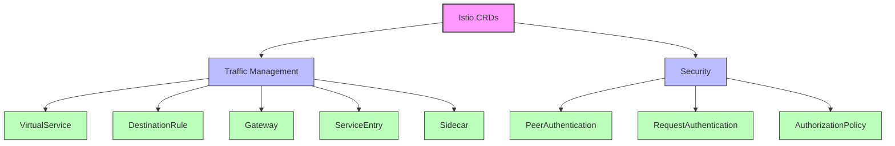
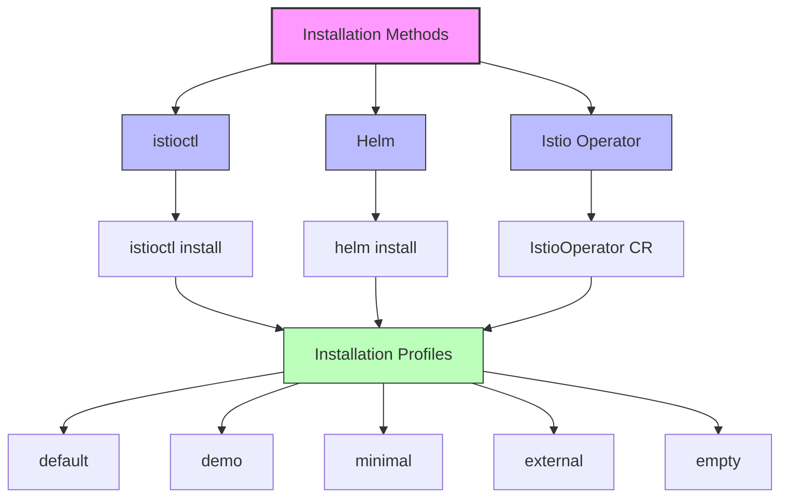
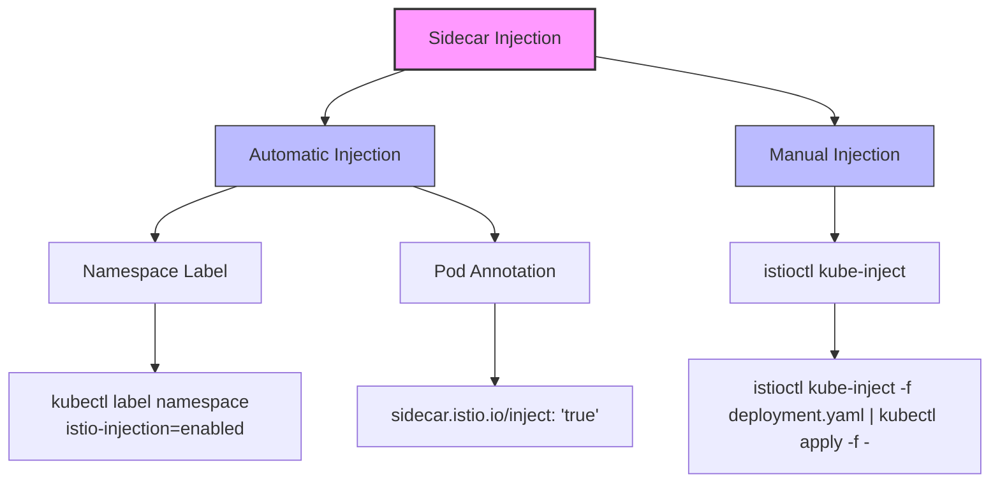

# Istio Service Mesh

## What is Istio?

Istio is an open-source service mesh platform that provides a way to control how microservices share data with one another. It is built on the Envoy proxy and offers a comprehensive solution for managing, observing, and securing microservices, particularly in Kubernetes environments.

## Istio Architecture



## Key Components of Istio

### Control Plane (Istiod)

In recent versions of Istio, the control plane components have been consolidated into a single binary called **Istiod**, which includes:

1. **Pilot**: Responsible for service discovery and traffic management
   - Converts high-level routing rules to Envoy configurations
   - Provides service discovery for Envoy proxies
   - Implements resiliency features (timeouts, retries, circuit breakers)

2. **Citadel**: Handles security and identity
   - Provides certificate issuance and rotation
   - Manages service-to-service authentication with mutual TLS
   - Enforces access policies between services

3. **Galley**: Manages configuration validation and distribution
   - Validates Istio configuration
   - Processes and distributes configuration to other components
   - Insulates other Istio components from Kubernetes details

### Data Plane

The data plane consists of a network of **Envoy proxies** deployed as sidecars to each service. These proxies:

- Intercept all network traffic to and from services
- Apply routing rules, policies, and security configurations
- Collect detailed metrics and traces
- Handle service discovery and load balancing

### Addons

Istio integrates with several tools to provide enhanced functionality:

- **Prometheus**: Collects and stores metrics
- **Grafana**: Provides dashboards for visualizing metrics
- **Jaeger** or **Zipkin**: Enables distributed tracing
- **Kiali**: Offers visualization of the service mesh topology and health

## Istio Features

### Traffic Management



Istio provides sophisticated traffic management capabilities:

- **Virtual Services**: Define routing rules for traffic
- **Destination Rules**: Configure what happens to traffic after routing
- **Gateways**: Control ingress and egress traffic
- **Service Entries**: Add external services to the mesh
- **Sidecars**: Configure the proxy behavior

Key traffic management features include:
- Canary deployments and A/B testing
- Traffic shifting and splitting
- Request routing based on headers, paths, or other attributes
- Circuit breaking and fault injection
- Timeouts and retries

### Security



Istio provides comprehensive security features:

- **Authentication**:
  - **Peer Authentication**: Service-to-service authentication using mutual TLS
  - **Request Authentication**: End-user authentication using JWT tokens

- **Authorization**:
  - Fine-grained access control with RBAC
  - Namespace, service, and method-level policies
  - Deny by default or allow by default policies

- **Certificate Management**:
  - Automated certificate issuance and rotation
  - Integration with external certificate authorities

### Observability



Istio provides extensive observability capabilities:

- **Metrics**: Automatically collects service metrics
  - Request volume, latency, and error rates
  - TCP metrics (bytes sent/received, connections)
  - Proxy-specific metrics

- **Tracing**: Distributed tracing for request flows
  - End-to-end visibility across services
  - Latency analysis for each service in the request path
  - Integration with Jaeger, Zipkin, and other tracing systems

- **Logging**: Enhanced access logging
  - Detailed logs of service requests
  - Configurable log formats and output destinations

- **Visualization**: Tools for visualizing the mesh
  - Kiali for service mesh topology and health
  - Grafana dashboards for metrics visualization

## Istio Custom Resources

Istio extends Kubernetes with Custom Resource Definitions (CRDs) to configure the service mesh:



### Traffic Management CRDs

- **VirtualService**: Defines how requests are routed to services
- **DestinationRule**: Defines policies that apply after routing
- **Gateway**: Controls ingress and egress traffic
- **ServiceEntry**: Adds external services to the mesh
- **Sidecar**: Configures the proxy behavior

### Security CRDs

- **PeerAuthentication**: Defines service-to-service authentication
- **RequestAuthentication**: Defines end-user authentication
- **AuthorizationPolicy**: Defines access control policies

## Getting Started with Istio

### Installation



Istio can be installed using several methods:

1. **istioctl**: The recommended way to install Istio
   ```bash
   istioctl install --set profile=demo
   ```

2. **Helm**: Using Helm charts
   ```bash
   helm install istio-base istio/base -n istio-system
   helm install istiod istio/istiod -n istio-system
   helm install istio-ingress istio/gateway -n istio-system
   ```

3. **Istio Operator**: For production environments
   ```bash
   istioctl operator init
   kubectl apply -f istio-operator.yaml
   ```

### Sidecar Injection



To add services to the mesh, you need to inject the Envoy sidecar proxy:

1. **Automatic Injection**: Label namespaces for automatic injection
   ```bash
   kubectl label namespace default istio-injection=enabled
   ```

2. **Manual Injection**: Inject the sidecar manually
   ```bash
   istioctl kube-inject -f deployment.yaml | kubectl apply -f -
   ```

### Basic Traffic Management Example

Here's a simple example of traffic routing with Istio:

```yaml
apiVersion: networking.istio.io/v1alpha3
kind: VirtualService
metadata:
  name: reviews
spec:
  hosts:
  - reviews
  http:
  - match:
    - headers:
        end-user:
          exact: jason
    route:
    - destination:
        host: reviews
        subset: v2
  - route:
    - destination:
        host: reviews
        subset: v1
---
apiVersion: networking.istio.io/v1alpha3
kind: DestinationRule
metadata:
  name: reviews
spec:
  host: reviews
  subsets:
  - name: v1
    labels:
      version: v1
  - name: v2
    labels:
      version: v2
```

This configuration routes requests to different versions of a service based on the user.

## Istio Best Practices

### Performance Optimization

- Use the appropriate installation profile for your needs
- Configure resource limits for Istio components
- Use namespace isolation to limit sidecar injection
- Consider using the CNI plugin to avoid init containers

### Security Hardening

- Enable strict mTLS mode for all services
- Implement least privilege authorization policies
- Regularly rotate certificates
- Secure the control plane with network policies

### Observability Setup

- Configure appropriate sampling rates for tracing
- Set up alerting based on service-level objectives (SLOs)
- Use custom dashboards for specific service metrics
- Implement log aggregation for the mesh

## Common Challenges and Solutions

### High Resource Usage

- Use the minimal profile for smaller clusters
- Tune proxy resources based on workload requirements
- Implement horizontal pod autoscaling for Istio components

### Complex Configuration

- Start with simple traffic management rules
- Use Kiali to visualize and validate configurations
- Implement a CI/CD pipeline for Istio configurations
- Consider using higher-level abstractions or operators

### Troubleshooting

- Use `istioctl analyze` to check for configuration issues
- Inspect proxy logs with `istioctl proxy-status` and `istioctl proxy-config`
- Use distributed tracing to identify bottlenecks
- Check control plane logs for errors

## Conclusion

Istio provides a comprehensive service mesh solution with powerful traffic management, security, and observability features. While it adds some complexity and resource overhead, the benefits for microservices architectures can be substantial, especially in terms of operational control and visibility.

By leveraging Istio's capabilities, organizations can implement advanced deployment strategies, enforce security policies, and gain deep insights into their service interactions, all without modifying application code.
