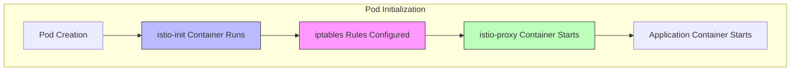
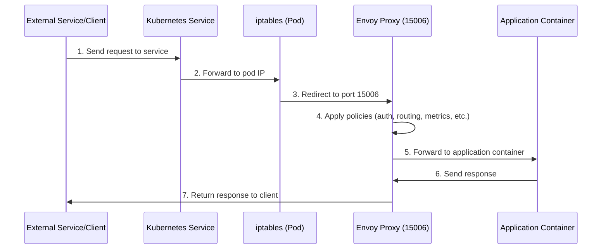
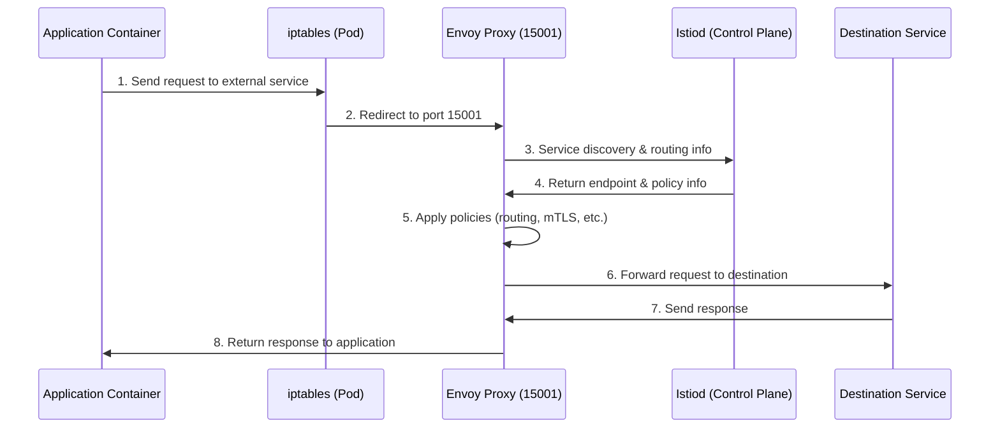
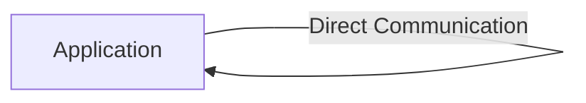

# Understanding Traffic Flow with Istio Sidecar Injection

## Introduction

When Istio injects a sidecar proxy (Envoy) into a Kubernetes pod, it fundamentally changes how network traffic flows to and from the application. This document explains the traffic interception mechanism, the flow patterns, and how to configure exceptions when needed.

## Sidecar Injection Overview

Sidecar injection adds an Envoy proxy container to each pod in the service mesh. This can be done in two ways:

1. **Automatic injection**: Using namespace labels
   ```bash
   kubectl label namespace <namespace> istio-injection=enabled
   ```

2. **Manual injection**: Using istioctl
   ```bash
   istioctl kube-inject -f deployment.yaml | kubectl apply -f -
   ```

## Traffic Interception Mechanism

Istio uses the `istio-init` initialization container to set up iptables rules that redirect all network traffic through the Envoy proxy. This happens transparently to the application.



### How iptables Redirection Works

The `istio-init` container configures iptables with rules that:

1. Capture all inbound traffic to specific ports (default: all ports)
2. Redirect this traffic to the Envoy proxy's inbound port (15006)
3. Capture all outbound traffic from the application
4. Redirect this traffic to the Envoy proxy's outbound port (15001)

```bash
# Simplified example of iptables rules set by istio-init
iptables -t nat -A PREROUTING -p tcp -j REDIRECT --to-port 15006
iptables -t nat -A OUTPUT -p tcp -j REDIRECT --to-port 15001
```

## Detailed Traffic Flow

### Inbound Traffic Flow (Traffic to the Pod)



1. An external client or service sends a request to a Kubernetes service
2. The Kubernetes service forwards the request to the pod IP
3. The iptables rules in the pod redirect the traffic to the Envoy proxy's inbound port (15006)
4. Envoy processes the request, applying authentication, authorization, metrics collection, etc.
5. Envoy forwards the request to the application container
6. The application processes the request and sends a response
7. The response follows the reverse path back to the client

### Outbound Traffic Flow (Traffic from the Pod)



1. The application container sends a request to an external service
2. The iptables rules redirect the traffic to the Envoy proxy's outbound port (15001)
3. Envoy consults the Istio control plane (Istiod) for service discovery and routing information
4. Istiod returns the necessary information about endpoints and policies
5. Envoy processes the request, applying routing rules, mTLS, metrics collection, etc.
6. Envoy forwards the request to the destination service
7. The destination service processes the request and sends a response
8. The response follows the reverse path back to the application

## Traffic Bypass Mechanisms

While most traffic is intercepted by the sidecar, there are several ways to bypass the proxy for specific traffic.

### 1. Localhost Traffic

By default, traffic to localhost (127.0.0.1) bypasses the sidecar:



### 2. Excluding IP Ranges

You can configure specific IP ranges to bypass the sidecar:

```yaml
# Pod annotation to exclude IP ranges
metadata:
  annotations:
    traffic.sidecar.istio.io/excludeOutboundIPRanges: "10.96.0.0/16,10.244.0.0/16"
```

### 3. Excluding Ports

You can exclude specific outbound ports:

```yaml
# Pod annotation to exclude ports
metadata:
  annotations:
    traffic.sidecar.istio.io/excludeOutboundPorts: "22,8000,8080"
```

### 4. Including Only Specific Ports

Alternatively, you can configure Istio to only intercept traffic to specific ports:

```yaml
# Pod annotation to include only specific ports
metadata:
  annotations:
    traffic.sidecar.istio.io/includeOutboundPorts: "9080,5000"
```

### 5. Kubernetes API Server Traffic

By default, traffic to the Kubernetes API server is often excluded:

```yaml
# Global mesh configuration in Istio
apiVersion: install.istio.io/v1alpha1
kind: IstioOperator
spec:
  meshConfig:
    outboundTrafficPolicy:
      mode: REGISTRY_ONLY
    # Exclude Kubernetes API server
    outboundTrafficPolicy:
      excludedIPRanges: ["10.96.0.1/32"]
```

## Sidecar Resource Configuration

You can control how the sidecar proxy interacts with services using the Sidecar resource:

```yaml
apiVersion: networking.istio.io/v1beta1
kind: Sidecar
metadata:
  name: default
  namespace: my-namespace
spec:
  egress:
  - hosts:
    - "./*"                 # Services in the same namespace
    - "istio-system/*"      # Services in istio-system
  ingress:
  - port:
      number: 9080
      protocol: HTTP
      name: http
    defaultEndpoint: 127.0.0.1:8080
```

This example:
- Limits egress traffic to services in the same namespace and the istio-system namespace
- Configures ingress traffic on port 9080 to be forwarded to the application on port 8080

## Verifying Traffic Interception

### 1. Check iptables Rules

```bash
# Get the pod name
POD_NAME=$(kubectl get pod -l app=your-app -o jsonpath='{.items[0].metadata.name}')

# Check iptables rules
kubectl exec -it $POD_NAME -c istio-proxy -- iptables -t nat -S
```

### 2. Check Envoy Listeners

```bash
# Check Envoy listeners
istioctl proxy-config listener $POD_NAME
```

### 3. Trace Traffic Flow

```bash
# Enable debug logging for Envoy
kubectl exec -it $POD_NAME -c istio-proxy -- curl -X POST localhost:15000/logging?level=debug

# View Envoy logs
kubectl logs $POD_NAME -c istio-proxy
```

## Common Issues and Troubleshooting

### 1. Traffic Not Being Intercepted

If traffic is not being intercepted by the sidecar:

- Verify the pod has the istio-proxy container:
  ```bash
  kubectl get pod $POD_NAME -o jsonpath='{.spec.containers[*].name}'
  ```

- Check if the application is using localhost or an excluded IP range/port
- Verify iptables rules are correctly set up

### 2. Application Can't Reach External Services

If the application can't reach external services:

- Check Istio's outbound traffic policy:
  ```bash
  kubectl get configmap istio -n istio-system -o jsonpath='{.data.mesh}' | grep outboundTrafficPolicy
  ```

- Consider using a ServiceEntry to allow external access:
  ```yaml
  apiVersion: networking.istio.io/v1beta1
  kind: ServiceEntry
  metadata:
    name: external-service
  spec:
    hosts:
    - example.com
    ports:
    - number: 443
      name: https
      protocol: HTTPS
    resolution: DNS
    location: MESH_EXTERNAL
  ```

### 3. Performance Impact

If you notice performance issues due to sidecar interception:

- Exclude high-volume traffic that doesn't need mesh features
- Adjust Envoy resource limits
- Consider using a more targeted sidecar injection approach

## Best Practices

1. **Be selective with sidecar injection**: Don't inject sidecars into pods that don't need mesh features

2. **Exclude high-volume internal traffic**: Use annotations to bypass the sidecar for high-volume internal traffic that doesn't need mesh features

3. **Limit egress access**: Use Sidecar resources to limit which services each workload can access

4. **Monitor proxy resource usage**: Keep an eye on CPU and memory usage of the istio-proxy container

5. **Use appropriate timeouts**: Configure appropriate timeouts for your services to prevent cascading failures

## Conclusion

When an Istio sidecar is injected into a pod, virtually all network traffic to and from the application is intercepted by and flows through the Envoy proxy. This interception is what enables Istio's powerful service mesh capabilities like traffic management, security, and observability.

Understanding this traffic flow is essential for troubleshooting, optimizing performance, and correctly configuring your service mesh. While the default behavior is to intercept all traffic, Istio provides several mechanisms to bypass the sidecar when needed for specific use cases.

## Additional Resources

- [Istio Traffic Management Documentation](https://istio.io/latest/docs/concepts/traffic-management/)
- [Istio Sidecar Injection Documentation](https://istio.io/latest/docs/setup/additional-setup/sidecar-injection/)
- [Istio Architecture Documentation](https://istio.io/latest/docs/ops/deployment/architecture/)
- [Envoy Proxy Documentation](https://www.envoyproxy.io/docs/envoy/latest/)
