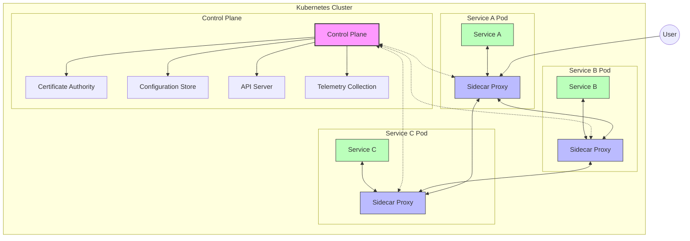
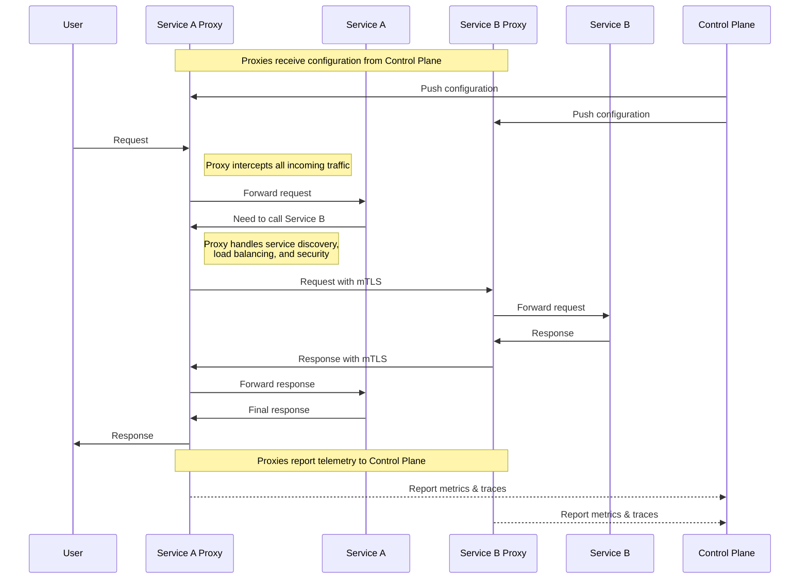
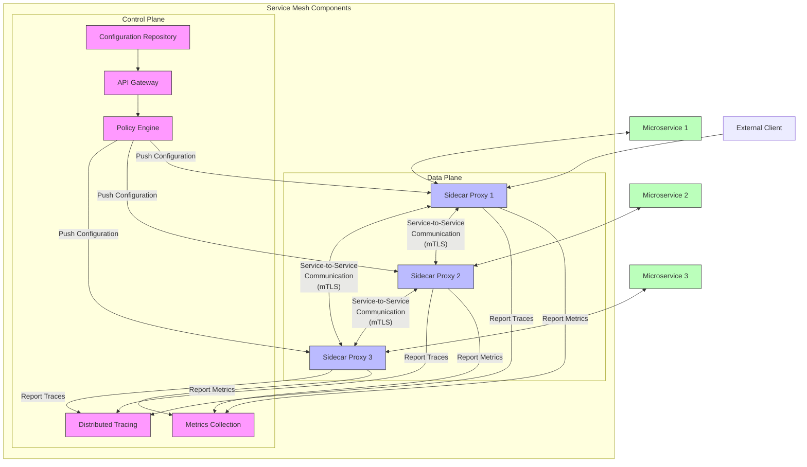
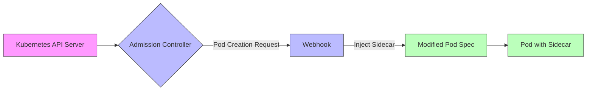
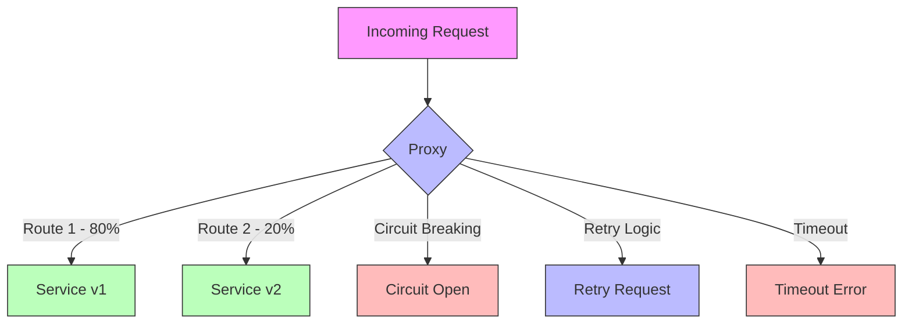
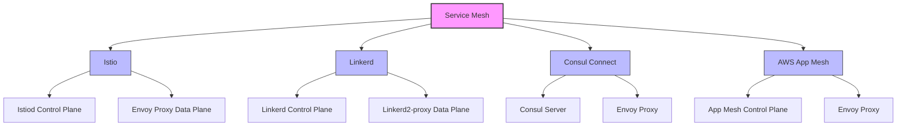

# Service Mesh Architecture Overview

This document provides a visual representation of service mesh architecture and explains how it works in a Kubernetes environment.

## Service Mesh Architecture

## How Service Mesh Works

## Data Flow in Service Mesh

## Key Operational Aspects

### Sidecar Injection Process

### Traffic Routing and Management

## Service Mesh Implementation Comparison

## Summary

The diagrams above illustrate the key components and workflows in a service mesh architecture:

1. **Architecture Overview**: Shows the relationship between the control plane, data plane (sidecar proxies), and the services they manage.

2. **Request Flow**: Demonstrates how a request flows through the service mesh, including interception by proxies and the role of the control plane.

3. **Data Flow**: Illustrates how configuration, metrics, and tracing data flow between components.

4. **Sidecar Injection**: Shows the process of automatically injecting sidecar proxies into Kubernetes pods.

5. **Traffic Management**: Depicts advanced traffic routing capabilities like canary deployments and circuit breaking.

6. **Implementation Comparison**: Compares the architecture of popular service mesh implementations.

The service mesh pattern decouples the application logic from network functionality, allowing developers to focus on business logic while the mesh handles complex networking concerns like service discovery, load balancing, encryption, authentication, and observability.
