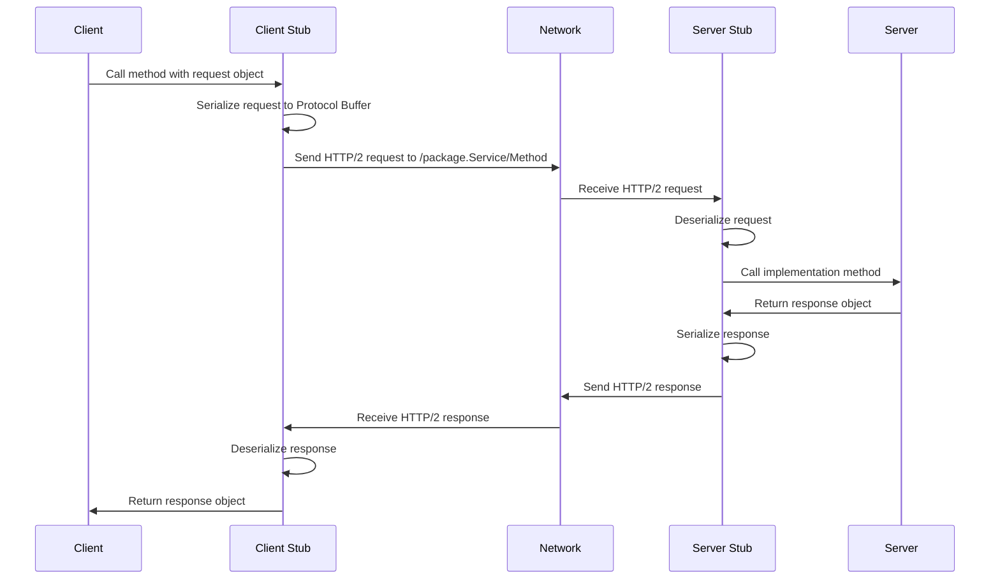

# gRPC Basics for Beginners

This guide provides a beginner-friendly introduction to gRPC, focusing on the client-server interaction model and how it works with Istio service mesh.

## What is gRPC?

gRPC is a high-performance, open-source Remote Procedure Call (RPC) framework that can run in any environment. It enables client and server applications to communicate transparently and build connected systems.

### Key Features of gRPC

- **Performance**: Uses HTTP/2 for transport with support for bidirectional streaming
- **Language Agnostic**: Works across multiple programming languages
- **Strongly Typed**: Uses Protocol Buffers for interface definition and data serialization
- **Code Generation**: Automatically generates client and server code

## gRPC vs REST: A Simple Comparison

| Feature | gRPC | REST |
|---------|------|------|
| Protocol | HTTP/2 | HTTP/1.1 |
| Data Format | Protocol Buffers (binary) | Typically JSON (text) |
| API Contract | Strict (.proto file) | Flexible (OpenAPI) |
| Code Generation | Yes, client and server | Optional, typically client only |
| Streaming | Bidirectional streaming | Limited (webhooks, SSE) |
| Browser Support | Limited (requires proxy) | Native |
| Learning Curve | Steeper | Gentler |

## How gRPC Works: The Basics

### 1. Define Your Service in a .proto File

The `.proto` file is the contract between client and server:

```protobuf
syntax = "proto3";

package example;

service GreetingService {
  rpc SayHello (HelloRequest) returns (HelloResponse) {}
}

message HelloRequest {
  string name = 1;
}

message HelloResponse {
  string greeting = 1;
}
```

This defines:
- A service called `GreetingService`
- A method called `SayHello`
- Input type `HelloRequest` with a `name` field
- Output type `HelloResponse` with a `greeting` field

### 2. Generate Code from the .proto File

Run the protocol buffer compiler to generate client and server code:

```bash
protoc --go_out=. --go-grpc_out=. example.proto  # For Go
python -m grpc_tools.protoc -I. --python_out=. --grpc_python_out=. example.proto  # For Python
```

This generates:
- Message classes (request/response objects)
- Client stub code
- Server interface code

### 3. Implement the Server

The server implements the service interface defined in the proto file:

```python
# Python example
class GreetingServiceServicer(example_pb2_grpc.GreetingServiceServicer):
    def SayHello(self, request, context):
        return example_pb2.HelloResponse(greeting=f"Hello, {request.name}!")

# Create and start the server
server = grpc.server(futures.ThreadPoolExecutor())
example_pb2_grpc.add_GreetingServiceServicer_to_server(GreetingServiceServicer(), server)
server.add_insecure_port('[::]:50051')
server.start()
```

### 4. Create a Client and Make Calls

The client uses the generated stub to make RPC calls:

```python
# Python example
channel = grpc.insecure_channel('localhost:50051')
stub = example_pb2_grpc.GreetingServiceStub(channel)

# Make the RPC call
response = stub.SayHello(example_pb2.HelloRequest(name="World"))
print(response.greeting)  # Prints: Hello, World!
```

## Understanding gRPC Paths

In gRPC, the path that a client calls follows a specific format that's different from REST APIs:

```
/[package].[service]/[method]
```

### Path Structure Breakdown

- **package**: The package name defined in your .proto file
- **service**: The service name defined in your .proto file
- **method**: The specific RPC method being called

For example, with this proto definition:

```protobuf
syntax = "proto3";

package payment;

service PaymentService {
  rpc ProcessPayment (PaymentRequest) returns (PaymentResponse) {}
  rpc GetPaymentStatus (StatusRequest) returns (StatusResponse) {}
}
```

The paths would be:
- `/payment.PaymentService/ProcessPayment`
- `/payment.PaymentService/GetPaymentStatus`

### How Paths Are Used in Istio

These paths are crucial for Istio's traffic management. In VirtualService configurations, you can route based on these paths:

```yaml
apiVersion: networking.istio.io/v1alpha3
kind: VirtualService
metadata:
  name: payment-service
spec:
  hosts:
  - payment-service
  http:
  - match:
    - uri:
        exact: "/payment.PaymentService/ProcessPayment"  # Match specific method
    route:
    - destination:
        host: payment-service
        subset: v1  # Send to stable version
  - match:
    - uri:
        prefix: "/payment.PaymentService/"  # Match any method in the service
    route:
    - destination:
        host: payment-service
        subset: v2  # Send to newer version
```

This allows for method-level traffic routing, which is more granular than what's typically possible with REST APIs.

## Client-Server Interaction in Detail

When a client wants to call a gRPC service, here's what happens:



### Step-by-Step Explanation

1. **Client Initiates Call**: The client calls a method on the generated stub
2. **Serialization**: The client stub serializes the request message to Protocol Buffer format
3. **HTTP/2 Request**: The client sends an HTTP/2 request to the server with path `/package.Service/Method`
4. **Server Receives Request**: The server's HTTP/2 handler receives the request
5. **Deserialization**: The server stub deserializes the Protocol Buffer into request objects
6. **Server Processing**: The server implementation processes the request
7. **Response Creation**: The server creates a response object
8. **Serialization**: The server stub serializes the response to Protocol Buffer format
9. **HTTP/2 Response**: The server sends an HTTP/2 response back to the client
10. **Client Receives Response**: The client stub receives and deserializes the response
11. **Client Gets Result**: The client receives the response object

### Client Code Deep Dive

Let's examine what happens when a client makes a gRPC call:

```python
# Create a channel to the server
channel = grpc.insecure_channel('localhost:50051')

# Create a stub (client) using the channel
stub = product_pb2_grpc.ProductServiceStub(channel)

# Create a request message
request = product_pb2.ProductRequest(product_id="p1")

# Make the RPC call
response = stub.GetProduct(request)

# Use the response
print(f"Received product: {response.name} from server {response.server_id}")
```

#### What's Happening Behind the Scenes

1. **Channel Creation**:
   - `grpc.insecure_channel('localhost:50051')` establishes a connection to the server
   - This is an HTTP/2 connection that will be reused for multiple requests
   - For production, use `grpc.secure_channel()` with SSL/TLS credentials

2. **Stub Creation**:
   - `product_pb2_grpc.ProductServiceStub(channel)` creates a client stub
   - The stub is generated from your .proto file
   - It provides methods that match your service definition

3. **Request Creation**:
   - `product_pb2.ProductRequest(product_id="p1")` creates a request message
   - This is a strongly-typed object generated from your .proto file
   - All fields are validated against the schema

4. **Making the Call**:
   - `stub.GetProduct(request)` looks like a normal function call
   - But it actually:
     - Serializes the request to Protocol Buffers binary format
     - Creates an HTTP/2 request with:
       - Method: POST
       - Path: `/product.ProductService/GetProduct`
       - Headers: `content-type: application/grpc`
       - Body: Length-prefixed Protocol Buffer message
     - Sends the request to the server
     - Waits for the response
     - Deserializes the response
     - Returns a response object

5. **Using the Response**:
   - The response is a strongly-typed object with fields defined in your .proto file
   - You can access fields directly with dot notation

#### Network-Level Details

At the HTTP/2 level, the request looks like:

```
:method: POST
:path: /product.ProductService/GetProduct
:scheme: http
content-type: application/grpc
grpc-accept-encoding: gzip
user-agent: grpc-python/1.54.0 grpc-c/28.0.0 (linux; chttp2)

[Binary Protocol Buffer data]
```

The response:

```
:status: 200
content-type: application/grpc
grpc-encoding: identity
grpc-status: 0

[Binary Protocol Buffer data]
```

This HTTP/2 exchange is what Istio's Envoy proxies intercept and apply routing rules to.

## gRPC Connection Types

gRPC supports four types of service methods:

1. **Unary RPC**: Client sends a single request and gets a single response
   ```protobuf
   rpc SayHello (HelloRequest) returns (HelloResponse);
   ```

2. **Server Streaming RPC**: Client sends a request and gets a stream of responses
   ```protobuf
   rpc SubscribeUpdates (SubscriptionRequest) returns (stream Update);
   ```

3. **Client Streaming RPC**: Client sends a stream of requests and gets a single response
   ```protobuf
   rpc ProcessBatch (stream BatchItem) returns (BatchResult);
   ```

4. **Bidirectional Streaming RPC**: Both sides send a stream of messages
   ```protobuf
   rpc Chat (stream ChatMessage) returns (stream ChatMessage);
   ```

## gRPC in Kubernetes and Istio

When deploying gRPC services in Kubernetes with Istio:

### 1. Service Definition

Define your Kubernetes service with the appropriate port:

```yaml
apiVersion: v1
kind: Service
metadata:
  name: my-grpc-service
spec:
  ports:
  - port: 50051
    name: grpc  # Important: name it 'grpc' for Istio to recognize it
  selector:
    app: my-grpc-app
```

### 2. Client Connection

A client in the same Kubernetes cluster connects using the service name:

```python
channel = grpc.insecure_channel('my-grpc-service:50051')
stub = my_service_pb2_grpc.MyServiceStub(channel)
response = stub.MyMethod(my_service_pb2.MyRequest(field="value"))
```

### 3. Istio Load Balancing

Istio manages connections between clients and servers:

```
Client Pod → Client's Envoy Proxy → Server's Envoy Proxy → Server Pod
```

The Envoy proxies handle:
- Load balancing
- Retries
- Circuit breaking
- mTLS encryption
- Metrics collection

### 4. Special Considerations for gRPC Load Balancing

Because gRPC uses long-lived HTTP/2 connections, Istio needs special configuration for optimal load balancing:

```yaml
apiVersion: networking.istio.io/v1alpha3
kind: DestinationRule
metadata:
  name: my-grpc-service
spec:
  host: my-grpc-service
  trafficPolicy:
    loadBalancer:
      simple: LEAST_CONN  # Better than ROUND_ROBIN for gRPC
    connectionPool:
      http:
        http2MaxRequests: 1000  # Max concurrent HTTP/2 requests
        maxRequestsPerConnection: 100  # Force connection cycling
```

These settings ensure that:
1. New connections are established after 100 requests
2. The load balancer can redistribute traffic when new connections are made
3. No single backend pod gets overloaded with requests

## Common gRPC Patterns

### Error Handling

gRPC has standardized error codes:

```python
# Server-side error handling
if not valid_request:
    context.set_code(grpc.StatusCode.INVALID_ARGUMENT)
    context.set_details("Invalid request parameter")
    return empty_response

# Client-side error handling
try:
    response = stub.MyMethod(request)
except grpc.RpcError as e:
    if e.code() == grpc.StatusCode.INVALID_ARGUMENT:
        print(f"Invalid argument: {e.details()}")
    elif e.code() == grpc.StatusCode.DEADLINE_EXCEEDED:
        print("Request timed out")
```

### Deadlines and Timeouts

Always set deadlines for RPC calls:

```python
# Set a 5-second deadline
timeout = 5  # seconds
try:
    response = stub.MyMethod(request, timeout=timeout)
except grpc.RpcError as e:
    if e.code() == grpc.StatusCode.DEADLINE_EXCEEDED:
        print("Request timed out")
```

### Metadata (Headers)

gRPC allows sending metadata (similar to HTTP headers):

```python
# Client-side
metadata = [('user-id', '123'), ('client-version', '1.0')]
response = stub.MyMethod(request, metadata=metadata)

# Server-side
def MyMethod(self, request, context):
    user_id = dict(context.invocation_metadata()).get('user-id')
    # Use the metadata...
    return response
```

## Debugging gRPC

### Tools for Debugging

1. **grpcurl**: Like curl but for gRPC
   ```bash
   grpcurl -plaintext localhost:50051 list  # List all services
   grpcurl -plaintext -d '{"name": "World"}' localhost:50051 example.GreetingService/SayHello
   ```

2. **grpc_cli**: Official gRPC command line tool
   ```bash
   grpc_cli ls localhost:50051  # List services
   grpc_cli call localhost:50051 SayHello "name: 'World'"
   ```

3. **Wireshark with Protocol Buffers**: For network-level debugging

### Logging and Tracing

Enable gRPC channel logging:

```python
import logging
logging.basicConfig(level=logging.DEBUG)

# Enable gRPC debug logging
channel = grpc.insecure_channel(
    'localhost:50051',
    options=[
        ('grpc.enable_http_proxy', 0),
        ('grpc.enable_channelz', 1),
    ]
)
```

## Conclusion

gRPC provides a powerful framework for building distributed systems with efficient communication. When combined with Istio service mesh, it offers additional benefits like advanced traffic management, security, and observability.

As you continue learning gRPC, focus on:
1. Designing effective Protocol Buffer messages and services
2. Understanding the different types of RPC methods
3. Implementing proper error handling and timeouts
4. Configuring Istio correctly for gRPC load balancing

Remember that while gRPC has a steeper learning curve than REST, it offers significant advantages in performance, type safety, and code generation that make it worth the investment for many use cases.
