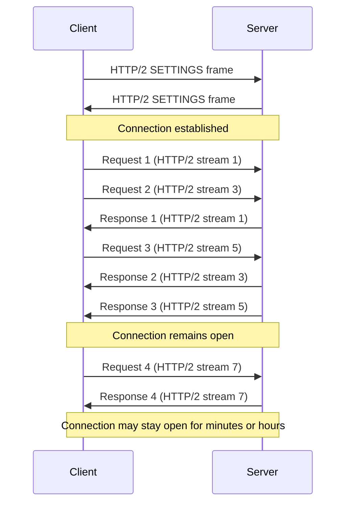
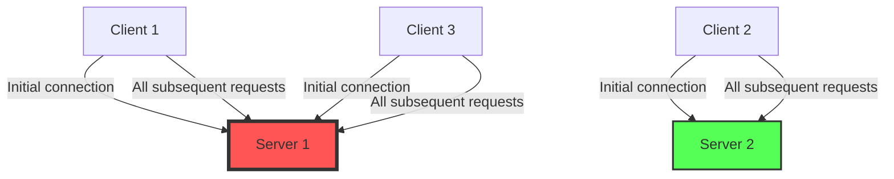
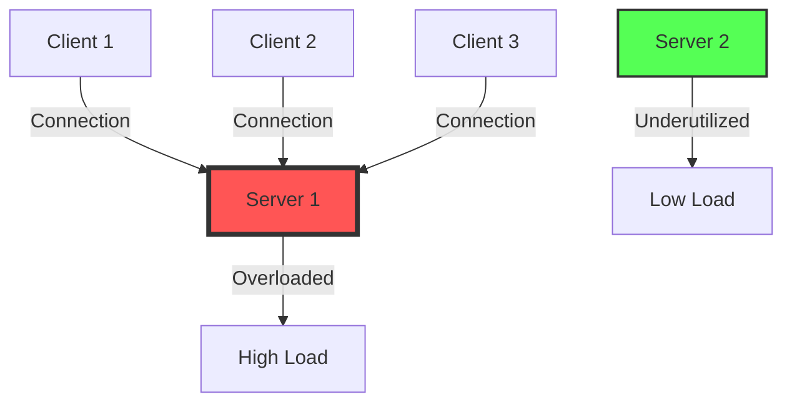
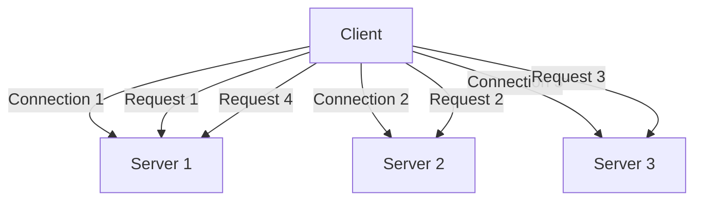
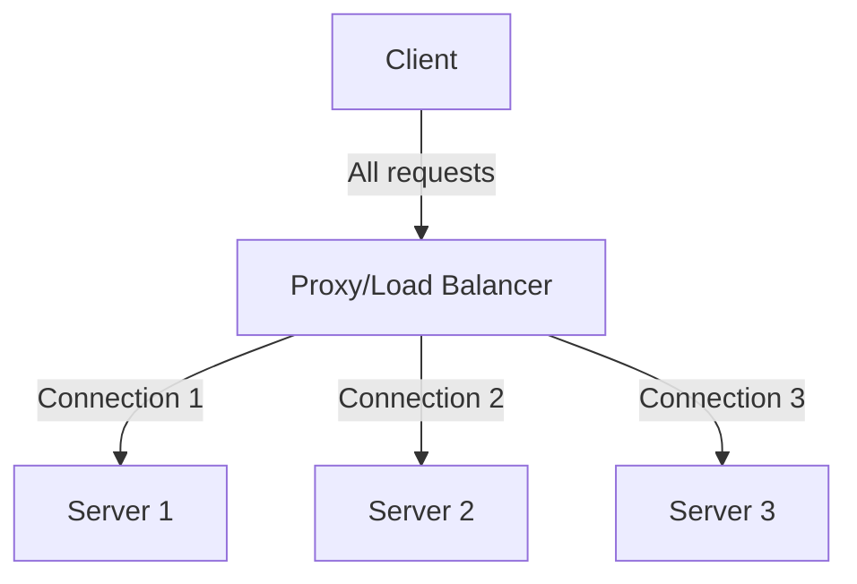
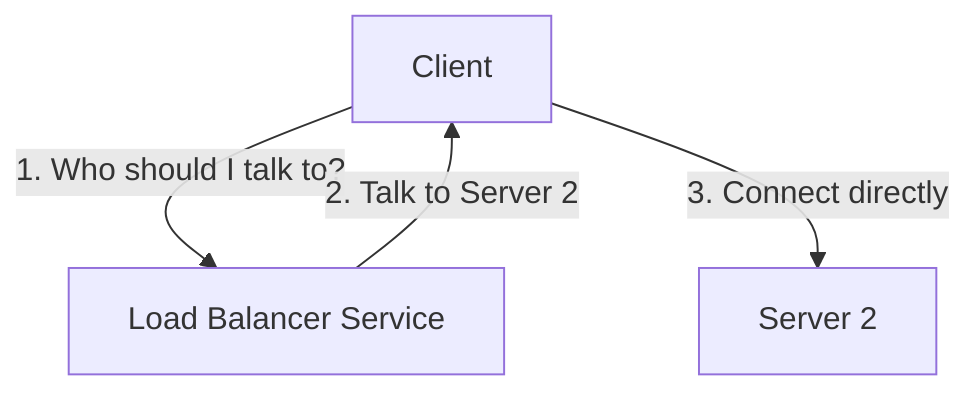
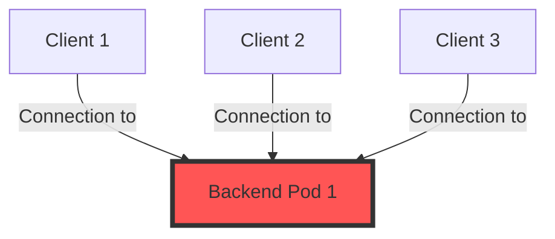
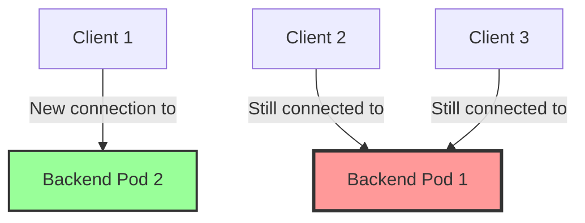
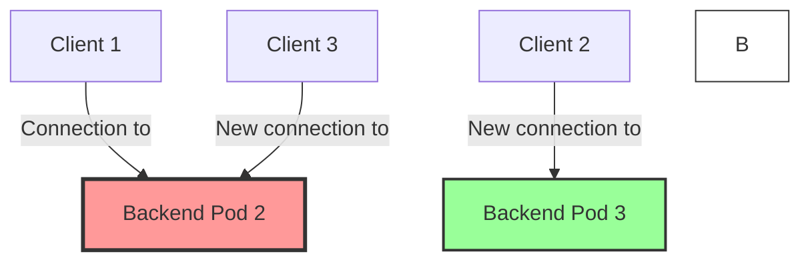

# gRPC Connection Management

This document explains how gRPC manages connections, the challenges this creates for load balancing, and how to configure Istio to handle gRPC connections effectively.

## HTTP/2 and gRPC Connection Fundamentals

gRPC is built on top of HTTP/2, which has fundamentally different connection characteristics compared to HTTP/1.1:

### Key HTTP/2 Connection Features

1. **Multiplexing**: Multiple requests and responses can be sent concurrently over a single connection
2. **Long-lived Connections**: Connections are kept open and reused for multiple requests
3. **Header Compression**: Reduces overhead for subsequent requests
4. **Binary Protocol**: More efficient than text-based HTTP/1.1
5. **Stream Prioritization**: More important requests can be processed first

### gRPC Connection Lifecycle



## Connection Management in gRPC Clients

### Channel Creation and Management

In gRPC, a **Channel** represents a long-lived connection to a gRPC server:

```python
# Python example
channel = grpc.insecure_channel('service:50051')
```

Key characteristics of gRPC channels:

1. **Lazy Connection**: Channels don't immediately establish a connection; they wait until the first RPC call
2. **Connection Pooling**: A single channel can maintain multiple HTTP/2 connections
3. **Connection Sharing**: Multiple stubs can share the same channel
4. **Automatic Reconnection**: Channels automatically reconnect if the connection is lost

### Channel States

A gRPC channel can be in one of several states:

```
IDLE → CONNECTING → READY → TRANSIENT_FAILURE → IDLE → ...
```

- **IDLE**: No connection, but ready to connect when needed
- **CONNECTING**: Actively trying to establish a connection
- **READY**: Successfully connected and ready for RPCs
- **TRANSIENT_FAILURE**: Connection failed, will retry after backoff
- **SHUTDOWN**: Channel is shutting down (after explicit close)

### Connection Configuration Options

gRPC provides several options to configure connection behavior:

```python
# Python example with connection options
channel = grpc.insecure_channel(
    'service:50051',
    options=[
        ('grpc.keepalive_time_ms', 30000),  # Send keepalive ping every 30 seconds
        ('grpc.keepalive_timeout_ms', 10000),  # Wait 10 seconds for keepalive ping response
        ('grpc.keepalive_permit_without_calls', True),  # Allow keepalive pings when no calls are in flight
        ('grpc.http2.max_pings_without_data', 0),  # Allow unlimited pings without data
        ('grpc.http2.min_time_between_pings_ms', 10000),  # Minimum time between pings
        ('grpc.max_connection_idle_ms', 300000),  # Close idle connections after 5 minutes
    ]
)
```

## Connection Management in gRPC Servers

gRPC servers also have connection management settings:

```python
# Python example
server = grpc.server(
    futures.ThreadPoolExecutor(max_workers=10),
    options=[
        ('grpc.keepalive_time_ms', 30000),
        ('grpc.keepalive_timeout_ms', 10000),
        ('grpc.keepalive_permit_without_calls', True),
        ('grpc.max_connection_age_ms', 600000),  # Force clients to reconnect after 10 minutes
        ('grpc.max_connection_age_grace_ms', 30000),  # Give 30 seconds grace period for pending RPCs
    ]
)
```

## Load Balancing Challenges with gRPC Connections

The long-lived nature of gRPC connections creates several challenges for load balancing:

### Challenge 1: Connection Stickiness



Once a client establishes a connection to a specific server, all requests from that client go to the same server, even if other servers become less loaded.

### Challenge 2: Uneven Connection Distribution

New clients might all connect to the same server if it's the first in a list:



### Challenge 3: Slow Rebalancing

When a new server is added or an existing server becomes less loaded, it takes time for the load to rebalance because existing connections persist.

## gRPC Load Balancing Strategies

There are several approaches to load balancing gRPC:

### 1. Client-Side Load Balancing

The client maintains connections to multiple servers and distributes requests:



Implementation in gRPC:

```python
# Python example with client-side load balancing
channel = grpc.insecure_channel(
    'dns:///service.namespace.svc.cluster.local:50051',
    options=[('grpc.service_config', json.dumps({
        'loadBalancingConfig': [{'round_robin': {}}]
    }))]
)
```

### 2. Proxy-Based Load Balancing (Istio Approach)

A proxy intercepts connections and distributes them:



This is how Istio works with Envoy proxies.

### 3. Lookaside Load Balancing

Clients query a load balancer service to determine which server to connect to:



## Istio and gRPC Connection Management

Istio uses Envoy proxies to manage gRPC connections. Here's how to configure it effectively:

### DestinationRule for gRPC Connection Management

```yaml
apiVersion: networking.istio.io/v1alpha3
kind: DestinationRule
metadata:
  name: grpc-service
spec:
  host: grpc-service
  trafficPolicy:
    loadBalancer:
      simple: LEAST_CONN  # Better than ROUND_ROBIN for gRPC
    connectionPool:
      http:
        http2MaxRequests: 1000  # Max concurrent HTTP/2 requests
        maxRequestsPerConnection: 100  # Force connection cycling
    outlierDetection:
      consecutive5xxErrors: 5
      interval: 30s
      baseEjectionTime: 30s
```

### Key Settings Explained

1. **`loadBalancer.simple: LEAST_CONN`**
   - Routes new connections to the backend with the fewest active connections
   - Better than ROUND_ROBIN for gRPC's long-lived connections

2. **`http2MaxRequests: 1000`**
   - Limits the number of concurrent requests on all connections to a backend
   - Prevents a single backend from being overwhelmed

3. **`maxRequestsPerConnection: 100`**
   - Forces connections to close and reestablish after 100 requests
   - This is the most important setting for gRPC load balancing
   - Allows the load balancer to redistribute connections over time
   - Without this, connections would persist indefinitely

4. **`outlierDetection`**
   - Implements circuit breaking
   - Temporarily removes unhealthy backends from the load balancing pool

## How `maxRequestsPerConnection` Works

Let's examine how `maxRequestsPerConnection: 100` helps balance load across three backend pods:

### Initial State



All clients initially connect to Backend Pod 1.

### After 100 Requests on Client 1's Connection



Client 1's connection is closed after 100 requests. When it establishes a new connection, the LEAST_CONN algorithm directs it to Backend Pod 2, which has fewer connections.

### After More Connections Cycle



As more connections reach the 100-request limit and cycle, the load gradually balances across all backend pods.

## Best Practices for gRPC Connection Management in Istio

1. **Always use `maxRequestsPerConnection`**
   - Set to a value that balances connection reuse with load distribution
   - Typical values: 50-200 requests

2. **Choose the right load balancing algorithm**
   - LEAST_CONN is generally best for gRPC
   - ROUND_ROBIN can work if connections cycle frequently

3. **Configure appropriate circuit breaking**
   - Prevents cascading failures
   - Allows the system to degrade gracefully

4. **Monitor connection distribution**
   - Use Istio's metrics to verify even load distribution
   - Watch for connection imbalances

5. **Set appropriate keepalive settings**
   - Too aggressive: Unnecessary network traffic
   - Too passive: Connections may be closed by intermediaries

## Conclusion

Effective gRPC connection management is crucial for achieving proper load balancing in a service mesh. By understanding how gRPC connections work and configuring Istio appropriately, you can ensure that your gRPC services scale effectively and remain resilient under load.

The most important takeaway: Configure `maxRequestsPerConnection` to force connection cycling, which enables the load balancer to redistribute connections over time.
