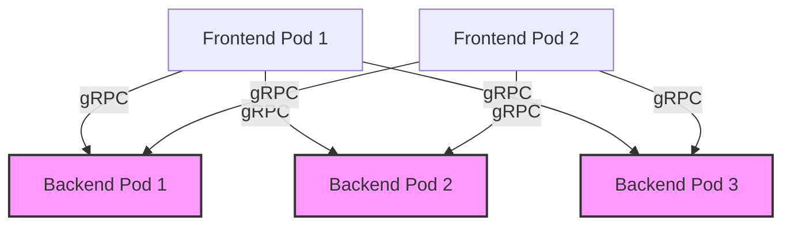
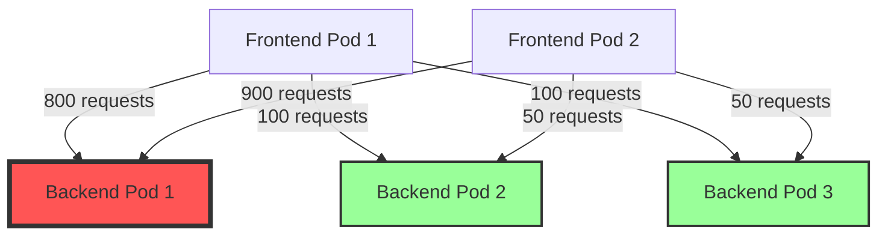
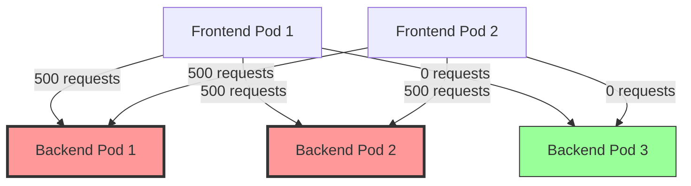
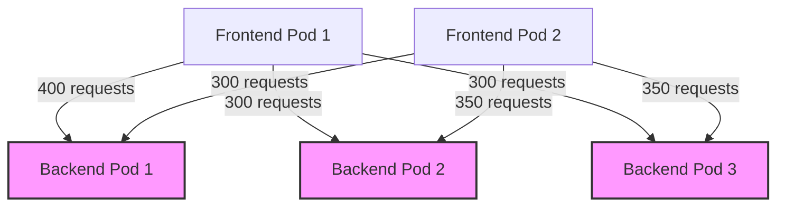
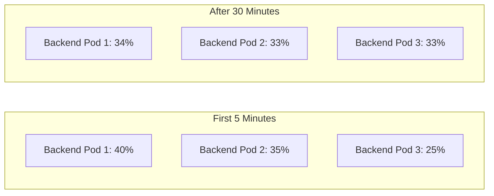

# Understanding gRPC Connection Pool Settings in Istio

This document explains how HTTP/2 connection pool settings work in Istio for gRPC services, using a practical example with a 3-pod backend deployment.

## Connection Pool Settings Explained

In Istio's DestinationRule, two key settings control HTTP/2 connection behavior:

```yaml
connectionPool:
  http:
    http2MaxRequests: 1000  # Max concurrent HTTP/2 requests
    maxRequestsPerConnection: 100  # Force connection cycling
```

- **http2MaxRequests**: The maximum number of concurrent HTTP/2 requests allowed to a backend.
- **maxRequestsPerConnection**: The maximum number of requests per connection before the connection is closed and a new one is established.

## Detailed Example: 3-Pod Backend Deployment

Let's consider a scenario with:
- 1 frontend service with 2 pods
- 1 backend service with 3 pods
- gRPC communication between them

### Setup



### Kubernetes Resources

```yaml
# Backend deployment with 3 pods
apiVersion: apps/v1
kind: Deployment
metadata:
  name: backend
spec:
  replicas: 3
  selector:
    matchLabels:
      app: backend
  template:
    metadata:
      labels:
        app: backend
    spec:
      containers:
      - name: backend
        image: example/grpc-backend:v1
        ports:
        - containerPort: 9000
---
# Backend service
apiVersion: v1
kind: Service
metadata:
  name: backend-service
spec:
  ports:
  - port: 9000
    name: grpc
  selector:
    app: backend
```

### Istio DestinationRule with Connection Pool Settings

```yaml
apiVersion: networking.istio.io/v1alpha3
kind: DestinationRule
metadata:
  name: backend-connection-pool
spec:
  host: backend-service
  trafficPolicy:
    loadBalancer:
      simple: LEAST_CONN
    connectionPool:
      http:
        http2MaxRequests: 1000
        maxRequestsPerConnection: 100
```

## What Happens Without These Settings?

Without proper connection pool settings, HTTP/2's long-lived connections can lead to uneven load distribution:



In this scenario:
- Backend Pod 1 receives a disproportionate amount of traffic (1700 requests)
- Backend Pods 2 and 3 are underutilized (150 and 150 requests respectively)
- This happens because HTTP/2 connections are long-lived and sticky

## How Connection Pool Settings Help

### Scenario 1: With `http2MaxRequests: 1000`

This setting limits the total number of concurrent requests across all connections to a single backend pod to 1000.



- Backend Pods 1 and 2 each handle 1000 requests (their maximum)
- However, Backend Pod 3 still receives no traffic
- This is better but still not optimal

### Scenario 2: With Both `http2MaxRequests: 1000` and `maxRequestsPerConnection: 100`

When we add `maxRequestsPerConnection: 100`, connections are forced to cycle after 100 requests:



Here's what happens:
1. Each frontend pod establishes initial connections to backend pods
2. After 100 requests on each connection, the connection is closed
3. When establishing new connections, the LEAST_CONN load balancing algorithm directs traffic to the backend pod with the fewest active connections
4. Over time, this leads to more even distribution of requests

## Step-by-Step Connection Cycling Process

Let's trace exactly how connections cycle with our settings:

### Initial State
- Frontend Pod 1 establishes connections to Backend Pods 1, 2, and 3
- Frontend Pod 2 does the same

### After Some Requests
1. Frontend Pod 1's connection to Backend Pod 1 reaches 100 requests
2. The connection is closed due to `maxRequestsPerConnection: 100`
3. Frontend Pod 1 needs to establish a new connection
4. The LEAST_CONN algorithm sees that Backend Pod 1 has more active connections than others
5. Frontend Pod 1 establishes a new connection to Backend Pod 2 or 3 instead
6. This process repeats, gradually balancing load across all backend pods

## Real-World Impact: Request Distribution Over Time



Over time, the combination of `maxRequestsPerConnection` and LEAST_CONN load balancing achieves near-perfect distribution.

## Practical Considerations for Setting Values

### Choosing `http2MaxRequests`

The `http2MaxRequests` value should be based on:
- The expected peak concurrent requests to your service
- The capacity of each backend pod
- The total number of backend pods

For our 3-pod example:
- If each pod can handle 500 concurrent requests
- Total system capacity is 1500 concurrent requests
- Setting `http2MaxRequests: 1000` ensures no single pod receives more than ~67% of capacity

### Choosing `maxRequestsPerConnection`

The `maxRequestsPerConnection` value should be based on:
- The average request rate
- How quickly you want load to rebalance
- Connection establishment overhead

For our example:
- Lower values (e.g., 50) cause more frequent connection cycling, leading to faster load balancing but more overhead
- Higher values (e.g., 200) reduce connection overhead but may slow down load balancing
- `maxRequestsPerConnection: 100` is a good middle ground for most gRPC services

## Monitoring Connection Pool Behavior

You can monitor the effectiveness of your connection pool settings using:

```bash
# Check connection distribution
istioctl proxy-config cluster <frontend-pod> -o json | jq '.[] | select(.name | contains("backend-service"))'

# Check request distribution in Prometheus
sum(istio_requests_total{destination_service="backend-service.default.svc.cluster.local"}) by (destination_workload_instance)
```

## Conclusion

Properly configured connection pool settings are essential for effective gRPC load balancing in Istio:

1. `http2MaxRequests` prevents any single backend pod from being overwhelmed
2. `maxRequestsPerConnection` ensures connections cycle regularly, allowing the load balancer to rebalance traffic
3. Combined with LEAST_CONN load balancing, these settings provide optimal distribution of gRPC traffic

For our 3-pod backend example, the settings:
```yaml
connectionPool:
  http:
    http2MaxRequests: 1000
    maxRequestsPerConnection: 100
```

Ensure that all three backend pods receive a fair share of the traffic, maximizing resource utilization and system resilience.
