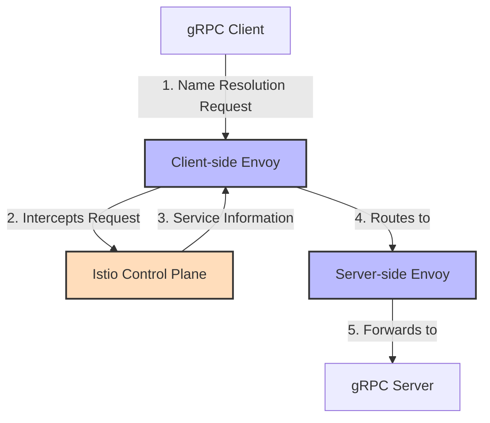

# gRPC Service Discovery in Istio Service Mesh

This guide explains how service discovery works for gRPC services in an Istio service mesh, including DNS resolution, load balancing, and best practices for configuring gRPC clients and servers.

## Introduction to gRPC Service Discovery

Service discovery is the process by which gRPC clients locate and connect to gRPC servers. In a Kubernetes environment with Istio, this process involves several layers:

1. **Kubernetes Service Discovery**: DNS-based resolution of service names
2. **Istio Service Registry**: Enhanced service registry maintained by Istio
3. **Envoy Proxy**: Sidecar proxies that intercept and route traffic
4. **gRPC Client-Side Resolution**: How gRPC clients resolve service names



## How gRPC Clients Discover Services in Istio

### Standard gRPC Service Discovery

In a standard gRPC implementation, clients use one of several name resolution mechanisms:

1. **DNS**: Resolves service names to IP addresses
2. **Static addresses**: Hardcoded IP addresses or hostnames
3. **Custom resolvers**: Application-specific resolution logic

### Istio's Enhancement to Service Discovery

Istio enhances this process by:

1. **Intercepting DNS queries**: The Envoy sidecar captures outbound traffic
2. **Service-aware routing**: Routes based on service identity, not just IP
3. **Load balancing**: Distributes requests across service instances
4. **Health checking**: Routes only to healthy instances

## DNS Resolution for gRPC in Kubernetes and Istio

### Kubernetes DNS Format

In Kubernetes, services are accessible via DNS names in the format:

```
<service-name>.<namespace>.svc.cluster.local
```

For example, a gRPC service named `payment-service` in the `finance` namespace would be accessible at:

```
payment-service.finance.svc.cluster.local:9000
```

### Simplified DNS in Same Namespace

Within the same namespace, services can be accessed using just the service name:

```
payment-service:9000
```

### How Istio Handles DNS Resolution

When a gRPC client in an Istio mesh attempts to resolve a service name:

1. The DNS query is processed normally by Kubernetes DNS
2. The connection attempt is intercepted by the client-side Envoy proxy
3. Envoy consults the Istio control plane for routing information
4. The request is forwarded to an appropriate service instance

## Client-Side Load Balancing Considerations

### gRPC Native Load Balancing

gRPC has built-in support for client-side load balancing, which can conflict with Istio's load balancing:

```go
// Go example of gRPC client-side load balancing
conn, err := grpc.Dial(
    "payment-service:9000",
    grpc.WithDefaultServiceConfig(`{"loadBalancingPolicy":"round_robin"}`),
)
```

### Recommended Approach with Istio

When using Istio, the recommended approach is:

1. **Disable client-side load balancing** in gRPC
2. **Use a direct connection** to the service name
3. **Let Istio handle load balancing** through Envoy

```go
// Go example for gRPC with Istio
conn, err := grpc.Dial(
    "payment-service:9000",
    grpc.WithBlock(),
    grpc.WithInsecure(),
    // No load balancing configuration - let Istio handle it
)
```

## Configuring Istio for gRPC Service Discovery

### DestinationRule for Load Balancing

Configure how Istio load balances gRPC traffic:

```yaml
apiVersion: networking.istio.io/v1alpha3
kind: DestinationRule
metadata:
  name: grpc-lb-settings
spec:
  host: payment-service.finance.svc.cluster.local
  trafficPolicy:
    loadBalancer:
      simple: LEAST_CONN  # Good for gRPC's long-lived connections
    connectionPool:
      http:
        http2MaxRequests: 1000
        maxRequestsPerConnection: 100
```

### Service Entry for External gRPC Services

For gRPC services outside the mesh:

```yaml
apiVersion: networking.istio.io/v1alpha3
kind: ServiceEntry
metadata:
  name: external-grpc-service
spec:
  hosts:
  - api.external-service.com
  ports:
  - number: 443
    name: grpc
    protocol: HTTPS
  resolution: DNS
  location: MESH_EXTERNAL
```

## Headless Services for Direct Pod Communication

For advanced scenarios requiring direct pod-to-pod communication:

```yaml
apiVersion: v1
kind: Service
metadata:
  name: grpc-headless-service
spec:
  clusterIP: None  # Headless service
  ports:
  - port: 9000
    name: grpc
  selector:
    app: grpc-service
```

With a headless service:
1. DNS returns all pod IPs instead of a service IP
2. Client can connect directly to specific pods
3. Istio still provides security and telemetry

## Service Resolution Modes in Istio

Istio supports different service resolution modes:

1. **STATIC**: Manually specified endpoints
2. **DNS**: Standard DNS-based resolution
3. **DNS_ROUND_ROBIN**: DNS with client-side round-robin
4. **PASSTHROUGH**: Direct passthrough to the requested address

For gRPC services, DNS resolution is typically used:

```yaml
apiVersion: networking.istio.io/v1alpha3
kind: ServiceEntry
metadata:
  name: custom-grpc-resolution
spec:
  hosts:
  - custom-grpc.example.com
  ports:
  - number: 9000
    name: grpc
    protocol: GRPC
  resolution: DNS  # Use DNS resolution
  endpoints:
  - address: grpc-backend-1.example.com
  - address: grpc-backend-2.example.com
```

## Locality-Aware Routing for gRPC

For multi-region deployments, configure locality-aware routing:

```yaml
apiVersion: networking.istio.io/v1alpha3
kind: DestinationRule
metadata:
  name: grpc-locality-lb
spec:
  host: payment-service.finance.svc.cluster.local
  trafficPolicy:
    loadBalancer:
      localityLbSetting:
        enabled: true
        distribute:
        - from: us-west/zone1/*
          to:
            "us-west/zone1/*": 80
            "us-west/zone2/*": 20
        failover:
        - from: us-west
          to: us-east
```

This configuration:
1. Prefers local zone endpoints (80% of traffic)
2. Sends some traffic to nearby zones (20%)
3. Fails over to another region if needed

## Troubleshooting gRPC Service Discovery

### Common Issues and Solutions

1. **Service Not Found**
   - Check Kubernetes service definition
   - Verify namespace is correct
   - Check port naming (must include 'grpc' or 'http2')

2. **Connection Refused**
   - Verify target pods are running
   - Check Istio sidecar injection
   - Examine Envoy logs for routing issues

3. **Load Balancing Not Working**
   - Ensure client-side LB is disabled
   - Verify DestinationRule configuration
   - Check connection pooling settings

### Debugging Commands

```bash
# Check Kubernetes service
kubectl get svc payment-service -n finance

# Check endpoints
kubectl get endpoints payment-service -n finance

# Check Istio service registry
istioctl proxy-config service <pod-name>.<namespace>

# Check Envoy routes
istioctl proxy-config routes <pod-name>.<namespace> --name http.9000

# Check Envoy clusters
istioctl proxy-config cluster <pod-name>.<namespace> | grep payment-service
```

## Best Practices for gRPC Service Discovery in Istio

1. **Consistent Port Naming**
   - Always name ports with 'grpc' prefix for automatic protocol detection

2. **Service Configuration**
   - Use standard Kubernetes services for most cases
   - Use headless services only when direct pod addressing is required

3. **Client Configuration**
   - Disable client-side load balancing
   - Use simple DNS names (service.namespace)
   - Set appropriate timeouts and deadlines

4. **Istio Configuration**
   - Use LEAST_CONN load balancing for long-lived gRPC connections
   - Configure connection pooling to cycle connections
   - Set up locality-aware routing for multi-region deployments

5. **Health Checking**
   - Implement gRPC health checking protocol
   - Configure Kubernetes readiness probes

## Advanced: gRPC-Specific Service Discovery

### xDS-Based Service Discovery

For advanced use cases, gRPC supports the Envoy xDS protocol for service discovery:

```go
// Go example of xDS-based service discovery
import (
    "google.golang.org/grpc"
    "google.golang.org/grpc/credentials/xds"
)

creds, err := xds.NewClientCredentials(xds.ClientOptions{})
conn, err := grpc.Dial(
    "xds:///payment-service",
    grpc.WithTransportCredentials(creds),
)
```

This approach:
1. Uses Envoy's xDS protocol directly from gRPC
2. Bypasses DNS resolution
3. Gets service information directly from Istio control plane

### Custom Name Resolution

For specialized needs, implement custom name resolution:

```go
// Go example of custom resolver
import (
    "google.golang.org/grpc"
    "google.golang.org/grpc/resolver"
)

// Register custom resolver
resolver.Register(NewCustomResolver())

// Use custom scheme
conn, err := grpc.Dial(
    "custom:///service-name",
    grpc.WithInsecure(),
)
```

## Example: Complete gRPC Service Discovery Configuration

Here's a complete example for configuring gRPC service discovery in Istio:

```yaml
# Kubernetes Service
apiVersion: v1
kind: Service
metadata:
  name: payment-service
  namespace: finance
spec:
  ports:
  - port: 9000
    name: grpc
  selector:
    app: payment-service
---
# Destination Rule for Load Balancing
apiVersion: networking.istio.io/v1alpha3
kind: DestinationRule
metadata:
  name: payment-service
  namespace: finance
spec:
  host: payment-service.finance.svc.cluster.local
  trafficPolicy:
    loadBalancer:
      simple: LEAST_CONN
    connectionPool:
      http:
        http2MaxRequests: 1000
        maxRequestsPerConnection: 100
---
# Virtual Service for Routing
apiVersion: networking.istio.io/v1alpha3
kind: VirtualService
metadata:
  name: payment-service
  namespace: finance
spec:
  hosts:
  - payment-service.finance.svc.cluster.local
  http:
  - route:
    - destination:
        host: payment-service.finance.svc.cluster.local
    timeout: 10s
```

## Conclusion

Effective gRPC service discovery in Istio combines the best of both worlds: gRPC's efficient communication protocol and Istio's powerful service mesh capabilities. By understanding how these technologies interact and following the best practices outlined in this guide, you can build robust, scalable, and observable gRPC-based microservices.

Key takeaways:
1. Let Istio handle service discovery and load balancing
2. Use consistent port naming for protocol detection
3. Configure appropriate load balancing for long-lived HTTP/2 connections
4. Implement proper health checking
5. Use the debugging tools provided by Istio to troubleshoot issues

## Additional Resources

- [Istio Service Discovery Documentation](https://istio.io/latest/docs/concepts/traffic-management/)
- [gRPC Name Resolution Documentation](https://grpc.io/docs/guides/name-resolution/)
- [Envoy xDS Protocol](https://www.envoyproxy.io/docs/envoy/latest/api-docs/xds_protocol)
- [Kubernetes DNS Specification](https://kubernetes.io/docs/concepts/services-networking/dns-pod-service/)
