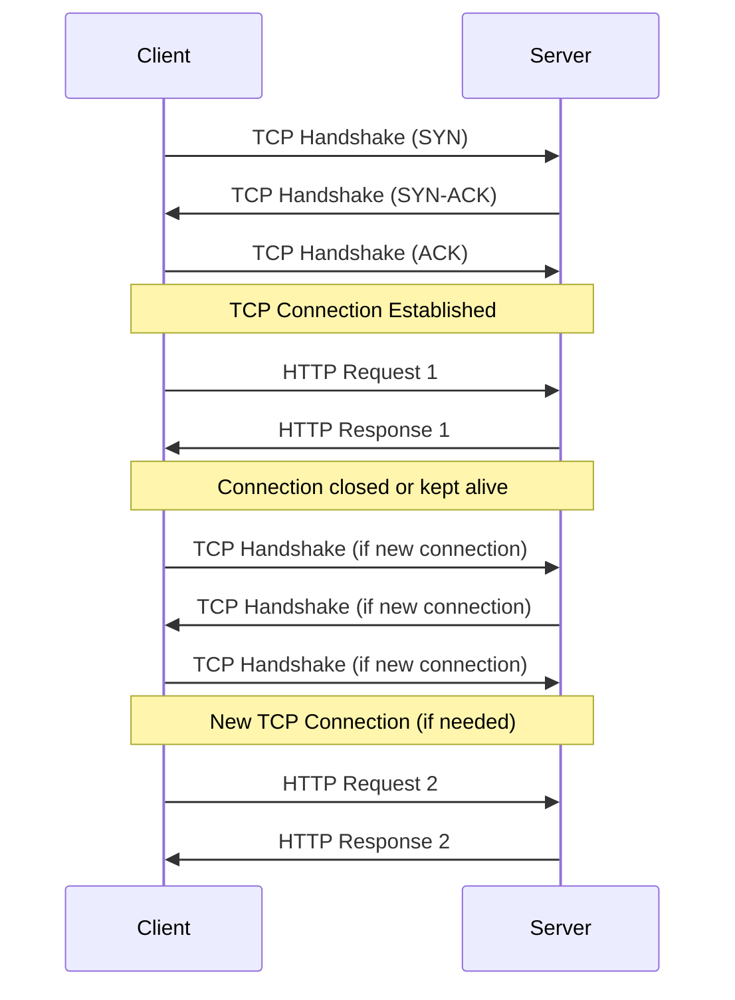
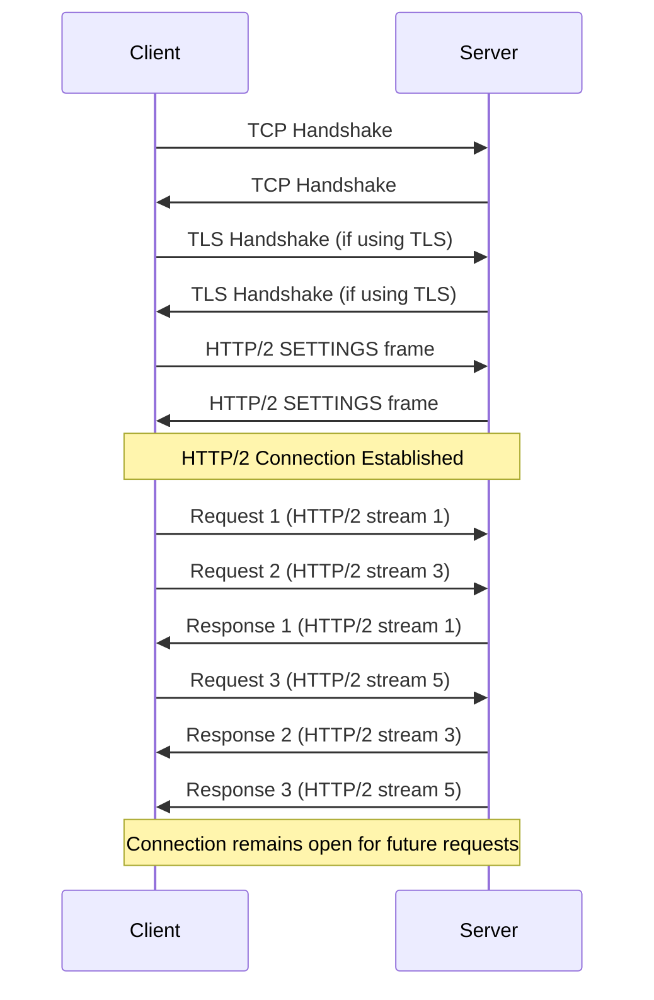
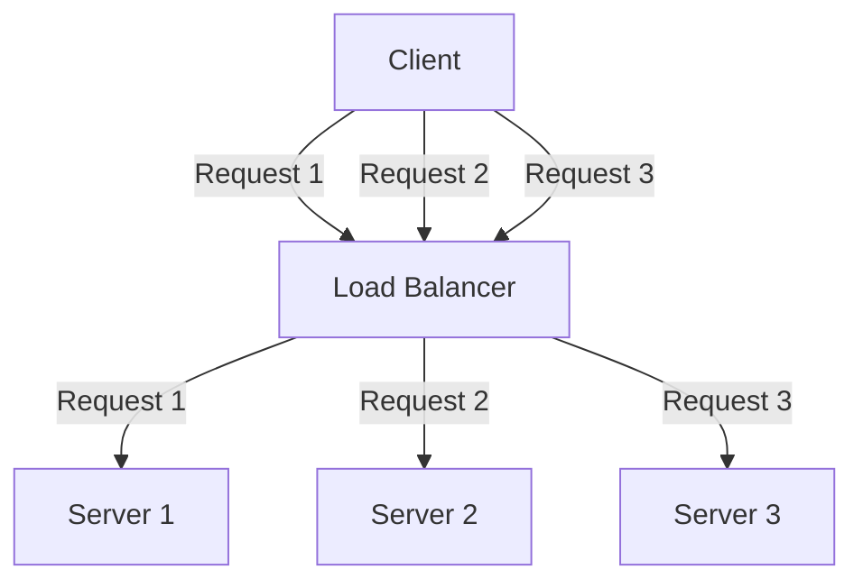
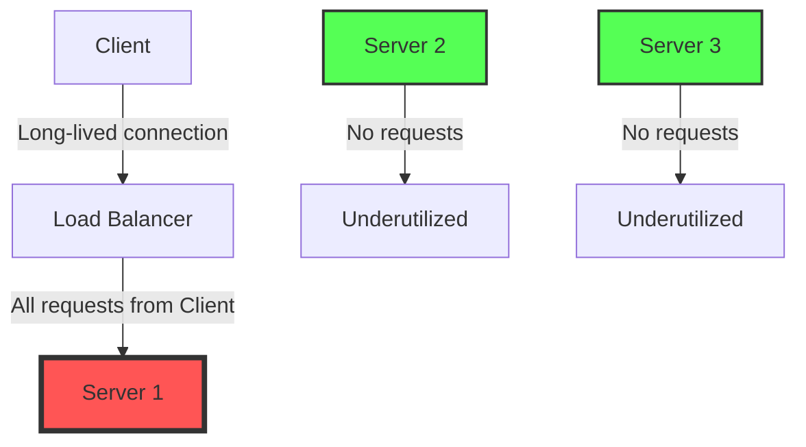
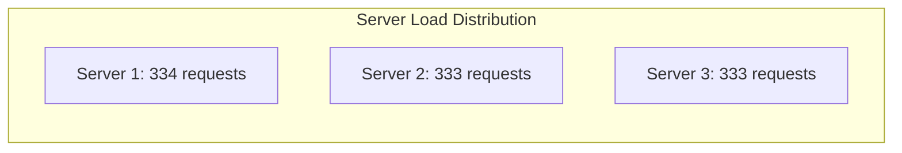
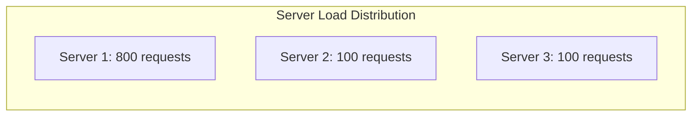
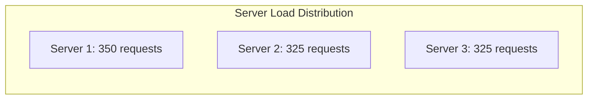

# gRPC vs REST: Connection Management Comparison

This document compares how gRPC and REST APIs manage connections, highlighting the key differences and their implications for performance, scalability, and load balancing.

## Connection Establishment and Management

### REST (HTTP/1.1)



### gRPC (HTTP/2)



## Key Differences in Connection Management

| Feature | REST (HTTP/1.1) | gRPC (HTTP/2) |
|---------|----------------|---------------|
| **Connection Lifecycle** | Short-lived or keep-alive with timeout | Long-lived by default |
| **Requests per Connection** | One at a time (head-of-line blocking) | Multiple concurrent (multiplexing) |
| **Connection Overhead** | New TCP handshake for each connection | One TCP handshake, reused for many requests |
| **Header Handling** | Plain text, sent with every request | Compressed, shared context between requests |
| **Connection Termination** | Often after each request or short idle timeout | Typically kept open until application closes |
| **Connection Pooling** | Client must implement connection pooling | Built into gRPC channels |

## Performance Implications

### REST (HTTP/1.1)

1. **Connection Establishment Overhead**:
   - Each new connection requires a TCP handshake (3-way)
   - If using HTTPS, add TLS handshake (additional roundtrips)
   - High latency for first request, especially over high-latency networks

2. **Connection Pooling**:
   - Browsers typically limit to 6-8 connections per domain
   - Server-side connection pools often needed
   - Keep-alive helps but connections still time out

3. **Request Overhead**:
   - Each request carries full HTTP headers
   - No header compression in HTTP/1.1
   - Verbose text-based protocol

### gRPC (HTTP/2)

1. **Connection Establishment Efficiency**:
   - Single connection setup amortized over many requests
   - After initial connection, new requests start immediately

2. **Multiplexing Benefits**:
   - Multiple requests in parallel without additional connections
   - No artificial connection limits
   - Better utilization of network resources

3. **Reduced Overhead**:
   - Header compression
   - Binary protocol reduces bytes transferred
   - Stream prioritization for important requests

## Load Balancing Considerations

### REST (HTTP/1.1)



1. **Connection Distribution**:
   - Each request can be independently load balanced
   - New TCP connection for each request allows perfect distribution
   - Load balancer has full control over request distribution

2. **Server Scaling**:
   - Adding/removing servers immediately affects load distribution
   - New servers receive requests immediately

3. **Load Balancing Algorithms**:
   - Round-robin works well
   - Least connections also effective
   - Session affinity optional (using cookies or IP)

### gRPC (HTTP/2)



1. **Connection Stickiness**:
   - Once established, connection stays with one server
   - All requests on that connection go to the same server
   - Can lead to uneven load distribution

2. **Server Scaling Challenges**:
   - New servers may receive no traffic until new connections are established
   - Removing servers can cause connection errors and retries

3. **Load Balancing Solutions**:
   - Need `maxRequestsPerConnection` to force connection cycling
   - LEAST_CONN algorithm preferred
   - Client-side load balancing as an alternative

## Real-World Scenario: 1000 Requests from 10 Clients

### REST (HTTP/1.1) with Keep-Alive



- Each client establishes multiple connections (connection pool)
- Load balancer distributes connections evenly
- Result: Near-perfect distribution

### gRPC (HTTP/2) without Connection Management



- Initial connections might all go to Server 1
- All subsequent requests follow those connections
- Result: Highly uneven distribution

### gRPC (HTTP/2) with Proper Istio Configuration



- `maxRequestsPerConnection: 100` forces connection cycling
- LEAST_CONN algorithm redistributes new connections
- Result: Much more even distribution

## Istio Configuration Comparison

### For REST APIs (HTTP/1.1)

```yaml
apiVersion: networking.istio.io/v1alpha3
kind: DestinationRule
metadata:
  name: rest-service
spec:
  host: rest-service
  trafficPolicy:
    loadBalancer:
      simple: ROUND_ROBIN  # Works well for REST
    connectionPool:
      http:
        maxRequestsPerConnection: 0  # No limit needed
```

### For gRPC Services (HTTP/2)

```yaml
apiVersion: networking.istio.io/v1alpha3
kind: DestinationRule
metadata:
  name: grpc-service
spec:
  host: grpc-service
  trafficPolicy:
    loadBalancer:
      simple: LEAST_CONN  # Better for gRPC
    connectionPool:
      http:
        http2MaxRequests: 1000
        maxRequestsPerConnection: 100  # Critical for gRPC load balancing
```

## Connection Management Best Practices

### REST APIs

1. **Use Keep-Alive Judiciously**:
   - Enable for high-volume clients
   - Set reasonable timeouts (e.g., 60-120 seconds)

2. **Configure Connection Pools**:
   - Client-side: Match expected concurrency
   - Server-side: Size based on expected client connections

3. **Load Balancer Settings**:
   - ROUND_ROBIN typically works well
   - Consider session affinity only if needed for stateful operations

### gRPC Services

1. **Force Connection Cycling**:
   - Always set `maxRequestsPerConnection` (50-200 range)
   - Lower values: Better distribution but more connection overhead
   - Higher values: Less overhead but slower redistribution

2. **Use Appropriate Load Balancing Algorithm**:
   - LEAST_CONN preferred for gRPC
   - Avoid ROUND_ROBIN unless connections cycle very frequently

3. **Configure Keepalives**:
   - Set reasonable keepalive intervals (20-60 seconds)
   - Configure timeouts to detect network issues

## Conclusion

REST APIs and gRPC services have fundamentally different connection management characteristics:

- **REST APIs** establish new connections frequently, making load balancing straightforward but increasing connection overhead.

- **gRPC services** use long-lived connections with multiplexing, reducing connection overhead but creating load balancing challenges.

When deploying gRPC services in Istio or any service mesh, it's critical to configure connection cycling through `maxRequestsPerConnection` to ensure proper load distribution. Without this setting, you may experience severely unbalanced loads across your service instances.
