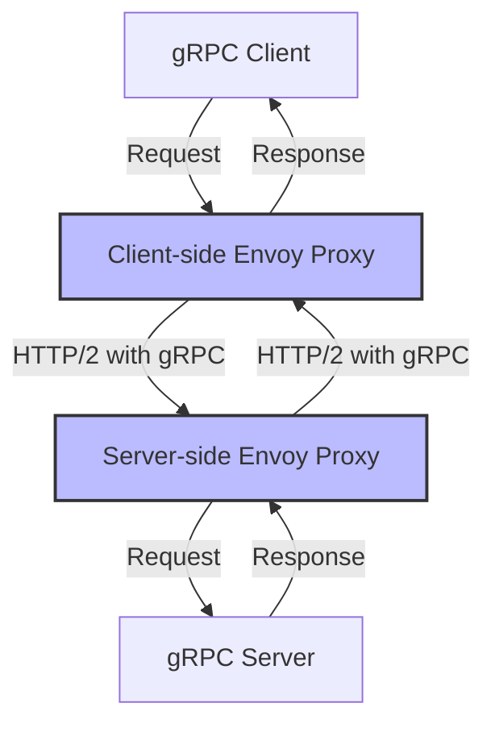
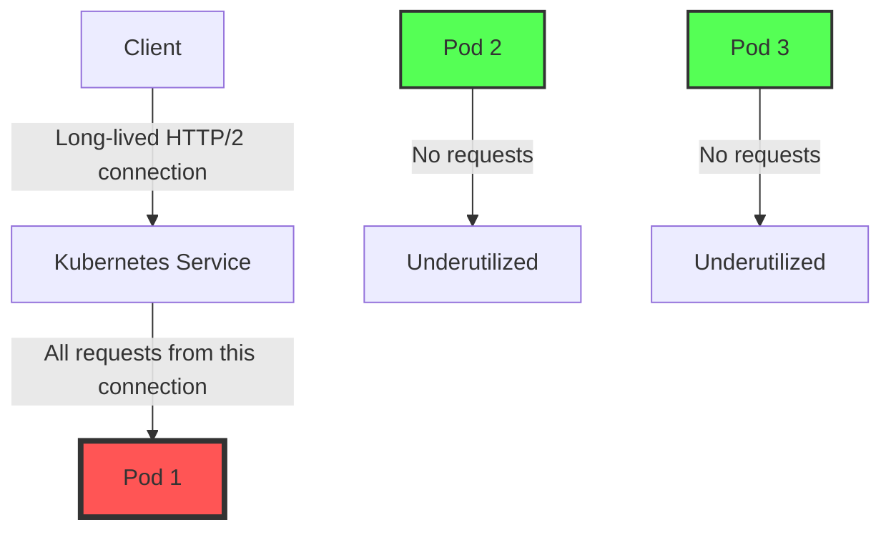

# Istio and gRPC Integration

This guide explains how to effectively use Istio service mesh with gRPC services, covering configuration, traffic management, security, and observability considerations.

## Introduction to gRPC with Istio

gRPC is a high-performance, open-source universal RPC framework that uses HTTP/2 for transport and Protocol Buffers for serialization. When used with Istio, there are specific considerations and configurations needed to ensure proper functionality and to leverage Istio's full capabilities.



## How Istio Handles gRPC Traffic

Istio's Envoy proxies natively support HTTP/2, which is the transport protocol used by gRPC. This enables Istio to:

1. **Route gRPC traffic** based on service, method, or metadata
2. **Load balance** gRPC requests across multiple backends
3. **Secure gRPC communications** with mTLS
4. **Collect metrics** specific to gRPC calls
5. **Trace** gRPC requests across services

## Configuring gRPC Services in Istio

### Service Definition

gRPC services should be defined in Kubernetes with the appropriate ports and protocols:

```yaml
apiVersion: v1
kind: Service
metadata:
  name: grpc-service
  labels:
    app: grpc-service
    service: grpc-service
spec:
  ports:
  - port: 9000
    name: grpc  # Important: port name must include 'grpc' or 'http2'
    protocol: TCP
  selector:
    app: grpc-service
```

The port naming convention is critical for Istio to recognize gRPC traffic:
- Use `grpc` or `grpc-*` for plaintext gRPC
- Use `grpc-web` for gRPC-Web
- Use `https` or `http2` for TLS-encrypted gRPC

### Deployment Configuration

When deploying gRPC services with Istio, ensure the Envoy sidecar is injected:

```yaml
apiVersion: apps/v1
kind: Deployment
metadata:
  name: grpc-service
spec:
  replicas: 3
  selector:
    matchLabels:
      app: grpc-service
  template:
    metadata:
      labels:
        app: grpc-service
      annotations:
        sidecar.istio.io/inject: "true"  # Ensure Istio sidecar injection
    spec:
      containers:
      - name: grpc-service
        image: example/grpc-service:latest
        ports:
        - containerPort: 9000
```

## Traffic Management for gRPC

### Routing gRPC Traffic with VirtualService

Istio can route gRPC traffic based on various criteria using VirtualService resources. Understanding how gRPC routing works in Istio requires knowing how gRPC requests are mapped to HTTP/2.

#### How gRPC Routes Are Matched

gRPC uses HTTP/2 as its transport protocol, and the service and method names are encoded in the HTTP/2 path in this format:
```
/[package].[service]/[method]
```

For example, a gRPC call to `PaymentService.ProcessPayment` in the `payment` package would use the path:
```
/payment.PaymentService/ProcessPayment
```

In VirtualService, you can match these paths using standard URI matching:

```yaml
apiVersion: networking.istio.io/v1alpha3
kind: VirtualService
metadata:
  name: grpc-route
spec:
  hosts:
  - grpc-service
  http:
  - match:
    - uri:
        prefix: "/my.package.MyService/"  # Match specific gRPC service
    - uri:
        exact: "/my.package.MyService/MyMethod"  # Match specific method
    route:
    - destination:
        host: grpc-service
        subset: v1
```

#### Key Points About gRPC Routing

1. **Method-Level Granularity**: You can route different gRPC methods to different service versions, allowing for fine-grained migration strategies.

2. **Header-Based Routing**: You can also route based on gRPC metadata, which is transmitted as HTTP/2 headers:

   ```yaml
   match:
     - headers:
         x-environment:
           exact: "staging"
   ```

3. **Retries for gRPC**: When configuring retries, use gRPC-specific status codes:

   ```yaml
   retries:
     attempts: 3
     perTryTimeout: 2s
     retryOn: "cancelled,deadline-exceeded,internal,resource-exhausted"
   ```

   These map to gRPC status codes:
   - `cancelled`: CANCELLED (1)
   - `deadline-exceeded`: DEADLINE_EXCEEDED (4)
   - `internal`: INTERNAL (13)
   - `resource-exhausted`: RESOURCE_EXHAUSTED (8)

4. **Timeout Considerations**: gRPC clients often have their own timeout mechanisms. Istio timeouts should be aligned with or slightly longer than client timeouts:

   ```yaml
   timeout: 10s  # Should be >= client timeout
   ```

### Load Balancing gRPC with DestinationRule

gRPC uses HTTP/2 which maintains long-lived connections. This creates special load balancing challenges that need to be addressed in your DestinationRule configuration.

#### HTTP/2 Connection Challenges

gRPC uses HTTP/2, which establishes long-lived connections. This can lead to uneven load distribution because:

1. A single connection may carry many requests
2. Connections persist for a long time
3. New connections are established infrequently

#### Optimal DestinationRule Configuration

```yaml
apiVersion: networking.istio.io/v1alpha3
kind: DestinationRule
metadata:
  name: grpc-lb
spec:
  host: grpc-service
  trafficPolicy:
    loadBalancer:
      simple: LEAST_CONN  # Better than ROUND_ROBIN for gRPC
    connectionPool:
      http:
        http2MaxRequests: 1000  # Max concurrent HTTP/2 requests
        maxRequestsPerConnection: 100  # Force connection cycling
```

#### Key Load Balancing Strategies

1. **LEAST_CONN**: This load balancing algorithm sends requests to the backend with the fewest active connections, which helps distribute gRPC traffic more evenly than round-robin.

2. **Connection Pool Settings**:
   - `http2MaxRequests`: Limits the number of concurrent requests on all connections to a backend
   - `maxRequestsPerConnection`: Forces new connections after this many requests, which helps distribute load

3. **Circuit Breaking**: Especially important for gRPC to prevent cascading failures:

   ```yaml
   outlierDetection:
     consecutiveErrors: 5
     interval: 30s
     baseEjectionTime: 30s
     maxEjectionPercent: 100
   ```

#### Locality-Aware Load Balancing

For multi-region deployments, locality-aware load balancing is beneficial for gRPC:

```yaml
loadBalancer:
  localityLbSetting:
    enabled: true
    distribute:
    - from: us-west/zone1/*
      to:
        "us-west/zone1/*": 80
        "us-west/zone2/*": 20
```

This configuration:
1. Keeps most gRPC traffic (80%) in the same zone to minimize latency
2. Sends some traffic (20%) to nearby zones for resilience

### Practical Example: Complete gRPC Traffic Management

Here's a complete example combining both VirtualService and DestinationRule for a gRPC service:

```yaml
# DestinationRule for load balancing
apiVersion: networking.istio.io/v1alpha3
kind: DestinationRule
metadata:
  name: payment-service
spec:
  host: payment-service
  trafficPolicy:
    loadBalancer:
      simple: LEAST_CONN
    connectionPool:
      http:
        http2MaxRequests: 1000
        maxRequestsPerConnection: 100
  subsets:
  - name: v1
    labels:
      version: v1
  - name: v2
    labels:
      version: v2
---
# VirtualService for routing
apiVersion: networking.istio.io/v1alpha3
kind: VirtualService
metadata:
  name: payment-service
spec:
  hosts:
  - payment-service
  http:
  # Production traffic for critical methods stays on v1
  - match:
    - uri:
        exact: "/payment.PaymentService/ProcessPayment"
      headers:
        x-environment:
          exact: "production"
    route:
    - destination:
        host: payment-service
        subset: v1
    timeout: 15s
    retries:
      attempts: 3
      perTryTimeout: 5s
      retryOn: "cancelled,deadline-exceeded,internal,resource-exhausted"
  
  # Testing new features in v2
  - match:
    - uri:
        prefix: "/payment.PaymentService/"
      headers:
        x-environment:
          exact: "testing"
    route:
    - destination:
        host: payment-service
        subset: v2
  
  # Gradual rollout for all other traffic
  - route:
    - destination:
        host: payment-service
        subset: v1
      weight: 80
    - destination:
        host: payment-service
        subset: v2
      weight: 20
```

This configuration:
1. Uses LEAST_CONN load balancing optimized for gRPC's long-lived connections
2. Forces connection cycling after 100 requests
3. Routes production payment processing to the stable v1
4. Routes testing traffic to v2 for all payment methods
5. Splits remaining traffic 80/20 between v1 and v2
6. Configures appropriate timeouts and retries for gRPC

### Timeouts and Retries

Configure appropriate timeouts and retries for gRPC services:

```yaml
apiVersion: networking.istio.io/v1alpha3
kind: VirtualService
metadata:
  name: grpc-timeouts
spec:
  hosts:
  - grpc-service
  http:
  - route:
    - destination:
        host: grpc-service
    timeout: 10s  # Overall request timeout
    retries:
      attempts: 3
      perTryTimeout: 2s
      retryOn: "cancelled,deadline-exceeded,internal,resource-exhausted"
```

The `retryOn` field should use gRPC-specific conditions:
- `cancelled`: gRPC CANCELLED (1)
- `deadline-exceeded`: gRPC DEADLINE_EXCEEDED (4)
- `internal`: gRPC INTERNAL (13)
- `resource-exhausted`: gRPC RESOURCE_EXHAUSTED (8)

## Security for gRPC Services

### Enabling mTLS for gRPC

mTLS works seamlessly with gRPC in Istio:

```yaml
apiVersion: security.istio.io/v1beta1
kind: PeerAuthentication
metadata:
  name: grpc-mtls
  namespace: default
spec:
  selector:
    matchLabels:
      app: grpc-service
  mtls:
    mode: STRICT  # Options: STRICT, PERMISSIVE, DISABLE
```

### Authorization Policies

Control access to gRPC services and methods:

```yaml
apiVersion: security.istio.io/v1beta1
kind: AuthorizationPolicy
metadata:
  name: grpc-auth
  namespace: default
spec:
  selector:
    matchLabels:
      app: grpc-service
  rules:
  - to:
    - operation:
        paths: ["/my.package.MyService/MyMethod"]  # Specific method
    from:
    - source:
        principals: ["cluster.local/ns/default/sa/client-sa"]
```

## Observability for gRPC

### Metrics

Istio automatically collects metrics for gRPC traffic, including:
- Request count
- Request duration
- Request size
- Response size
- Error rates by status code

To get gRPC-specific status codes in metrics, add these annotations to your deployment:

```yaml
metadata:
  annotations:
    proxy.istio.io/config: |
      proxyStatsMatcher:
        inclusionPrefixes:
        - "grpc"
```

### Distributed Tracing

For proper tracing of gRPC requests:

1. Ensure your gRPC services propagate trace headers:
   - `x-b3-traceid`
   - `x-b3-spanid`
   - `x-b3-parentspanid`
   - `x-b3-sampled`

2. Use gRPC interceptors to handle trace propagation:

```go
// Go example with OpenTelemetry
import (
    "go.opentelemetry.io/contrib/instrumentation/google.golang.org/grpc/otelgrpc"
    "google.golang.org/grpc"
)

// Client-side
conn, err := grpc.Dial(
    address,
    grpc.WithUnaryInterceptor(otelgrpc.UnaryClientInterceptor()),
    grpc.WithStreamInterceptor(otelgrpc.StreamClientInterceptor()),
)

// Server-side
server := grpc.NewServer(
    grpc.UnaryInterceptor(otelgrpc.UnaryServerInterceptor()),
    grpc.StreamInterceptor(otelgrpc.StreamServerInterceptor()),
)
```

### Visualizing gRPC Traffic in Kiali

Kiali can visualize gRPC traffic flows between services. To improve visibility:

1. Ensure port naming follows conventions (`grpc` or `http2`)
2. Add app and version labels to all deployments
3. Configure Kiali to recognize gRPC services

## Common Challenges and Solutions

### Challenge 1: gRPC Status Codes Not Visible

**Problem**: Istio translates gRPC status codes to HTTP status codes, losing detail.

**Solution**: Use the `proxy.istio.io/config` annotation to include gRPC metrics and configure Prometheus to capture them.

### Challenge 2: Load Balancing Issues

**Problem**: gRPC uses long-lived HTTP/2 connections which can lead to uneven load distribution.

**Solution**: 
- Use `LEAST_CONN` load balancing
- Configure `maxRequestsPerConnection` to force connection cycling
- Consider client-side load balancing for high-performance needs

### Challenge 3: Timeout Configuration

**Problem**: gRPC has its own timeout mechanism that may conflict with Istio timeouts.

**Solution**: Ensure timeouts are consistently configured:
- Set appropriate VirtualService timeouts
- Align with client-side gRPC timeouts
- Use deadline propagation in your gRPC code

## Advanced gRPC Features with Istio

### gRPC-Web Support

To support gRPC-Web clients (browsers):

1. Deploy Envoy with gRPC-Web filter:

```yaml
apiVersion: networking.istio.io/v1alpha3
kind: EnvoyFilter
metadata:
  name: grpc-web
  namespace: istio-system
spec:
  configPatches:
  - applyTo: HTTP_FILTER
    match:
      context: GATEWAY
      listener:
        filterChain:
          filter:
            name: "envoy.filters.network.http_connection_manager"
    patch:
      operation: INSERT_BEFORE
      value:
        name: envoy.filters.http.grpc_web
        typed_config:
          "@type": type.googleapis.com/envoy.extensions.filters.http.grpc_web.v3.GrpcWeb
```

2. Configure Gateway and VirtualService:

```yaml
apiVersion: networking.istio.io/v1alpha3
kind: Gateway
metadata:
  name: grpc-web-gateway
spec:
  selector:
    istio: ingressgateway
  servers:
  - port:
      number: 80
      name: http
      protocol: HTTP
    hosts:
    - "grpc.example.com"
---
apiVersion: networking.istio.io/v1alpha3
kind: VirtualService
metadata:
  name: grpc-web-vs
spec:
  hosts:
  - "grpc.example.com"
  gateways:
  - grpc-web-gateway
  http:
  - route:
    - destination:
        host: grpc-service
        port:
          number: 9000
```

### Health Checking gRPC Services

Implement proper health checking for gRPC services:

1. Implement the gRPC Health Checking Protocol in your service
2. Configure Kubernetes probes:

```yaml
livenessProbe:
  exec:
    command: ["/bin/grpc_health_probe", "-addr=:9000"]
  initialDelaySeconds: 10
readinessProbe:
  exec:
    command: ["/bin/grpc_health_probe", "-addr=:9000"]
  initialDelaySeconds: 5
```

## Performance Tuning

### Envoy Proxy Configuration

Optimize Envoy for gRPC workloads:

```yaml
apiVersion: networking.istio.io/v1alpha3
kind: EnvoyFilter
metadata:
  name: grpc-performance
spec:
  configPatches:
  - applyTo: CLUSTER
    match:
      context: SIDECAR_OUTBOUND
    patch:
      operation: MERGE
      value:
        upstream_connection_options:
          tcp_keepalive:
            keepalive_time: 300
        circuit_breakers:
          thresholds:
          - max_connections: 1000
            max_pending_requests: 1000
            max_requests: 5000
```

### Client-Side Considerations

Advise on client configuration:
- Use connection pooling
- Implement deadlines
- Consider bidirectional streaming for efficiency

## Testing gRPC with Istio

### Tools for Testing

1. **grpcurl**: Command-line tool for interacting with gRPC services
   ```bash
   grpcurl -plaintext grpc-service:9000 list
   grpcurl -plaintext grpc-service:9000 my.package.MyService/MyMethod
   ```

2. **ghz**: Load testing tool for gRPC
   ```bash
   ghz --insecure --call my.package.MyService/MyMethod -d '{"field": "value"}' -n 1000 -c 50 grpc-service:9000
   ```

### Fault Injection

Test resilience with fault injection:

```yaml
apiVersion: networking.istio.io/v1alpha3
kind: VirtualService
metadata:
  name: grpc-fault
spec:
  hosts:
  - grpc-service
  http:
  - fault:
      delay:
        percentage:
          value: 10.0
        fixedDelay: 1s
      abort:
        percentage:
          value: 5.0
        httpStatus: 14  # UNAVAILABLE in gRPC
    route:
    - destination:
        host: grpc-service
```

## Example: Complete gRPC Service Mesh Configuration

Here's a complete example for a gRPC service in Istio:

```yaml
# Service definition
apiVersion: v1
kind: Service
metadata:
  name: grpc-service
  labels:
    app: grpc-service
spec:
  ports:
  - port: 9000
    name: grpc
  selector:
    app: grpc-service
---
# Deployment
apiVersion: apps/v1
kind: Deployment
metadata:
  name: grpc-service
spec:
  replicas: 3
  selector:
    matchLabels:
      app: grpc-service
  template:
    metadata:
      labels:
        app: grpc-service
      annotations:
        sidecar.istio.io/inject: "true"
    spec:
      containers:
      - name: grpc-service
        image: example/grpc-service:latest
        ports:
        - containerPort: 9000
        livenessProbe:
          exec:
            command: ["/bin/grpc_health_probe", "-addr=:9000"]
          initialDelaySeconds: 10
---
# Destination Rule
apiVersion: networking.istio.io/v1alpha3
kind: DestinationRule
metadata:
  name: grpc-service
spec:
  host: grpc-service
  trafficPolicy:
    loadBalancer:
      simple: LEAST_CONN
    connectionPool:
      http:
        http2MaxRequests: 1000
        maxRequestsPerConnection: 100
  subsets:
  - name: v1
    labels:
      version: v1
---
# Virtual Service
apiVersion: networking.istio.io/v1alpha3
kind: VirtualService
metadata:
  name: grpc-service
spec:
  hosts:
  - grpc-service
  http:
  - route:
    - destination:
        host: grpc-service
        subset: v1
    timeout: 10s
    retries:
      attempts: 3
      perTryTimeout: 2s
      retryOn: "cancelled,deadline-exceeded,internal,resource-exhausted"
---
# Security Policy
apiVersion: security.istio.io/v1beta1
kind: PeerAuthentication
metadata:
  name: grpc-service-mtls
spec:
  selector:
    matchLabels:
      app: grpc-service
  mtls:
    mode: STRICT
```

## Native Kubernetes Load Balancing for gRPC

While Istio provides advanced traffic management capabilities for gRPC services, it's also possible to use native Kubernetes Services for basic load balancing of gRPC traffic. However, there are important limitations to consider.

### How Native Kubernetes Service Load Balancing Works

Kubernetes Services provide network connectivity to a set of Pods using label selectors:

```yaml
apiVersion: v1
kind: Service
metadata:
  name: grpc-service
spec:
  ports:
  - port: 50051
    name: grpc
  selector:
    app: grpc-app
```

For gRPC services, the load balancing works as follows:

1. **Client Connection**: A client connects to the Service's ClusterIP or DNS name
2. **kube-proxy Handling**: The kube-proxy component intercepts this connection
3. **Backend Selection**: kube-proxy selects a backend Pod using iptables or IPVS rules
4. **Connection Forwarding**: The connection is forwarded to the selected Pod

### Limitations of Native Kubernetes Load Balancing for gRPC



1. **Connection-level Load Balancing Only**: Kubernetes Services perform load balancing at the connection level, not the request level
2. **Long-lived Connections**: gRPC uses HTTP/2 with long-lived connections, so all requests on a connection go to the same Pod
3. **Uneven Distribution**: This can lead to uneven load distribution, especially with few clients making many requests
4. **No Connection Cycling**: There's no equivalent to Istio's `maxRequestsPerConnection` to force connection cycling
5. **Limited Health Checking**: Basic readiness probes, but no advanced health checking or circuit breaking

### When Native Kubernetes Load Balancing Is Sufficient

Native Kubernetes load balancing may be sufficient when:

1. **Many Clients, Few Requests Per Client**: If you have many clients each making few requests, connections will naturally distribute
2. **Client-Side Load Balancing**: If your gRPC clients implement client-side load balancing
3. **Simple Needs**: If you don't need advanced traffic management, security, or observability features

### Example: Client-Side Load Balancing with Kubernetes

For better load balancing without Istio, implement client-side load balancing:

```python
# Python example with client-side load balancing
channel = grpc.insecure_channel(
    'dns:///grpc-service.default.svc.cluster.local:50051',
    options=[('grpc.service_config', json.dumps({
        'loadBalancingConfig': [{'round_robin': {}}]
    }))]
)
```

This uses DNS resolution to discover all endpoints and distributes requests across them.

### Comparison: Native Kubernetes vs. Istio for gRPC

| Feature | Native Kubernetes | Istio |
|---------|-------------------|-------|
| **Load Balancing Level** | Connection-level | Request-level possible with settings |
| **Connection Cycling** | Not available | Available via `maxRequestsPerConnection` |
| **Load Balancing Algorithms** | Limited (depends on kube-proxy mode) | Multiple (ROUND_ROBIN, LEAST_CONN, etc.) |
| **Traffic Splitting** | Not available | Available via VirtualService |
| **Circuit Breaking** | Not available | Available via DestinationRule |
| **Retries** | Not available | Available via VirtualService |
| **Timeouts** | Not available | Available via VirtualService |
| **mTLS** | Not available | Automatic or configurable |
| **Observability** | Basic metrics | Detailed metrics, tracing, logging |
| **Overhead** | Lower | Higher (Envoy proxy) |

## Conclusion

Integrating gRPC services with Istio provides powerful capabilities for traffic management, security, and observability. By understanding the unique characteristics of gRPC traffic, you can configure Istio to effectively manage your gRPC services.

While native Kubernetes Services can provide basic load balancing for gRPC, they have significant limitations due to the connection-oriented nature of HTTP/2. For production gRPC deployments with multiple service instances, Istio's advanced traffic management capabilities offer substantial benefits in load distribution, reliability, and observability. together.

Remember these key points:
1. Use proper port naming conventions for protocol detection
2. Configure appropriate load balancing for HTTP/2 connections
3. Set up correct timeout and retry policies
4. Implement proper header propagation for distributed tracing
5. Consider performance optimizations for production deployments

## Additional Resources

- [Istio Documentation on Protocol Selection](https://istio.io/latest/docs/ops/configuration/traffic-management/protocol-selection/)
- [gRPC Documentation](https://grpc.io/docs/)
- [Envoy gRPC Documentation](https://www.envoyproxy.io/docs/envoy/latest/configuration/http/http_filters/grpc_stats_filter)
- [gRPC Health Checking Protocol](https://github.com/grpc/grpc/blob/master/doc/health-checking.md)
