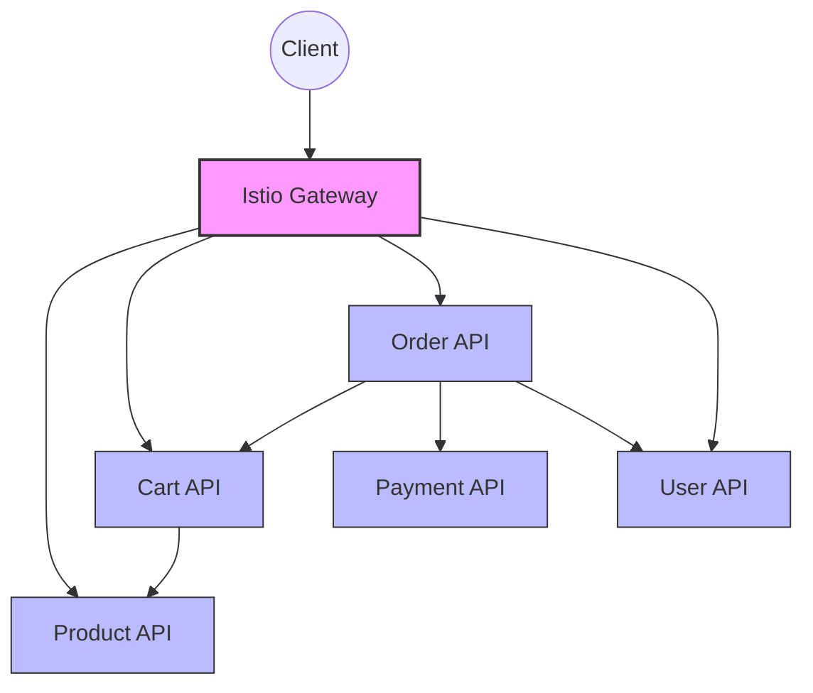

# Detailed Example: Configuring Service Mesh with Istio

This guide provides a detailed, practical example of configuring a service mesh using Istio for a microservices application.

## Overview

We'll configure a service mesh for a sample e-commerce application with the following microservices:
- Product Service
- Cart Service
- Order Service
- User Service
- Payment Service



## Prerequisites

- Kubernetes cluster (v1.19+)
- Istio installed (v1.14+)
- kubectl and istioctl configured

## Step 1: Namespace Setup

Create and label namespaces for our application:

```yaml
# namespaces.yaml
apiVersion: v1
kind: Namespace
metadata:
  name: ecommerce
  labels:
    istio-injection: enabled
---
apiVersion: v1
kind: Namespace
metadata:
  name: ecommerce-staging
  labels:
    istio-injection: enabled
```

Apply the configuration:

```bash
kubectl apply -f namespaces.yaml
```

## Step 2: Deploy Microservices

For this example, we'll deploy simplified versions of our microservices:

```yaml
# product-service.yaml
apiVersion: apps/v1
kind: Deployment
metadata:
  name: product-service
  namespace: ecommerce
spec:
  replicas: 2
  selector:
    matchLabels:
      app: product-service
  template:
    metadata:
      labels:
        app: product-service
        version: v1
    spec:
      containers:
      - name: product-service
        image: example/product-service:1.0
        ports:
        - containerPort: 8080
---
apiVersion: v1
kind: Service
metadata:
  name: product-service
  namespace: ecommerce
spec:
  ports:
  - port: 8080
    name: http
  selector:
    app: product-service
```

Create similar deployment and service definitions for the other microservices. Apply them:

```bash
kubectl apply -f product-service.yaml
kubectl apply -f cart-service.yaml
kubectl apply -f order-service.yaml
kubectl apply -f user-service.yaml
kubectl apply -f payment-service.yaml
```

## Step 3: Configure Istio Gateway

Create an Istio Gateway to expose the application:

```yaml
# gateway.yaml
apiVersion: networking.istio.io/v1alpha3
kind: Gateway
metadata:
  name: ecommerce-gateway
  namespace: ecommerce
spec:
  selector:
    istio: ingressgateway
  servers:
  - port:
      number: 80
      name: http
      protocol: HTTP
    hosts:
    - "ecommerce.example.com"
  - port:
      number: 443
      name: https
      protocol: HTTPS
    hosts:
    - "ecommerce.example.com"
    tls:
      mode: SIMPLE
      credentialName: ecommerce-cert
```

Apply the gateway configuration:

```bash
kubectl apply -f gateway.yaml
```

## Step 4: Configure Virtual Services

Create Virtual Services to route traffic to the appropriate microservices:

```yaml
# virtual-services.yaml
apiVersion: networking.istio.io/v1alpha3
kind: VirtualService
metadata:
  name: ecommerce-vs
  namespace: ecommerce
spec:
  hosts:
  - "ecommerce.example.com"
  gateways:
  - ecommerce-gateway
  http:
  - match:
    - uri:
        prefix: /products
    route:
    - destination:
        host: product-service
        port:
          number: 8080
  - match:
    - uri:
        prefix: /cart
    route:
    - destination:
        host: cart-service
        port:
          number: 8080
  - match:
    - uri:
        prefix: /orders
    route:
    - destination:
        host: order-service
        port:
          number: 8080
  - match:
    - uri:
        prefix: /users
    route:
    - destination:
        host: user-service
        port:
          number: 8080
  - match:
    - uri:
        prefix: /payment
    route:
    - destination:
        host: payment-service
        port:
          number: 8080
```

Apply the Virtual Service configuration:

```bash
kubectl apply -f virtual-services.yaml
```

## Step 5: Configure Destination Rules

Create Destination Rules to define subsets and traffic policies:

```yaml
# destination-rules.yaml
apiVersion: networking.istio.io/v1alpha3
kind: DestinationRule
metadata:
  name: product-service
  namespace: ecommerce
spec:
  host: product-service
  trafficPolicy:
    loadBalancer:
      simple: ROUND_ROBIN
  subsets:
  - name: v1
    labels:
      version: v1
---
apiVersion: networking.istio.io/v1alpha3
kind: DestinationRule
metadata:
  name: cart-service
  namespace: ecommerce
spec:
  host: cart-service
  trafficPolicy:
    loadBalancer:
      simple: ROUND_ROBIN
  subsets:
  - name: v1
    labels:
      version: v1
```

Create similar Destination Rules for the other services and apply them:

```bash
kubectl apply -f destination-rules.yaml
```

## Step 6: Implement Canary Deployment

Let's implement a canary deployment for the product service:

```yaml
# product-service-v2.yaml
apiVersion: apps/v1
kind: Deployment
metadata:
  name: product-service-v2
  namespace: ecommerce
spec:
  replicas: 1
  selector:
    matchLabels:
      app: product-service
      version: v2
  template:
    metadata:
      labels:
        app: product-service
        version: v2
    spec:
      containers:
      - name: product-service
        image: example/product-service:2.0
        ports:
        - containerPort: 8080
```

Apply the v2 deployment:

```bash
kubectl apply -f product-service-v2.yaml
```

Update the Virtual Service to split traffic between v1 and v2:

```yaml
# product-vs-canary.yaml
apiVersion: networking.istio.io/v1alpha3
kind: VirtualService
metadata:
  name: ecommerce-vs
  namespace: ecommerce
spec:
  hosts:
  - "ecommerce.example.com"
  gateways:
  - ecommerce-gateway
  http:
  - match:
    - uri:
        prefix: /products
    route:
    - destination:
        host: product-service
        subset: v1
        port:
          number: 8080
      weight: 80
    - destination:
        host: product-service
        subset: v2
        port:
          number: 8080
      weight: 20
  # Other routes remain unchanged
```

Apply the updated Virtual Service:

```bash
kubectl apply -f product-vs-canary.yaml
```

## Step 7: Configure mTLS

Enable mutual TLS for all services in the mesh:

```yaml
# mtls-policy.yaml
apiVersion: security.istio.io/v1beta1
kind: PeerAuthentication
metadata:
  name: default
  namespace: ecommerce
spec:
  mtls:
    mode: STRICT
```

Apply the mTLS policy:

```bash
kubectl apply -f mtls-policy.yaml
```

## Step 8: Configure Authentication

Set up JWT authentication for the user service:

```yaml
# jwt-auth.yaml
apiVersion: security.istio.io/v1beta1
kind: RequestAuthentication
metadata:
  name: jwt-auth
  namespace: ecommerce
spec:
  selector:
    matchLabels:
      app: user-service
  jwtRules:
  - issuer: "https://auth.example.com"
    jwksUri: "https://auth.example.com/.well-known/jwks.json"
---
apiVersion: security.istio.io/v1beta1
kind: AuthorizationPolicy
metadata:
  name: user-service-policy
  namespace: ecommerce
spec:
  selector:
    matchLabels:
      app: user-service
  rules:
  - from:
    - source:
        requestPrincipals: ["*"]
    to:
    - operation:
        methods: ["GET"]
        paths: ["/users/profile"]
```

Apply the authentication configuration:

```bash
kubectl apply -f jwt-auth.yaml
```

## Step 9: Configure Rate Limiting

Set up rate limiting for the API endpoints:

```yaml
# rate-limit.yaml
apiVersion: networking.istio.io/v1alpha3
kind: EnvoyFilter
metadata:
  name: filter-ratelimit
  namespace: istio-system
spec:
  configPatches:
  - applyTo: HTTP_FILTER
    match:
      context: GATEWAY
      listener:
        filterChain:
          filter:
            name: "envoy.filters.network.http_connection_manager"
    patch:
      operation: INSERT_BEFORE
      value:
        name: envoy.filters.http.ratelimit
        typed_config:
          "@type": type.googleapis.com/envoy.extensions.filters.http.ratelimit.v3.RateLimit
          domain: ecommerce
          rate_limit_service:
            grpc_service:
              envoy_grpc:
                cluster_name: rate_limit_service
              timeout: 10s
            transport_api_version: V3
```

Apply the rate limiting configuration:

```bash
kubectl apply -f rate-limit.yaml
```

## Step 10: Configure Circuit Breaking

Set up circuit breaking for the payment service:

```yaml
# circuit-breaker.yaml
apiVersion: networking.istio.io/v1alpha3
kind: DestinationRule
metadata:
  name: payment-service-cb
  namespace: ecommerce
spec:
  host: payment-service
  trafficPolicy:
    connectionPool:
      tcp:
        maxConnections: 100
      http:
        http1MaxPendingRequests: 10
        maxRequestsPerConnection: 10
    outlierDetection:
      consecutive5xxErrors: 5
      interval: 30s
      baseEjectionTime: 30s
```

Apply the circuit breaker configuration:

```bash
kubectl apply -f circuit-breaker.yaml
```

## Step 11: Configure Fault Injection

Set up fault injection for testing resilience:

```yaml
# fault-injection.yaml
apiVersion: networking.istio.io/v1alpha3
kind: VirtualService
metadata:
  name: payment-service-fault
  namespace: ecommerce
spec:
  hosts:
  - payment-service
  http:
  - match:
    - sourceLabels:
        app: order-service
        version: v2
    fault:
      delay:
        percentage:
          value: 10
        fixedDelay: 5s
      abort:
        percentage:
          value: 5
        httpStatus: 500
    route:
    - destination:
        host: payment-service
```

Apply the fault injection configuration:

```bash
kubectl apply -f fault-injection.yaml
```

## Step 12: Configure Observability

### Tracing

Configure tracing for all services:

```yaml
# tracing.yaml
apiVersion: telemetry.istio.io/v1alpha1
kind: Telemetry
metadata:
  name: tracing-config
  namespace: istio-system
spec:
  tracing:
  - providers:
    - name: zipkin
    randomSamplingPercentage: 100.0
```

Apply the tracing configuration:

```bash
kubectl apply -f tracing.yaml
```

### Metrics

Configure custom metrics collection:

```yaml
# metrics.yaml
apiVersion: telemetry.istio.io/v1alpha1
kind: Telemetry
metadata:
  name: metrics-config
  namespace: istio-system
spec:
  metrics:
  - providers:
    - name: prometheus
    overrides:
    - match:
        metric: REQUEST_COUNT
        mode: CLIENT_AND_SERVER
      tagOverrides:
        response_code:
          value: response.code
```

Apply the metrics configuration:

```bash
kubectl apply -f metrics.yaml
```

## Step 13: Configure Service Entry for External Services

Configure access to external payment processor:

```yaml
# service-entry.yaml
apiVersion: networking.istio.io/v1alpha3
kind: ServiceEntry
metadata:
  name: payment-processor
  namespace: ecommerce
spec:
  hosts:
  - api.paymentprocessor.com
  ports:
  - number: 443
    name: https
    protocol: HTTPS
  resolution: DNS
  location: MESH_EXTERNAL
---
apiVersion: networking.istio.io/v1alpha3
kind: DestinationRule
metadata:
  name: payment-processor
  namespace: ecommerce
spec:
  host: api.paymentprocessor.com
  trafficPolicy:
    tls:
      mode: SIMPLE
```

Apply the service entry configuration:

```bash
kubectl apply -f service-entry.yaml
```

## Step 14: Configure Egress Gateway

Set up an egress gateway for external traffic:

```yaml
# egress-gateway.yaml
apiVersion: networking.istio.io/v1alpha3
kind: Gateway
metadata:
  name: ecommerce-egress
  namespace: ecommerce
spec:
  selector:
    istio: egressgateway
  servers:
  - port:
      number: 443
      name: https
      protocol: HTTPS
    hosts:
    - api.paymentprocessor.com
---
apiVersion: networking.istio.io/v1alpha3
kind: VirtualService
metadata:
  name: payment-processor-egress
  namespace: ecommerce
spec:
  hosts:
  - api.paymentprocessor.com
  gateways:
  - ecommerce-egress
  - mesh
  http:
  - match:
    - gateways:
      - mesh
      port: 443
    route:
    - destination:
        host: istio-egressgateway.istio-system.svc.cluster.local
        port:
          number: 443
  - match:
    - gateways:
      - ecommerce-egress
      port: 443
    route:
    - destination:
        host: api.paymentprocessor.com
        port:
          number: 443
```

Apply the egress gateway configuration:

```bash
kubectl apply -f egress-gateway.yaml
```

## Step 15: Verify the Configuration

Verify that all components are working correctly:

```bash
# Check all Istio resources
kubectl get gateways,virtualservices,destinationrules -n ecommerce

# Check deployments and pods
kubectl get deployments,pods -n ecommerce

# Check Istio proxy status
istioctl proxy-status

# Analyze Istio configuration for issues
istioctl analyze -n ecommerce
```

## Step 16: Monitor the Service Mesh

Access the Istio dashboards:

```bash
# Access Kiali dashboard
istioctl dashboard kiali

# Access Grafana dashboard
istioctl dashboard grafana

# Access Jaeger dashboard
istioctl dashboard jaeger
```

## Complete Configuration Example

The complete service mesh configuration for our e-commerce application includes:

1. **Namespace Configuration**: Isolated environments with automatic sidecar injection
2. **Microservice Deployments**: Containerized services with proper labeling
3. **Gateway Configuration**: Controlled entry points to the mesh
4. **Traffic Management**: Routing, load balancing, and canary deployments
5. **Security**: mTLS, authentication, and authorization policies
6. **Resilience**: Circuit breaking and fault injection
7. **Observability**: Distributed tracing and metrics collection
8. **External Service Integration**: Controlled access to external dependencies

This configuration provides a comprehensive service mesh that enables:

- Secure service-to-service communication
- Advanced traffic management
- Detailed observability
- Resilient application behavior
- Controlled external access

## Conclusion

This example demonstrates a comprehensive Istio service mesh configuration for a microservices-based e-commerce application. The configuration covers all major aspects of service mesh functionality, including traffic management, security, observability, and resilience.

By following this example, you can adapt the configurations to your own microservices architecture and requirements, leveraging Istio's powerful capabilities to build a robust and manageable service mesh.

## Additional Resources

- [Istio Documentation](https://istio.io/latest/docs/)
- [Istio GitHub Repository](https://github.com/istio/istio)
- [Kubernetes Documentation](https://kubernetes.io/docs/home/)
- [Envoy Proxy Documentation](https://www.envoyproxy.io/docs/envoy/latest/)
