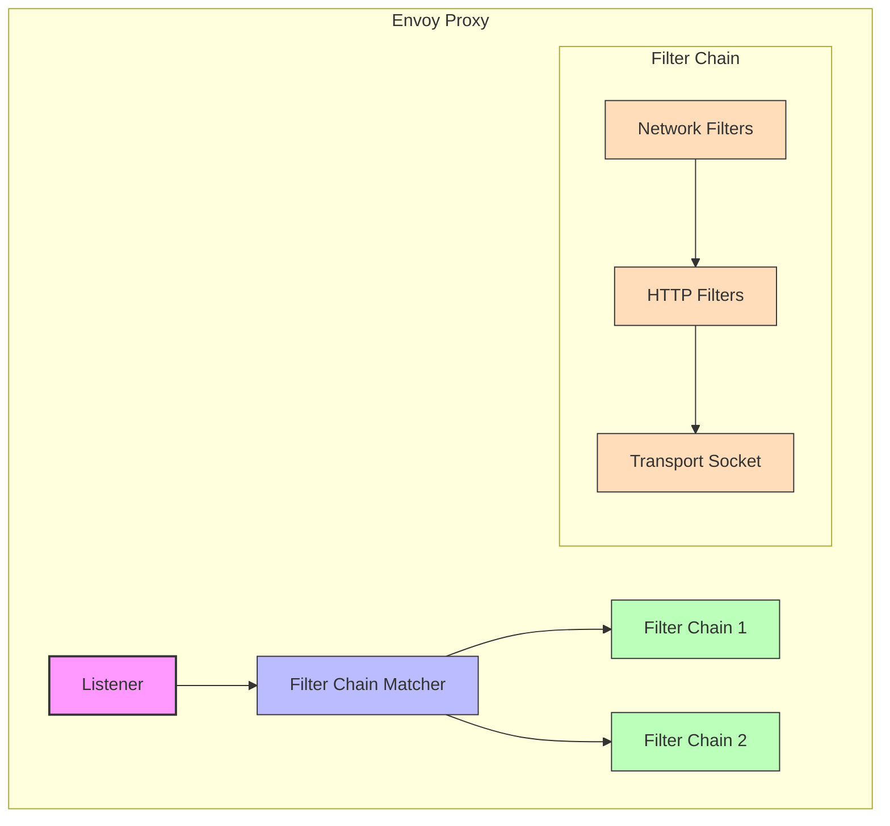

# Inspecting Envoy Proxy Filter Chains in Istio

## Introduction

Envoy proxies in Istio use filter chains to process incoming and outgoing traffic. Understanding how to inspect these filter chains is crucial for troubleshooting, security verification, and understanding how Istio handles traffic. This document explains various methods to examine Envoy proxy filter chains with practical examples.

## What are Envoy Filter Chains?

Filter chains in Envoy are sequences of filters that process network traffic. Each filter chain consists of:

1. **Filter Chain Matcher**: Determines which chain to use based on connection attributes
2. **Network Filters**: Process L3/L4 traffic (TCP/UDP)
3. **HTTP Filters**: Process L7 traffic (HTTP)
4. **Transport Socket**: Handles TLS termination/origination



## Methods to Inspect Filter Chains

### Method 1: Using `istioctl proxy-config`

The `istioctl proxy-config` command is the primary tool for inspecting Envoy configuration in Istio.

#### Viewing Listeners and Filter Chains

```bash
# List all listeners for a pod
istioctl proxy-config listener <pod-name>.<namespace>

# Example
istioctl proxy-config listener productpage-v1-59b8f9778-jxlqn.default
```

Example output:
```
ADDRESS       PORT  MATCH                                                                                         DESTINATION
0.0.0.0       15001 ALL                                                                                           Cluster: Passthrough
0.0.0.0       15006 ALL                                                                                           Route: 15006
10.96.1.10    9080  Trans: raw_buffer; App: HTTP                                                                  Route: default.9080
```

#### Viewing Detailed Listener Configuration

```bash
# Get detailed configuration for a specific listener
istioctl proxy-config listener <pod-name>.<namespace> --port <port> -o json

# Example
istioctl proxy-config listener productpage-v1-59b8f9778-jxlqn.default --port 9080 -o json
```

This will output the complete JSON configuration for the listener, including all filter chains. Look for the `filter_chains` section:

```json
{
  "name": "10.96.1.10_9080",
  "address": {
    "socket_address": {
      "address": "10.96.1.10",
      "port_value": 9080
    }
  },
  "filter_chains": [
    {
      "filter_chain_match": {
        "transport_protocol": "raw_buffer",
        "application_protocols": [
          "http/1.0",
          "http/1.1",
          "h2c"
        ]
      },
      "filters": [
        {
          "name": "envoy.filters.network.http_connection_manager",
          "typed_config": {
            "@type": "type.googleapis.com/envoy.extensions.filters.network.http_connection_manager.v3.HttpConnectionManager",
            "stat_prefix": "outbound_10.96.1.10_9080",
            "http_filters": [
              {
                "name": "envoy.filters.http.router",
                "typed_config": {
                  "@type": "type.googleapis.com/envoy.extensions.filters.http.router.v3.Router"
                }
              }
            ]
          }
        }
      ]
    },
    {
      "filter_chain_match": {
        "transport_protocol": "tls",
        "application_protocols": [
          "http/1.0",
          "http/1.1",
          "h2"
        ]
      },
      "filters": [
        // TLS filter configuration
      ],
      "transport_socket": {
        "name": "envoy.transport_sockets.tls",
        "typed_config": {
          "@type": "type.googleapis.com/envoy.extensions.transport_sockets.tls.v3.UpstreamTlsContext",
          "common_tls_context": {
            "alpn_protocols": [
              "h2",
              "http/1.1"
            ],
            "tls_certificate_sds_secret_configs": [
              {
                "name": "default",
                "sds_config": {
                  "api_config_source": {
                    "api_type": "GRPC",
                    "grpc_services": [
                      {
                        "envoy_grpc": {
                          "cluster_name": "sds-grpc"
                        }
                      }
                    ],
                    "transport_api_version": "V3"
                  },
                  "initial_fetch_timeout": "0s",
                  "resource_api_version": "V3"
                }
              }
            ],
            "validation_context_sds_secret_config": {
              "name": "ROOTCA",
              "sds_config": {
                "api_config_source": {
                  "api_type": "GRPC",
                  "grpc_services": [
                    {
                      "envoy_grpc": {
                        "cluster_name": "sds-grpc"
                      }
                    }
                  ],
                  "transport_api_version": "V3"
                },
                "initial_fetch_timeout": "0s",
                "resource_api_version": "V3"
              }
            }
          }
        }
      }
    }
  ]
}
```

#### Focusing on Specific Filter Chain Elements

```bash
# View HTTP filters for a specific listener
istioctl proxy-config listener <pod-name>.<namespace> --port <port> -o json | jq '.[] | .filter_chains[] | .filters[] | select(.name == "envoy.filters.network.http_connection_manager") | .typed_config.http_filters'

# Example
istioctl proxy-config listener productpage-v1-59b8f9778-jxlqn.default --port 9080 -o json | jq '.[] | .filter_chains[] | .filters[] | select(.name == "envoy.filters.network.http_connection_manager") | .typed_config.http_filters'
```

### Method 2: Using `istioctl dashboard envoy`

You can access the Envoy admin interface directly:

```bash
# Open the Envoy admin interface for a specific pod
istioctl dashboard envoy <pod-name>.<namespace>

# Example
istioctl dashboard envoy productpage-v1-59b8f9778-jxlqn.default
```

This opens a browser window with the Envoy admin interface. Navigate to:
- **Config Dump**: For complete configuration
- **Listeners**: For listener and filter chain information
- **Clusters**: For upstream cluster information

### Method 3: Directly Accessing the Envoy Admin API

You can also port-forward to the Envoy admin port and access it directly:

```bash
# Port forward to the Envoy admin interface
kubectl port-forward <pod-name> -n <namespace> 15000:15000

# Example
kubectl port-forward productpage-v1-59b8f9778-jxlqn -n default 15000:15000
```

Then access the admin interface in your browser at `http://localhost:15000` or use curl:

```bash
# Get the complete configuration dump
curl http://localhost:15000/config_dump > config_dump.json

# Get listener configuration
curl http://localhost:15000/config_dump?resource=listeners > listeners.json
```

### Method 4: Using `kubectl exec`

You can directly execute commands inside the Istio proxy container:

```bash
# Execute a command in the istio-proxy container
kubectl exec <pod-name> -n <namespace> -c istio-proxy -- curl localhost:15000/config_dump

# Example
kubectl exec productpage-v1-59b8f9778-jxlqn -n default -c istio-proxy -- curl localhost:15000/config_dump > config_dump.json
```

Or use the pilot-agent tool:

```bash
# Get Envoy stats related to listeners
kubectl exec <pod-name> -n <namespace> -c istio-proxy -- pilot-agent request GET stats | grep listener

# Example
kubectl exec productpage-v1-59b8f9778-jxlqn -n default -c istio-proxy -- pilot-agent request GET stats | grep listener
```

## Understanding Filter Chain Output

### Key Filter Chain Components to Look For

1. **Filter Chain Match Criteria**:
   - Transport protocol (TLS vs raw_buffer)
   - Application protocols (HTTP/1.1, HTTP/2)
   - Server names (SNI)
   - Source/destination prefixes

2. **Network Filters**:
   - `envoy.filters.network.http_connection_manager`: HTTP traffic handling
   - `envoy.filters.network.tcp_proxy`: TCP traffic handling
   - `envoy.filters.network.rbac`: Network-level RBAC

3. **HTTP Filters**:
   - `envoy.filters.http.router`: Request routing
   - `envoy.filters.http.jwt_authn`: JWT authentication
   - `envoy.filters.http.rbac`: HTTP-level RBAC
   - `envoy.filters.http.cors`: CORS support
   - `envoy.filters.http.fault`: Fault injection

4. **Transport Socket**:
   - TLS configuration
   - Certificate information
   - ALPN protocols

### Example: Identifying mTLS Configuration

To check if a listener is configured for mTLS, look for:

```bash
# Check for TLS filter chains with client certificate requirements
istioctl proxy-config listener <pod-name>.<namespace> --port <port> -o json | jq '.[] | .filter_chains[] | select(.transport_socket.name == "envoy.transport_sockets.tls") | .transport_socket.typed_config.require_client_certificate'

# Example
istioctl proxy-config listener productpage-v1-59b8f9778-jxlqn.default --port 15006 -o json | jq '.[] | .filter_chains[] | select(.transport_socket.name == "envoy.transport_sockets.tls") | .transport_socket.typed_config.require_client_certificate'
```

If the output is `true`, the listener requires client certificates (mTLS).

### Example: Checking for PERMISSIVE Mode

To verify if a service is in PERMISSIVE mode, look for multiple filter chains with different transport protocols:

```bash
# Check for both TLS and raw_buffer filter chains
istioctl proxy-config listener <pod-name>.<namespace> --port <port> -o json | jq '.[] | .filter_chains[] | .filter_chain_match.transport_protocol'

# Example
istioctl proxy-config listener productpage-v1-59b8f9778-jxlqn.default --port 15006 -o json | jq '.[] | .filter_chains[] | .filter_chain_match.transport_protocol'
```

If you see both `"tls"` and `"raw_buffer"` in the output, the service is in PERMISSIVE mode.

## Practical Examples

### Example 1: Verifying mTLS Configuration

To check if a service is configured for mTLS and in which mode:

```bash
# First, get the inbound listener configuration
istioctl proxy-config listener <pod-name>.<namespace> --port 15006 -o json > inbound.json

# Check for filter chains with TLS transport socket
cat inbound.json | jq '.[] | .filter_chains[] | select(.transport_socket.name == "envoy.transport_sockets.tls") | .transport_socket.typed_config.require_client_certificate'

# Check for filter chains with raw_buffer transport protocol
cat inbound.json | jq '.[] | .filter_chains[] | select(.filter_chain_match.transport_protocol == "raw_buffer")'
```

Interpretation:
- If `require_client_certificate` is `true` and there are no `raw_buffer` filter chains: STRICT mode
- If `require_client_certificate` is `true` and there are `raw_buffer` filter chains: PERMISSIVE mode
- If there are only `raw_buffer` filter chains: DISABLE mode

### Example 2: Examining HTTP Filters

To inspect the HTTP filters applied to a service:

```bash
# Get HTTP filters for the inbound listener
istioctl proxy-config listener <pod-name>.<namespace> --port 15006 -o json | jq '.[] | .filter_chains[] | .filters[] | select(.name == "envoy.filters.network.http_connection_manager") | .typed_config.http_filters[] | .name'

# Example
istioctl proxy-config listener productpage-v1-59b8f9778-jxlqn.default --port 15006 -o json | jq '.[] | .filter_chains[] | .filters[] | select(.name == "envoy.filters.network.http_connection_manager") | .typed_config.http_filters[] | .name'
```

This will show all HTTP filters applied to the service, such as:
```
"envoy.filters.http.jwt_authn"
"envoy.filters.http.rbac"
"envoy.filters.http.cors"
"envoy.filters.http.fault"
"envoy.filters.http.router"
```

### Example 3: Analyzing Filter Chain Matching Logic

To understand how Envoy decides which filter chain to use:

```bash
# Get filter chain match criteria
istioctl proxy-config listener <pod-name>.<namespace> --port <port> -o json | jq '.[] | .filter_chains[] | .filter_chain_match'

# Example
istioctl proxy-config listener productpage-v1-59b8f9778-jxlqn.default --port 15006 -o json | jq '.[] | .filter_chains[] | .filter_chain_match'
```

Example output:
```json
{
  "transport_protocol": "tls",
  "application_protocols": [
    "istio",
    "istio-peer-exchange",
    "istio-http/1.0",
    "istio-http/1.1",
    "istio-h2"
  ]
}
{
  "transport_protocol": "raw_buffer"
}
```

This shows that this listener has two filter chains:
1. One for TLS traffic with Istio-specific ALPN protocols
2. One for plain text (raw_buffer) traffic

## Troubleshooting Common Issues

### Issue 1: Missing Filter Chains

If you're expecting certain filter chains (e.g., for mTLS) but don't see them:

1. **Check PeerAuthentication policies**:
   ```bash
   kubectl get peerauthentication --all-namespaces -o yaml
   ```

2. **Verify Istio injection**:
   ```bash
   kubectl get pod <pod-name> -n <namespace> -o yaml | grep istio-proxy
   ```

3. **Check for conflicting DestinationRules**:
   ```bash
   kubectl get destinationrules --all-namespaces -o yaml
   ```

### Issue 2: Filter Chain Selection Problems

If traffic is being processed by the wrong filter chain:

1. **Examine Envoy logs for filter chain selection**:
   ```bash
   kubectl logs <pod-name> -n <namespace> -c istio-proxy | grep "filter chain"
   ```

2. **Check client TLS settings**:
   ```bash
   istioctl proxy-config cluster <client-pod>.<namespace> --fqdn <service-name>.<service-namespace>.svc.cluster.local -o json | jq '.[].transport_socket'
   ```

### Issue 3: Custom Filters Not Applied

If custom EnvoyFilters are not being applied:

1. **Verify EnvoyFilter resources**:
   ```bash
   kubectl get envoyfilters --all-namespaces
   ```

2. **Check EnvoyFilter match criteria**:
   ```bash
   kubectl get envoyfilter <filter-name> -n <namespace> -o yaml
   ```

3. **Look for warnings in istiod logs**:
   ```bash
   kubectl logs -n istio-system -l app=istiod | grep -i "envoyfilter\|filter"
   ```

## Best Practices

1. **Use `istioctl analyze` first**:
   ```bash
   istioctl analyze -n <namespace>
   ```
   This can detect common configuration issues before diving into filter chains.

2. **Compare configurations**:
   Compare filter chains between working and non-working services to identify differences.

3. **Start with high-level commands**:
   Begin with simple `istioctl proxy-config` commands before diving into detailed JSON output.

4. **Use jq for parsing**:
   Install and use `jq` for easier parsing of JSON output.

5. **Check istiod logs**:
   If proxy configurations look unexpected, check istiod logs for configuration distribution issues.

## Conclusion

Understanding Envoy proxy filter chains is essential for troubleshooting and verifying Istio's traffic management, security, and other features. The tools and methods described in this document allow you to inspect filter chains at various levels of detail, from high-level overviews to specific configuration elements.

By mastering these inspection techniques, you can effectively diagnose issues, verify security configurations, and understand how Istio is processing traffic in your service mesh.

## Additional Resources

- [Istio Debugging Envoy Documentation](https://istio.io/latest/docs/ops/diagnostic-tools/proxy-cmd/)
- [Envoy Listener Configuration Reference](https://www.envoyproxy.io/docs/envoy/latest/api-v3/config/listener/v3/listener.proto)
- [Istio EnvoyFilter API Reference](https://istio.io/latest/docs/reference/config/networking/envoy-filter/)
- [Envoy Admin Interface Documentation](https://www.envoyproxy.io/docs/envoy/latest/operations/admin)
