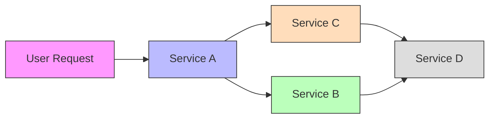
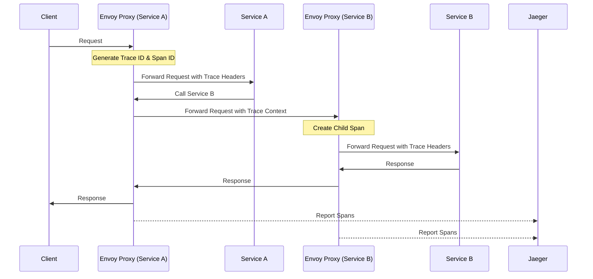

# Distributed Tracing with Jaeger in Istio Service Mesh

This guide explains how to deploy, configure, and use Jaeger distributed tracing with Istio service mesh in a Kubernetes environment.

## Introduction to Distributed Tracing

Distributed tracing is a method used to profile and monitor applications, especially those built using a microservices architecture. It helps track a request as it travels through different services, providing visibility into:

- Request flow across services
- Latency at each step
- Errors and their origins
- Dependencies between services



## How Istio Integrates with Jaeger

Istio automatically instruments all service mesh traffic to generate distributed traces without requiring application code changes. Here's how it works:



## Prerequisites

Before deploying Jaeger, ensure you have:

1. A Kubernetes cluster with Istio installed
2. Helm 3.x installed
3. `kubectl` configured to access your cluster
4. Cluster administrator access

## Deployment Options

Jaeger offers several deployment strategies:

1. **All-in-One** (recommended for development/testing)
   - Single deployment with all components
   - In-memory storage (data lost on restart)
   - Simplest to deploy

2. **Production** (recommended for production environments)
   - Separate deployments for agent, collector, query service
   - Persistent storage (Elasticsearch/Cassandra)
   - Scalable and fault-tolerant

## Installing Jaeger with Helm

### Step 1: Add the Jaeger Helm Repository

```bash
helm repo add jaegertracing https://jaegertracing.github.io/helm-charts
helm repo update
```

### Step 2: Install Jaeger

For development/testing (All-in-One):

```bash
helm install jaeger ./install/jaeger \
  --namespace istio-system \
  --create-namespace
```

For production with Elasticsearch:

```bash
# First, deploy Elasticsearch (or use existing instance)
helm repo add elastic https://helm.elastic.co
helm install elasticsearch elastic/elasticsearch \
  --namespace istio-system \
  --set replicas=1 \
  --set minimumMasterNodes=1 \
  --set resources.requests.cpu=100m \
  --set resources.requests.memory=1Gi \
  --set resources.limits.memory=2Gi

# Then deploy Jaeger with Elasticsearch storage
helm install jaeger ./install/jaeger \
  --namespace istio-system \
  --set jaeger.strategy=production \
  --set jaeger.storage.type=elasticsearch \
  --set jaeger.storage.elasticsearch.host=elasticsearch-master
```

## Configuring Istio for Distributed Tracing

### Step 1: Enable Tracing in Istio

Ensure your Istio installation has tracing enabled. If installing with IstioOperator, use:

```yaml
apiVersion: install.istio.io/v1alpha1
kind: IstioOperator
spec:
  meshConfig:
    enableTracing: true
    defaultConfig:
      tracing:
        sampling: 100.0  # Sample 100% of traces (reduce for production)
        zipkin:
          address: jaeger-collector.istio-system:9411
```

For existing installations, patch the configmap:

```bash
kubectl -n istio-system patch configmap istio -p '{"data":{"mesh":"{\"enableTracing\": true, \"defaultConfig\": {\"tracing\": {\"sampling\": 100.0, \"zipkin\": {\"address\": \"jaeger-collector.istio-system:9411\"}}}}"}}' --type=merge
```

### Step 2: Propagate Trace Headers in Your Applications

For complete traces, ensure your applications propagate these headers:

- `x-request-id`
- `x-b3-traceid`
- `x-b3-spanid`
- `x-b3-parentspanid`
- `x-b3-sampled`
- `x-b3-flags`
- `b3`

Istio's Envoy proxies handle this automatically for HTTP headers, but your application must forward these headers when making outbound requests.

## Accessing the Jaeger UI

### Method 1: Port Forwarding

```bash
kubectl port-forward svc/jaeger-query -n istio-system 16686:16686
```

Then access: http://localhost:16686

### Method 2: Via Ingress

If you've enabled Ingress in the Jaeger configuration, access it through your Ingress controller's IP or hostname:

```bash
# Get Ingress IP/hostname
kubectl get ingress -n istio-system jaeger-query
```

## Understanding the Jaeger UI

The Jaeger UI provides several views:

1. **Search**: Find traces by service, operation, tags, duration, etc.
2. **Trace View**: Visualize the complete request flow with timing
3. **Compare View**: Compare multiple traces side by side
4. **System Architecture**: View dependencies between services

### Key UI Elements


1. **Service Dropdown**: Select the service to trace
2. **Operation Dropdown**: Filter by operation name
3. **Tags Search**: Filter traces by custom tags
4. **Min/Max Duration**: Filter by request duration
5. **Limit Results**: Control number of traces displayed
6. **Trace Timeline**: Visual representation of spans
7. **Span Detail**: Metadata for each span

## Generating Sample Traces

To test your tracing setup:

```bash
# Deploy the Bookinfo sample application
kubectl apply -f samples/bookinfo/platform/kube/bookinfo.yaml

# Generate traffic
for i in $(seq 1 100); do
  curl -s -o /dev/null "http://$GATEWAY_URL/productpage"
  sleep 0.5
done
```

## Integrating Jaeger with Kiali

To view traces directly from Kiali:

1. Configure Kiali to use Jaeger:

```yaml
external_services:
  tracing:
    enabled: true
    in_cluster_url: "http://jaeger-query.istio-system:16686"
```

2. In Kiali, navigate to a service or workload
3. Click on "Traces" tab to view recent traces

## Sampling Strategies

For production environments, sampling all traces can be resource-intensive. Configure sampling rates:

```yaml
sampling:
  options:
    default_strategy:
      type: probabilistic
      param: 0.1  # Sample 10% of traces
```

Common sampling strategies:
- **Probabilistic**: Random sampling based on percentage
- **Rate Limiting**: Fixed number of traces per second
- **Adaptive**: Dynamic sampling based on traffic patterns

## Advanced Configuration

### Custom Span Tags

Add custom tags to spans for better filtering:

```yaml
pilot:
  traceSampling: 50.0
  env:
    PILOT_TRACE_SAMPLING: 50.0
    PILOT_TRACE_TAGS: "cluster=my-cluster,region=us-west"
```

### Trace Context Propagation

Istio supports multiple trace context propagation formats:
- B3 (Zipkin)
- W3C Trace Context
- Datadog
- Jaeger

Configure in your IstioOperator:

```yaml
meshConfig:
  defaultConfig:
    tracing:
      zipkin:
        address: jaeger-collector.istio-system:9411
      sampling: 100.0
      custom_tags:
        environment:
          literal:
            value: "production"
```

## Troubleshooting

### No Traces Appearing

1. **Check Sampling Rate**: Ensure sampling is not set too low
   ```bash
   kubectl -n istio-system get cm istio -o jsonpath='{.data.mesh}' | grep sampling
   ```

2. **Verify Jaeger Collector is Running**:
   ```bash
   kubectl get pods -n istio-system -l app=jaeger
   ```

3. **Check Istio is Configured for Tracing**:
   ```bash
   kubectl -n istio-system get cm istio -o jsonpath='{.data.mesh}' | grep enableTracing
   ```

4. **Verify Trace Headers are Propagated**:
   ```bash
   # Use istioctl to check proxy config
   istioctl proxy-config bootstrap <pod-name>.<namespace>
   ```

### Incomplete Traces

1. **Check Header Propagation**: Ensure all services forward trace headers
2. **Verify Service Connectivity**: Check if all services can reach Jaeger collector
3. **Inspect Envoy Access Logs**: Look for trace ID in Envoy logs

## Best Practices

1. **Sampling Strategy**: Use appropriate sampling rates for your traffic volume
2. **Storage Scaling**: For production, ensure adequate storage resources
3. **Retention Period**: Configure appropriate trace retention based on needs
4. **Custom Tags**: Add meaningful tags to improve trace filtering
5. **Security**: Consider securing Jaeger UI with authentication

## Performance Considerations

1. **Resource Allocation**: Allocate sufficient resources to Jaeger components
2. **Sampling Rate**: Adjust based on traffic volume and resource constraints
3. **Storage Type**: In-memory for testing, Elasticsearch/Cassandra for production
4. **Batch Processing**: Configure appropriate batch sizes for span reporting

## Conclusion

Distributed tracing with Jaeger provides invaluable insights into your service mesh. By following this guide, you've set up a powerful observability tool that helps you understand request flows, identify bottlenecks, and troubleshoot issues across your microservices architecture.

## Additional Resources

- [Jaeger Documentation](https://www.jaegertracing.io/docs/latest/)
- [Istio Distributed Tracing](https://istio.io/latest/docs/tasks/observability/distributed-tracing/)
- [OpenTelemetry Integration](https://opentelemetry.io/docs/instrumentation/js/getting-started/nodejs/)
- [Jaeger Operator](https://github.com/jaegertracing/jaeger-operator)
