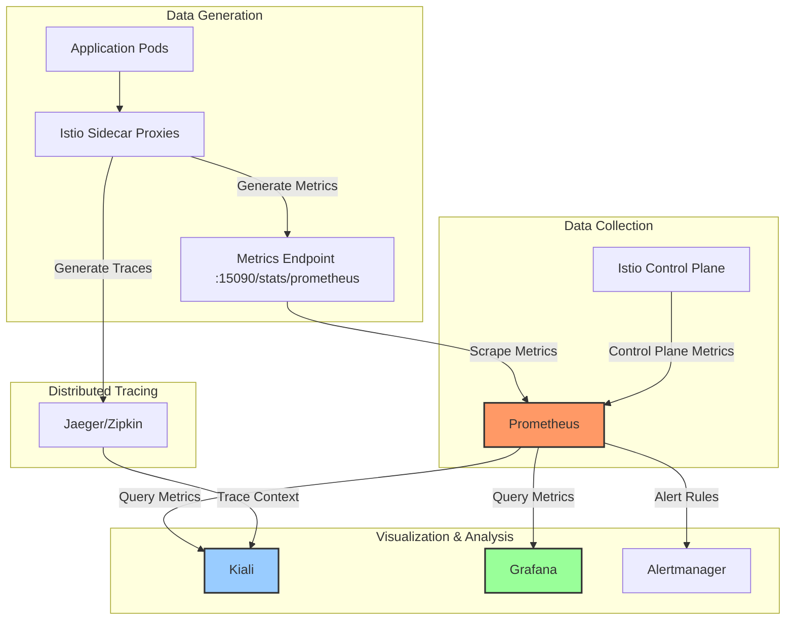
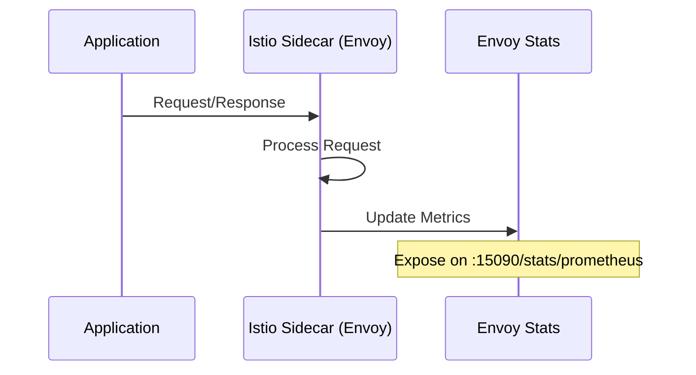
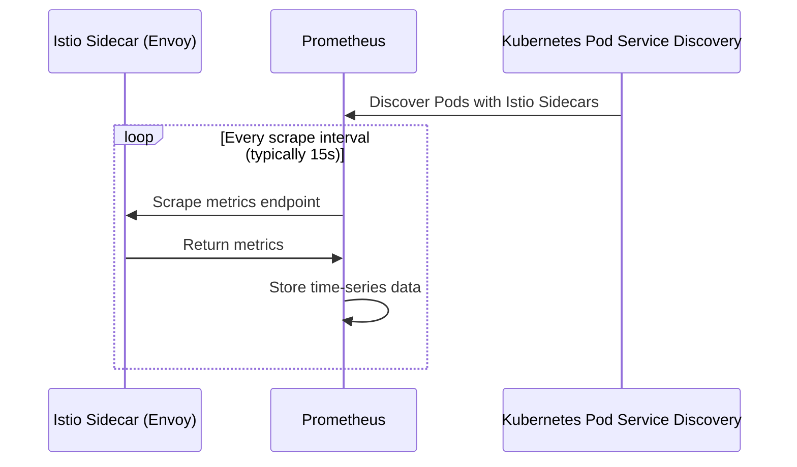
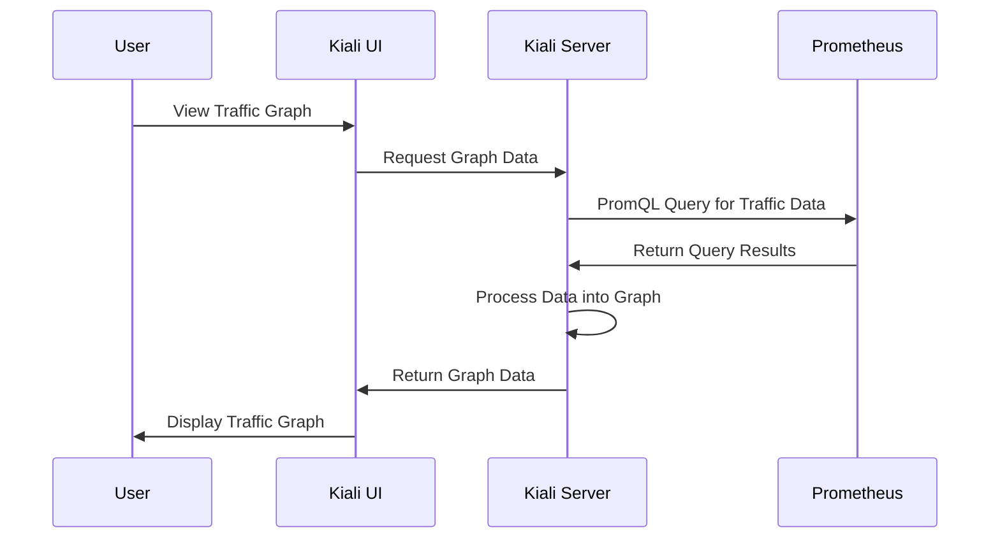
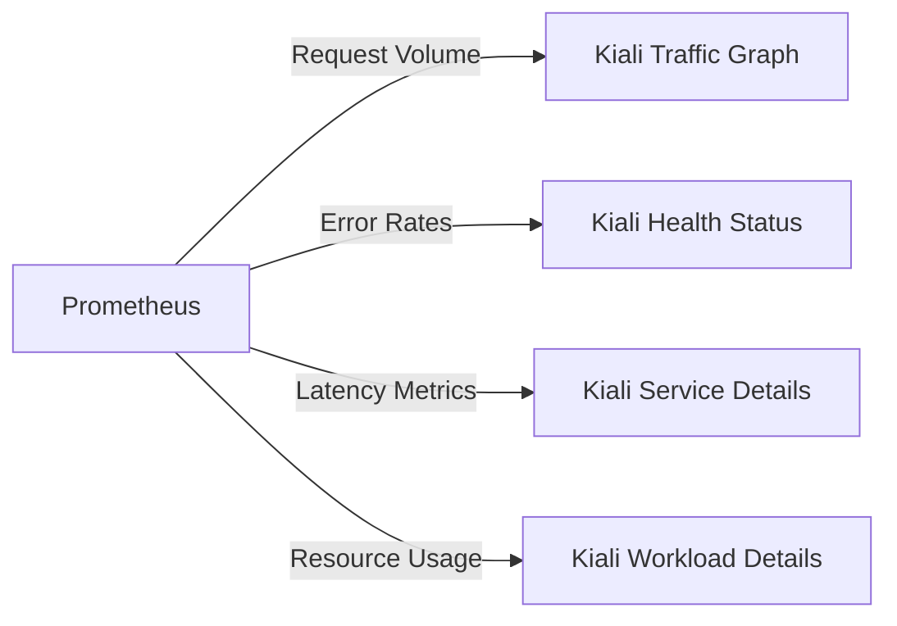

# Understanding Prometheus in Istio Service Mesh Observability

## Introduction

Prometheus is a critical component in the Istio service mesh ecosystem, serving as the foundation for monitoring, alerting, and visualization. This document explains why Prometheus is essential, how it integrates with Istio and other observability tools, and the data flow between components.

## Why Prometheus is Essential for Istio

Prometheus provides several key capabilities that make it indispensable for Istio service mesh deployments:

1. **Metrics Collection**: Captures detailed telemetry data from Istio's Envoy proxies
2. **Time-Series Database**: Stores historical performance data for trend analysis
3. **Query Language (PromQL)**: Enables complex queries and aggregations of metrics
4. **Service Discovery**: Automatically discovers and monitors new services
5. **Data Source for Visualization**: Powers dashboards in Kiali, Grafana, and other tools

Without Prometheus, most of Istio's observability features would be unavailable, including traffic visualization, performance monitoring, and anomaly detection.

## The Observability Stack Architecture



## Detailed Data Flow

### 1. Metrics Generation



When traffic flows through the service mesh:
1. The application sends/receives requests
2. The Envoy sidecar proxy intercepts the traffic
3. Envoy processes the request and updates internal metrics counters
4. Metrics are exposed on a dedicated port (15090) in Prometheus format

### 2. Metrics Collection



Prometheus collects metrics through:
1. Service discovery to find all pods with Istio sidecars
2. Regular scraping of the metrics endpoints (typically every 15 seconds)
3. Storage of the time-series data with timestamps
4. Application of recording rules for pre-computed aggregations

### 3. Visualization in Kiali



When you view the traffic graph in Kiali:
1. Kiali server queries Prometheus for service-to-service communication metrics
2. Prometheus returns the raw metrics data
3. Kiali processes this data to build a visual representation of the service mesh
4. The graph shows nodes (services) and edges (requests between services)
5. Additional metrics like error rates and latencies are overlaid on the graph

## Key Prometheus Metrics in Istio

Istio generates hundreds of metrics, but these are particularly important:

### Traffic Metrics
- `istio_requests_total`: Total count of requests
- `istio_request_duration_milliseconds`: Request duration
- `istio_request_bytes`: Size of requests
- `istio_response_bytes`: Size of responses

### Error Metrics
- `istio_requests_total{response_code=~"5.*"}`: 5xx errors
- `istio_requests_total{response_code=~"4.*"}`: 4xx errors

### TCP Metrics
- `istio_tcp_sent_bytes_total`: TCP bytes sent
- `istio_tcp_received_bytes_total`: TCP bytes received
- `istio_tcp_connections_opened_total`: TCP connections opened
- `istio_tcp_connections_closed_total`: TCP connections closed

## How Different Tools Use Prometheus Data

### Kiali
- **Traffic Graph**: Shows service-to-service communication
- **Health Status**: Calculates health based on error rates
- **Metrics Tabs**: Displays charts of service performance
- **Validation**: Validates configurations against actual behavior



### Grafana
- **Istio Mesh Dashboard**: Overall service mesh health
- **Istio Service Dashboard**: Detailed service metrics
- **Istio Workload Dashboard**: Pod-level metrics
- **Istio Performance Dashboard**: Control plane performance

### Alertmanager
- **SLO Violations**: Alerts on service level objective breaches
- **Error Spikes**: Detects unusual error rates
- **Latency Issues**: Alerts on slow response times

## Setting Up Prometheus for Istio

### 1. Installation Options

You can install Prometheus for Istio in several ways:

```bash
# Using Istio's built-in addons
kubectl apply -f istio-1.18.0/samples/addons/prometheus.yaml

# Using Helm
helm install prometheus prometheus-community/prometheus \
  --namespace monitoring \
  --set server.persistentVolume.enabled=false
```

### 2. Configuration for Istio

Prometheus needs specific configuration to scrape Istio metrics:

```yaml
scrape_configs:
  - job_name: 'istio-mesh'
    kubernetes_sd_configs:
    - role: pod
    relabel_configs:
    - source_labels: [__meta_kubernetes_pod_annotation_prometheus_io_scrape]
      action: keep
      regex: true
    - source_labels: [__meta_kubernetes_pod_annotation_sidecar_istio_io_status]
      action: keep
```

### 3. Connecting Kiali to Prometheus

In Kiali's configuration, specify the Prometheus URL:

```yaml
external_services:
  prometheus:
    url: "http://prometheus-server.monitoring:9090"
```

## Troubleshooting Prometheus Integration

### Common Issues

1. **Kiali Can't Connect to Prometheus**
   - Verify the Prometheus service name and namespace
   - Check network policies that might block access
   - Ensure Prometheus is running: `kubectl get pods -n monitoring`

2. **Missing Metrics in Kiali**
   - Verify Istio sidecars are injected properly
   - Check if Prometheus is scraping the pods: `kubectl port-forward svc/prometheus-server 9090:9090` and check targets
   - Look for scrape errors in Prometheus logs

3. **Empty Traffic Graph**
   - Generate some traffic between services
   - Check if metrics are present in Prometheus directly
   - Verify time range selection in Kiali

### Diagnostic Commands

```bash
# Check if Prometheus is running
kubectl get pods -n monitoring | grep prometheus

# Check Prometheus targets
kubectl port-forward svc/prometheus-server -n monitoring 9090:9090
# Then open http://localhost:9090/targets in your browser

# Check if Istio metrics are being collected
kubectl port-forward svc/prometheus-server -n monitoring 9090:9090
# Then open http://localhost:9090/graph and query: istio_requests_total

# Check Kiali logs for Prometheus connection issues
kubectl logs -n istio-system -l app=kiali
```

## Best Practices

1. **Resource Allocation**
   - Allocate sufficient resources to Prometheus based on cluster size
   - Consider using persistent storage for production deployments

2. **Retention Settings**
   - Configure appropriate data retention based on your needs
   - Use recording rules for frequently accessed queries

3. **Security**
   - Use network policies to restrict access to Prometheus
   - Consider enabling authentication for Prometheus UI

4. **Scalability**
   - For large clusters, consider using Prometheus Operator and sharding
   - Implement recording rules to improve query performance

## Advanced Configurations

### High Availability Prometheus

For production environments, consider a high-availability setup:

```yaml
prometheus:
  replicaCount: 2
  statefulSet:
    enabled: true
  persistentVolume:
    enabled: true
    size: 50Gi
```

### Custom Metrics

To add custom metrics from your applications:

1. Instrument your application with Prometheus client libraries
2. Expose a metrics endpoint (typically `/metrics`)
3. Add annotations to your pods:
   ```yaml
   annotations:
     prometheus.io/scrape: "true"
     prometheus.io/port: "8080"
     prometheus.io/path: "/metrics"
   ```

## Conclusion

Prometheus is not just an optional component but a fundamental requirement for effective Istio service mesh observability. It provides the data foundation that powers visualization tools like Kiali and Grafana, enabling operators to understand, monitor, and troubleshoot their service mesh.

By understanding the data flow from Istio sidecars through Prometheus to visualization tools, you can better configure, troubleshoot, and optimize your observability stack.

## Additional Resources

- [Istio Observability Documentation](https://istio.io/latest/docs/tasks/observability/)
- [Prometheus Documentation](https://prometheus.io/docs/introduction/overview/)
- [Kiali Documentation](https://kiali.io/docs/)
- [Grafana Documentation](https://grafana.com/docs/)
