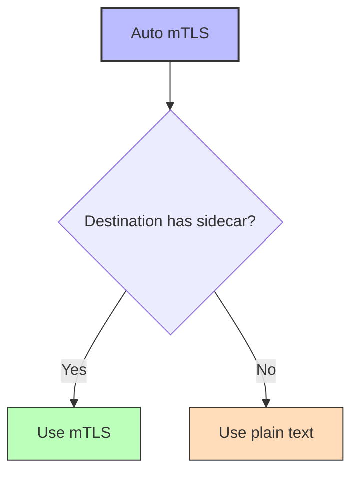
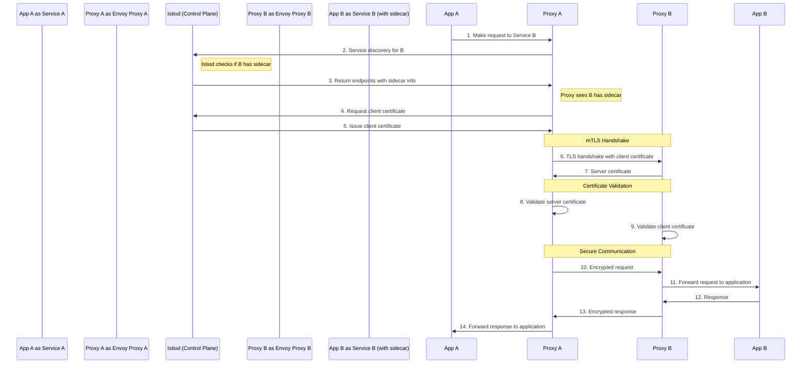
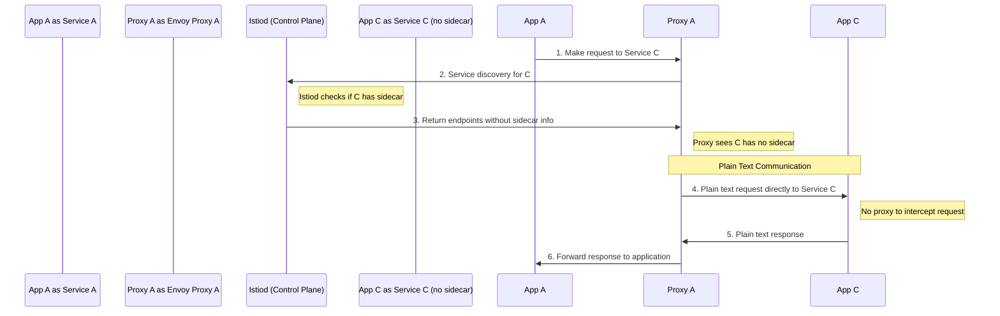

# Understanding Auto mTLS with Mixed Traffic in Istio

## What is Auto mTLS?

Auto mTLS is an Istio feature that automatically determines whether to use mTLS or plain text when a service communicates with another service. This feature works alongside PERMISSIVE mode to create a seamless experience in environments with both mesh and non-mesh services.



## How Auto mTLS Works

When auto mTLS is enabled (which it is by default in recent Istio versions):

1. **Service Discovery Enhancement**: Istio enhances service discovery to include information about whether a service has a sidecar proxy
2. **Dynamic Protocol Selection**: The client-side proxy automatically selects mTLS or plain text based on this information
3. **Transparent to Applications**: Applications don't need to be aware of which protocol is being used
4. **No Manual Configuration**: You don't need to manually configure DestinationRules for each service

## Detailed Request Flow with Auto mTLS

Let's break down what happens in the mixed traffic scenario with auto mTLS in more detail:

### When Communicating with a Mesh Service (with Sidecar)



**Key Points:**
- Istiod provides information about whether Service B has a sidecar
- Proxy A automatically initiates mTLS because it knows Service B has a sidecar
- The entire mTLS handshake process happens automatically
- All traffic between proxies is encrypted and authenticated

### When Communicating with a Non-Mesh Service (without Sidecar)



**Key Points:**
- Istiod indicates that Service C does not have a sidecar
- Proxy A automatically uses plain text communication
- No TLS handshake is attempted
- Traffic is sent directly to the application, not to a proxy

## How Istio Detects Sidecars

Istio's control plane (Istiod) keeps track of which services have sidecars through several mechanisms:

1. **Sidecar Injection Labels**: Namespaces or pods labeled with `istio-injection=enabled`
2. **Proxy Registration**: When a sidecar starts, it registers with the control plane
3. **Endpoint Discovery**: The control plane monitors endpoints and their sidecar status
4. **Workload Entry Resources**: Manually configured workloads can specify sidecar status

This information is then used by the auto mTLS feature to make intelligent decisions about which protocol to use.

## Implementation Details

### Control Plane Configuration

Auto mTLS is enabled by default in recent Istio versions, but can be explicitly configured:

```yaml
apiVersion: install.istio.io/v1alpha1
kind: IstioOperator
spec:
  meshConfig:
    enableAutoMtls: true  # Default is true in recent versions
```

### Proxy Configuration

When auto mTLS is enabled, Istio configures the Envoy proxy with:

1. **Cluster TLS Settings**: Dynamic TLS settings based on endpoint metadata
2. **TLS Context**: Configuration for both mTLS and plain text
3. **Fallback Behavior**: Rules for what to do if TLS detection fails

### Destination Rule Interaction

Auto mTLS works alongside DestinationRules:

- If a DestinationRule explicitly configures TLS settings, it overrides auto mTLS
- If no DestinationRule exists, auto mTLS makes the decision based on sidecar presence
- You can still use DestinationRules for other traffic policies without affecting auto mTLS

## Practical Example

Consider a Kubernetes cluster with the following services:

- **product-service**: Has Istio sidecar (in the mesh)
- **inventory-service**: Has Istio sidecar (in the mesh)
- **legacy-db**: No Istio sidecar (outside the mesh)

With auto mTLS enabled and PERMISSIVE mode configured:

1. When **product-service** calls **inventory-service**:
   - Auto mTLS detects that inventory-service has a sidecar
   - Communication automatically uses mTLS
   - Traffic is encrypted and authenticated

2. When **product-service** calls **legacy-db**:
   - Auto mTLS detects that legacy-db has no sidecar
   - Communication automatically uses plain text
   - No TLS handshake is attempted

All of this happens without any manual configuration of DestinationRules or explicit TLS settings.

## Benefits of Auto mTLS with PERMISSIVE Mode

The combination of auto mTLS and PERMISSIVE mode provides several benefits:

1. **Zero Configuration Security**: Services get the highest level of security possible without manual configuration
2. **Seamless Integration**: Mesh services can communicate with both mesh and non-mesh services
3. **Gradual Migration**: You can gradually add services to the mesh without breaking communication
4. **Operational Simplicity**: Reduces the need for explicit TLS configuration
5. **Optimal Security**: Each connection uses the highest security level supported by both endpoints

## Monitoring Auto mTLS Behavior

You can monitor how auto mTLS is behaving using several tools:

### Istio CLI

```bash
# Check if traffic to a service is using mTLS
istioctl x describe service <service-name>.<namespace>

# Example output:
# Service: product-service.default
# TLS Mode: PERMISSIVE
# Clients: inventory-service.default (mTLS), legacy-db.default (PLAINTEXT)
```

### Prometheus Metrics

```bash
# Query to show ratio of mTLS vs plain text traffic
sum(istio_requests_total{connection_security_policy="mutual_tls"}) by (destination_service) / 
sum(istio_requests_total) by (destination_service)
```

### Kiali Visualization

Kiali provides visual indicators for which connections are using mTLS:
- Lock icons show secure connections
- Different colors indicate security status
- Security view shows overall mesh security status

## Common Issues and Troubleshooting

### Issue 1: Expected mTLS but Getting Plain Text

If you expect a connection to use mTLS but it's using plain text:

1. **Check Sidecar Status**: Verify both services have sidecars
   ```bash
   kubectl get pods -n <namespace> -o jsonpath='{.items[*].metadata.name}'
   kubectl get pods -n <namespace> -o jsonpath='{.items[*].spec.containers[*].name}'
   ```

2. **Check PeerAuthentication**: Ensure no policy is forcing DISABLE mode
   ```bash
   kubectl get peerauthentication --all-namespaces
   ```

3. **Check DestinationRules**: Look for rules that might override auto mTLS
   ```bash
   kubectl get destinationrules --all-namespaces
   ```

### Issue 2: Connection Failures

If services can't connect:

1. **Check Proxy Logs**: Look for TLS handshake failures
   ```bash
   kubectl logs -n <namespace> <pod-name> -c istio-proxy
   ```

2. **Verify Certificate Validity**: Check certificate status
   ```bash
   istioctl proxy-config secret <pod-name>.<namespace>
   ```

3. **Test with Explicit Configuration**: Try setting explicit TLS mode
   ```yaml
   apiVersion: networking.istio.io/v1alpha3
   kind: DestinationRule
   metadata:
     name: test-tls
   spec:
     host: <service-name>
     trafficPolicy:
       tls:
         mode: ISTIO_MUTUAL  # Force mTLS
   ```

## Best Practices for Auto mTLS

1. **Keep It Enabled**: Leave auto mTLS enabled for simplicity
2. **Use with PERMISSIVE Mode**: During migration, combine with PERMISSIVE mode
3. **Monitor Traffic Security**: Regularly check which connections are using mTLS
4. **Avoid Conflicting Rules**: Be careful with explicit DestinationRules that might override auto mTLS
5. **Document Non-Mesh Services**: Keep track of services that don't have sidecars
6. **Plan for Full Coverage**: Work toward having all services in the mesh for maximum security

## Advanced Scenarios

### Auto mTLS with External Services

When communicating with external services:

1. **ServiceEntry with TLS Origination**: For external services that support TLS
   ```yaml
   apiVersion: networking.istio.io/v1alpha3
   kind: ServiceEntry
   metadata:
     name: external-api
   spec:
     hosts:
     - api.external-service.com
     ports:
     - number: 443
       name: https
       protocol: HTTPS
     resolution: DNS
     location: MESH_EXTERNAL
   ---
   apiVersion: networking.istio.io/v1alpha3
   kind: DestinationRule
   metadata:
     name: external-api-tls
   spec:
     host: api.external-service.com
     trafficPolicy:
       tls:
         mode: SIMPLE  # Use one-way TLS
   ```

2. **Egress Gateway**: For controlled external access
   ```yaml
   apiVersion: networking.istio.io/v1alpha3
   kind: Gateway
   metadata:
     name: istio-egressgateway
   spec:
     selector:
       istio: egressgateway
     servers:
     - port:
         number: 443
         name: https
         protocol: HTTPS
       hosts:
       - api.external-service.com
   ```

### Auto mTLS with Multi-Cluster Mesh

In a multi-cluster setup:

1. **Cross-Cluster Service Discovery**: Istiod shares service and sidecar information across clusters
2. **Certificate Trust**: Clusters share a common root certificate
3. **Automatic mTLS**: Services in different clusters communicate using mTLS automatically
4. **Transparent to Applications**: Applications are unaware of the cluster boundaries

## Conclusion

Auto mTLS in Istio provides a powerful way to automatically secure service-to-service communication without manual configuration. When combined with PERMISSIVE mode, it enables seamless integration of both mesh and non-mesh services, making it ideal for gradual migration scenarios and mixed environments.

By understanding how auto mTLS works with mixed traffic, you can leverage this feature to achieve optimal security with minimal operational overhead, while maintaining compatibility with services that cannot yet support mTLS.

## Additional Resources

- [Istio Auto mTLS Documentation](https://istio.io/latest/docs/tasks/security/authentication/authn-policy/#auto-mutual-tls)
- [Mutual TLS Migration](https://istio.io/latest/docs/tasks/security/authentication/mtls-migration/)
- [PeerAuthentication API Reference](https://istio.io/latest/docs/reference/config/security/peer_authentication/)
- [DestinationRule API Reference](https://istio.io/latest/docs/reference/config/networking/destination-rule/)
