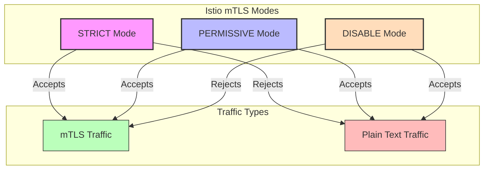
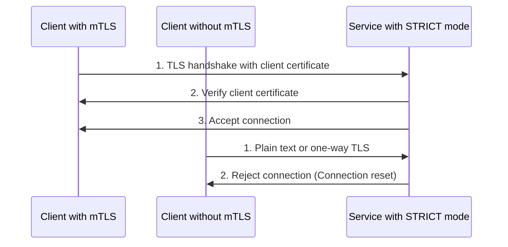
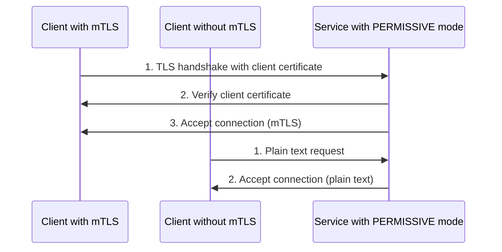
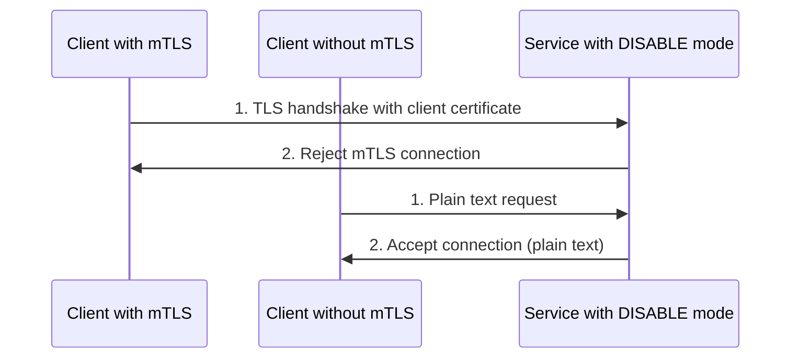
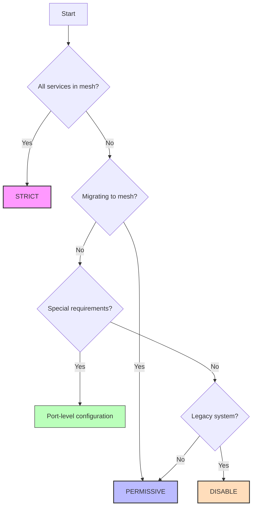
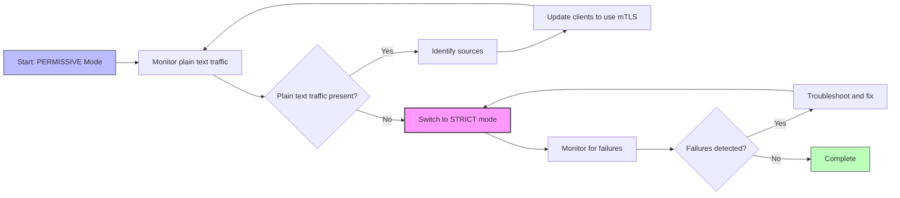
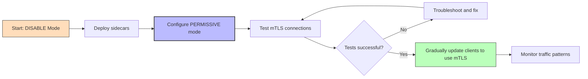

# Understanding Istio mTLS Modes in Detail

## Introduction

Mutual TLS (mTLS) is a key security feature in Istio that provides authentication and encryption for service-to-service communication. This document provides an in-depth explanation of the different mTLS modes available in Istio, their behavior, use cases, and implementation details.

## Overview of mTLS Modes

Istio supports three mTLS modes that control how services communicate within the mesh:



## STRICT Mode

### Definition

In STRICT mode, a service only accepts mutual TLS connections. All plain text connections are rejected.

### Detailed Behavior



When a service is configured with STRICT mode:

1. **Incoming Connections**:
   - The service's proxy (Envoy) requires a valid client certificate for all incoming connections
   - Connections without a valid client certificate are immediately rejected
   - The client receives a connection reset or TLS handshake failure

2. **Outgoing Connections**:
   - The service's proxy always attempts to establish mTLS connections to other services
   - If the target service doesn't support mTLS, the connection fails

3. **Certificate Validation**:
   - The proxy validates that the client certificate was issued by a trusted Certificate Authority (CA)
   - The proxy verifies the identity (SPIFFE ID) in the certificate matches the expected service identity
   - Certificate revocation status is checked if configured

### Implementation Details

In STRICT mode, Istio configures the Envoy proxy with the following settings:

```yaml
# Simplified Envoy configuration (not directly user-configurable)
listener:
  filter_chains:
  - transport_socket:
      name: envoy.transport_sockets.tls
      typed_config:
        "@type": type.googleapis.com/envoy.extensions.transport_sockets.tls.v3.DownstreamTlsContext
        require_client_certificate: true
        validation_context:
          trusted_ca:
            filename: /etc/certs/root-cert.pem
```

### Use Cases

STRICT mode is ideal for:

1. **Production environments** where all services are part of the mesh
2. **High-security zones** that require strong authentication and encryption
3. **Regulated environments** that must enforce encryption for compliance
4. **Mature service mesh deployments** where all services have Istio sidecars

### Example Configuration

```yaml
apiVersion: security.istio.io/v1beta1
kind: PeerAuthentication
metadata:
  name: strict-mtls-example
  namespace: default
spec:
  mtls:
    mode: STRICT
```

### Advantages and Limitations

**Advantages**:
- Highest security level
- Guaranteed encryption for all traffic
- Strong service identity verification
- Prevents accidental plain text communication

**Limitations**:
- Cannot communicate with non-mesh services
- Requires all clients to support mTLS
- More complex to troubleshoot
- May require special handling for health checks and metrics scraping

## PERMISSIVE Mode

### Definition

In PERMISSIVE mode, a service accepts both mutual TLS and plain text traffic. This allows services to receive connections from both mesh and non-mesh clients.

### Detailed Behavior



When a service is configured with PERMISSIVE mode:

1. **Incoming Connections**:
   - The service's proxy accepts both mTLS and plain text connections
   - For mTLS connections, certificates are validated
   - For plain text connections, no authentication is performed

2. **Outgoing Connections**:
   - The service's proxy attempts mTLS first (TLS origination)
   - If the target doesn't support mTLS, falls back to plain text

3. **Protocol Detection**:
   - The proxy uses protocol detection to determine if incoming traffic is TLS or plain text
   - This is done by examining the first few bytes of the connection

### Implementation Details

In PERMISSIVE mode, Istio configures the Envoy proxy with multiple filter chains:

```yaml
# Simplified Envoy configuration (not directly user-configurable)
listener:
  filter_chains:
  - filter_chain_match:
      transport_protocol: "tls"
    transport_socket:
      name: envoy.transport_sockets.tls
      typed_config:
        "@type": type.googleapis.com/envoy.extensions.transport_sockets.tls.v3.DownstreamTlsContext
        require_client_certificate: true
        validation_context:
          trusted_ca:
            filename: /etc/certs/root-cert.pem
  - filter_chain_match:
      transport_protocol: "raw_buffer"
    # Plain text configuration
```

### Use Cases

PERMISSIVE mode is ideal for:

1. **Migration scenarios** when transitioning to mTLS
2. **Mixed environments** with both mesh and non-mesh services
3. **Development and testing** environments
4. **Services that need to accept external traffic** without a gateway

### Example Configuration

```yaml
apiVersion: security.istio.io/v1beta1
kind: PeerAuthentication
metadata:
  name: permissive-mtls-example
  namespace: default
spec:
  mtls:
    mode: PERMISSIVE
```

### Advantages and Limitations

**Advantages**:
- Flexible deployment options
- Supports gradual migration to mTLS
- Compatible with non-mesh clients
- Easier troubleshooting

**Limitations**:
- Lower security than STRICT mode
- No guarantee of encryption for all traffic
- Potential for accidental plain text communication
- More complex proxy configuration

## DISABLE Mode

### Definition

In DISABLE mode, mutual TLS is turned off. The service only accepts plain text traffic and rejects mTLS connections.

### Detailed Behavior



When a service is configured with DISABLE mode:

1. **Incoming Connections**:
   - The service's proxy only accepts plain text connections
   - mTLS connections are rejected
   - No authentication is performed

2. **Outgoing Connections**:
   - The service's proxy uses plain text for outgoing connections
   - No attempt is made to establish mTLS

3. **Security Implications**:
   - Traffic is not encrypted
   - No service identity verification
   - Vulnerable to man-in-the-middle attacks

### Implementation Details

In DISABLE mode, Istio configures the Envoy proxy to only accept plain text:

```yaml
# Simplified Envoy configuration (not directly user-configurable)
listener:
  filter_chains:
  - filter_chain_match:
      transport_protocol: "raw_buffer"
    # Plain text configuration only
```

### Use Cases

DISABLE mode is suitable for:

1. **Legacy services** that cannot support TLS
2. **Performance-critical services** where encryption overhead is a concern
3. **Services with their own encryption mechanisms**
4. **Debugging specific issues** temporarily

### Example Configuration

```yaml
apiVersion: security.istio.io/v1beta1
kind: PeerAuthentication
metadata:
  name: disable-mtls-example
  namespace: default
spec:
  mtls:
    mode: DISABLE
```

### Advantages and Limitations

**Advantages**:
- Simplest configuration
- No encryption overhead
- Compatible with any client
- Useful for specific legacy systems

**Limitations**:
- No authentication
- No encryption
- Vulnerable to network attacks
- Goes against service mesh security principles

## Port-Level mTLS Configuration

Istio allows configuring different mTLS modes for specific ports of a service, which is particularly useful when a service exposes multiple protocols or has special requirements for certain ports.

### Detailed Behavior

When port-level mTLS is configured:

1. The specified mTLS mode applies only to the designated ports
2. Other ports use the default mode specified at the workload level
3. If no workload-level mode is specified, they inherit from namespace or mesh-wide policies

### Example Configuration

```yaml
apiVersion: security.istio.io/v1beta1
kind: PeerAuthentication
metadata:
  name: port-level-mtls-example
  namespace: default
spec:
  selector:
    matchLabels:
      app: my-service
  mtls:
    mode: STRICT  # Default mode for all ports
  portLevelMtls:
    8080:
      mode: PERMISSIVE  # Override for port 8080
    9090:
      mode: DISABLE     # Override for port 9090
```

### Use Cases for Port-Level Configuration

1. **Mixed protocol services**: HTTP on one port, gRPC on another
2. **Health check endpoints**: Keeping health check ports in PERMISSIVE mode
3. **Admin interfaces**: Different security requirements for admin ports
4. **Legacy protocol support**: Special handling for protocols that don't support TLS

## Comparing mTLS Modes

| Feature | STRICT | PERMISSIVE | DISABLE |
|---------|--------|------------|---------|
| **Security Level** | High | Medium | Low |
| **Encryption** | Guaranteed | Optional | None |
| **Authentication** | Strong | Optional | None |
| **Compatibility** | Mesh services only | Both mesh and non-mesh | Any service |
| **Use Case** | Production | Migration | Legacy systems |
| **Complexity** | Higher | Medium | Low |
| **Performance Impact** | Higher | Medium | Lowest |

## mTLS Mode Selection Decision Tree



## mTLS Mode Transition Strategies

### From PERMISSIVE to STRICT



### From DISABLE to PERMISSIVE



## Monitoring mTLS Mode Effectiveness

### Metrics to Monitor

1. **Connection Security**:
   - `istio_requests_total` with `connection_security_policy` label
   - Shows the ratio of mTLS vs plain text connections

2. **TLS Handshake Failures**:
   - `envoy_cluster_ssl_handshake_error`
   - Indicates problems with certificate validation or mTLS configuration

3. **Traffic by mTLS Status**:
   - In Kiali, enable the "Security" display in the Graph view
   - Shows which connections are secured with mTLS

### Visualization in Kiali

Kiali provides visual indicators for mTLS status:

- **Lock icon**: Indicates mTLS is being used
- **Color coding**: Different colors for secured vs unsecured connections
- **Traffic analysis**: Shows percentage of traffic using mTLS

### Commands for Verification

```bash
# Check if traffic to a service is using mTLS
istioctl x describe service <service>.<namespace>

# View TLS configuration for a pod
istioctl proxy-config listener <pod-name>.<namespace> --port <port> -o json

# Check mTLS policy applied to a workload
istioctl x auth -n <namespace> <pod-name>
```

## Advanced mTLS Mode Configurations

### Auto mTLS

Istio's auto mTLS feature automatically detects whether a service has a sidecar and configures clients accordingly:

```yaml
# Enable auto mTLS in mesh configuration
apiVersion: install.istio.io/v1alpha1
kind: IstioOperator
spec:
  meshConfig:
    enableAutoMtls: true
```

With auto mTLS:
- Clients automatically use mTLS when talking to services with sidecars
- Clients use plain text when talking to services without sidecars
- Works regardless of PeerAuthentication policy

### Selective Peer Authentication

You can create multiple PeerAuthentication policies with different selectors:

```yaml
apiVersion: security.istio.io/v1beta1
kind: PeerAuthentication
metadata:
  name: finance-strict
  namespace: default
spec:
  selector:
    matchLabels:
      security-tier: finance
  mtls:
    mode: STRICT
---
apiVersion: security.istio.io/v1beta1
kind: PeerAuthentication
metadata:
  name: public-permissive
  namespace: default
spec:
  selector:
    matchLabels:
      security-tier: public
  mtls:
    mode: PERMISSIVE
```

### Overriding Destination Rule TLS Settings

In some cases, you might need to override the mTLS settings from PeerAuthentication with DestinationRule:

```yaml
apiVersion: networking.istio.io/v1alpha3
kind: DestinationRule
metadata:
  name: override-mtls
spec:
  host: myservice.default.svc.cluster.local
  trafficPolicy:
    tls:
      mode: DISABLE  # Overrides PeerAuthentication
```

This is generally not recommended as it can lead to configuration conflicts, but it can be useful in specific scenarios.

## Best Practices for mTLS Mode Selection

1. **Default to PERMISSIVE during migration**: Start with PERMISSIVE mode when adopting Istio
2. **Aim for STRICT in production**: Move to STRICT mode once all services are part of the mesh
3. **Use port-level configuration sparingly**: Only use when specific ports have different requirements
4. **Monitor before changing modes**: Always check traffic patterns before changing mTLS modes
5. **Test in non-production first**: Validate mTLS changes in staging before production
6. **Document exceptions**: Keep clear documentation of any services not using STRICT mode
7. **Regular security audits**: Periodically review mTLS configuration across the mesh

## Troubleshooting mTLS Mode Issues

### Common Issues by Mode

#### STRICT Mode Issues

1. **Connection Refused Errors**:
   - Symptom: Services cannot connect to each other
   - Cause: One service doesn't have a sidecar or valid certificates
   - Solution: Ensure all services have sidecars and valid certificates

2. **Certificate Validation Failures**:
   - Symptom: TLS handshake errors in logs
   - Cause: Certificate issues or trust problems
   - Solution: Check certificate validity and CA configuration

#### PERMISSIVE Mode Issues

1. **Inconsistent Security**:
   - Symptom: Some connections use mTLS, others don't
   - Cause: Mixed client capabilities
   - Solution: Monitor and gradually update clients to use mTLS

2. **Unexpected Plain Text**:
   - Symptom: Traffic that should be encrypted is in plain text
   - Cause: Clients not configured for mTLS
   - Solution: Update client DestinationRules to use mTLS

#### DISABLE Mode Issues

1. **Rejected mTLS Connections**:
   - Symptom: Clients configured for mTLS cannot connect
   - Cause: Service is set to DISABLE but clients try to use mTLS
   - Solution: Update client DestinationRules or switch to PERMISSIVE mode

### Debugging Steps

1. **Check applied policies**:
   ```bash
   istioctl x auth -n <namespace> <pod-name>
   ```

2. **Verify proxy configuration**:
   ```bash
   istioctl proxy-config listener <pod-name>.<namespace>
   ```

3. **Examine proxy logs**:
   ```bash
   kubectl logs <pod-name> -c istio-proxy -n <namespace>
   ```

4. **Test with explicit client configuration**:
   ```yaml
   apiVersion: networking.istio.io/v1alpha3
   kind: DestinationRule
   metadata:
     name: test-mtls
   spec:
     host: problematic-service
     trafficPolicy:
       tls:
         mode: DISABLE  # Try different modes to isolate the issue
   ```

## Conclusion

Understanding the different mTLS modes in Istio is crucial for implementing effective service mesh security. Each mode—STRICT, PERMISSIVE, and DISABLE—serves specific purposes in different stages of service mesh adoption and for different security requirements.

The choice of mTLS mode should be based on your security requirements, the maturity of your service mesh implementation, and the specific needs of each service. By carefully selecting and configuring mTLS modes, you can achieve the right balance between security and compatibility in your Istio service mesh.

## Additional Resources

- [Istio Authentication Policy](https://istio.io/latest/docs/reference/config/security/peer_authentication/)
- [Mutual TLS Deep Dive](https://istio.io/latest/docs/concepts/security/#mutual-tls-authentication)
- [Auto mTLS](https://istio.io/latest/docs/tasks/security/authentication/authn-policy/#auto-mutual-tls)
- [Mutual TLS Migration](https://istio.io/latest/docs/tasks/security/authentication/mtls-migration/)
