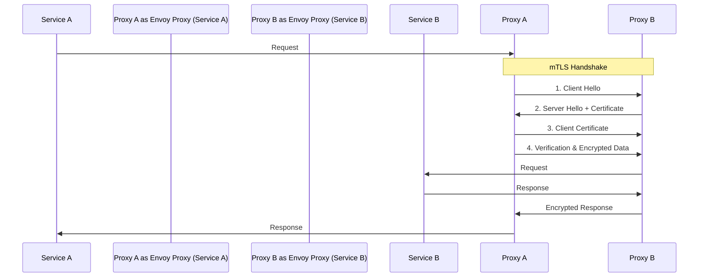
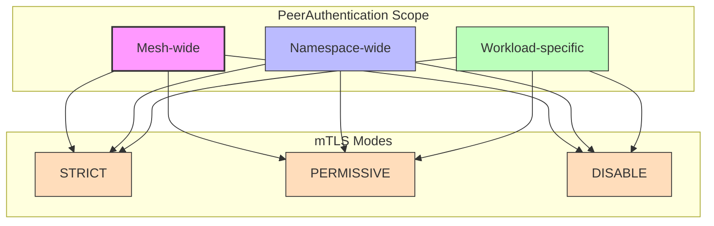

# Understanding mTLS and PeerAuthentication in Istio

## Introduction

Mutual TLS (mTLS) is a critical security feature in Istio that provides secure service-to-service communication within your service mesh. This document explains how mTLS works in Istio, how to configure it using PeerAuthentication resources, and best practices for implementation.

## What is Mutual TLS (mTLS)?



### Traditional TLS vs. Mutual TLS

**Traditional TLS (One-way TLS):**
- Only the server presents a certificate
- Client verifies the server's identity
- Server does not verify the client's identity

**Mutual TLS (Two-way TLS):**
- Both client and server present certificates
- Client verifies the server's identity
- Server verifies the client's identity
- Provides stronger security through bidirectional authentication

## How mTLS Works in Istio

In Istio, mTLS is implemented at the sidecar proxy (Envoy) level:

1. **Certificate Issuance**: Istio's Certificate Authority (Citadel) issues certificates to each proxy
2. **Identity Encoding**: Certificates contain SPIFFE IDs that represent the service identity
3. **Transparent Interception**: All traffic is transparently intercepted by the proxies
4. **Automatic Encryption**: Traffic between proxies is automatically encrypted
5. **Identity Verification**: Proxies verify each other's identities before establishing communication

### Key Benefits of mTLS in Istio

1. **Strong Authentication**: Ensures services only communicate with authenticated peers
2. **Encryption**: Protects data in transit from eavesdropping and tampering
3. **Identity-Based Security**: Enables fine-grained access control based on service identity
4. **Zero-Trust Security**: Implements the principle of "never trust, always verify"
5. **Transparent Implementation**: Application code doesn't need modification

## PeerAuthentication in Istio

PeerAuthentication is the Istio resource that configures mTLS settings for workloads in the mesh.



### PeerAuthentication Resource Structure

```yaml
apiVersion: security.istio.io/v1beta1
kind: PeerAuthentication
metadata:
  name: example-peer-policy
  namespace: foo
spec:
  selector:
    matchLabels:
      app: example-app
  mtls:
    mode: STRICT
  portLevelMtls:
    8080:
      mode: DISABLE
```

### mTLS Modes

PeerAuthentication supports three mTLS modes:

1. **STRICT**: Accepts only mTLS traffic
   - Highest security level
   - Rejects all plain text connections
   - Requires all clients to support mTLS

2. **PERMISSIVE**: Accepts both mTLS and plain text traffic
   - Useful for migration scenarios
   - Allows non-mesh clients to connect
   - Less secure than STRICT mode

3. **DISABLE**: Accepts only plain text traffic
   - No authentication or encryption
   - Useful for specific compatibility requirements
   - Least secure option

### Scope of PeerAuthentication

PeerAuthentication can be applied at different levels:

1. **Mesh-wide**: Applies to all workloads in the mesh
   ```yaml
   apiVersion: security.istio.io/v1beta1
   kind: PeerAuthentication
   metadata:
     name: default
     namespace: istio-system
   spec:
     mtls:
       mode: STRICT
   ```

2. **Namespace-wide**: Applies to all workloads in a specific namespace
   ```yaml
   apiVersion: security.istio.io/v1beta1
   kind: PeerAuthentication
   metadata:
     name: default
     namespace: foo
   spec:
     mtls:
       mode: STRICT
   ```

3. **Workload-specific**: Applies to specific workloads (using selector)
   ```yaml
   apiVersion: security.istio.io/v1beta1
   kind: PeerAuthentication
   metadata:
     name: example
     namespace: foo
   spec:
     selector:
       matchLabels:
         app: example
     mtls:
       mode: STRICT
   ```

4. **Port-specific**: Applies to specific ports of selected workloads
   ```yaml
   apiVersion: security.istio.io/v1beta1
   kind: PeerAuthentication
   metadata:
     name: example
     namespace: foo
   spec:
     selector:
       matchLabels:
         app: example
     mtls:
       mode: STRICT
     portLevelMtls:
       8080:
         mode: DISABLE
   ```

### Precedence Rules

When multiple PeerAuthentication policies apply to a workload, Istio follows these precedence rules:

1. **Workload-specific policy** takes precedence over namespace-wide policy
2. **Namespace-wide policy** takes precedence over mesh-wide policy
3. **Port-specific settings** take precedence over workload-level settings
4. If no policy is defined, the mesh-wide default is used

## Practical Examples

### Example 1: Enable Strict mTLS Mesh-wide

```yaml
apiVersion: security.istio.io/v1beta1
kind: PeerAuthentication
metadata:
  name: default
  namespace: istio-system
spec:
  mtls:
    mode: STRICT
```

Apply with:
```bash
kubectl apply -f mesh-strict-mtls.yaml
```

### Example 2: Enable Permissive Mode for a Namespace

```yaml
apiVersion: security.istio.io/v1beta1
kind: PeerAuthentication
metadata:
  name: default
  namespace: legacy-services
spec:
  mtls:
    mode: PERMISSIVE
```

Apply with:
```bash
kubectl apply -f namespace-permissive-mtls.yaml
```

### Example 3: Workload-Specific Configuration

```yaml
apiVersion: security.istio.io/v1beta1
kind: PeerAuthentication
metadata:
  name: payment-service-mtls
  namespace: ecommerce
spec:
  selector:
    matchLabels:
      app: payment-service
  mtls:
    mode: STRICT
  portLevelMtls:
    8080:
      mode: PERMISSIVE
```

Apply with:
```bash
kubectl apply -f payment-service-mtls.yaml
```

### Example 4: Disable mTLS for a Legacy Service

```yaml
apiVersion: security.istio.io/v1beta1
kind: PeerAuthentication
metadata:
  name: legacy-service-mtls
  namespace: default
spec:
  selector:
    matchLabels:
      app: legacy-service
  mtls:
    mode: DISABLE
```

Apply with:
```bash
kubectl apply -f legacy-service-disable-mtls.yaml
```

## Migrating to Strict mTLS

Migrating to strict mTLS should be done carefully to avoid disrupting service communication. Here's a recommended approach:

```mermaid
graph LR
    A[Start: Default Policy] --> B[Step 1: PERMISSIVE Mode Mesh-wide]
    B --> C[Step 2: Monitor for Issues]
    C --> D[Step 3: STRICT Mode for Namespaces]
    D --> E[Step 4: Monitor Each Namespace]
    E --> F[Step 5: STRICT Mode Mesh-wide]
    
    style A fill:#bbf,stroke:#333,stroke-width:1px
    style B fill:#bfb,stroke:#333,stroke-width:1px
    style C fill:#fdb,stroke:#333,stroke-width:1px
    style D fill:#bfb,stroke:#333,stroke-width:1px
    style E fill:#fdb,stroke:#333,stroke-width:1px
    style F fill:#f9f,stroke:#333,stroke-width:2px
```



### Step 1: Enable Permissive Mode Mesh-wide

```yaml
apiVersion: security.istio.io/v1beta1
kind: PeerAuthentication
metadata:
  name: default
  namespace: istio-system
spec:
  mtls:
    mode: PERMISSIVE
```

### Step 2: Monitor for Issues

Check for any communication issues between services:
```bash
# Check proxy logs for mTLS-related issues
kubectl logs -l app=your-app -c istio-proxy

# Check Kiali for traffic security status
istioctl dashboard kiali
```

### Step 3: Enable Strict Mode Namespace by Namespace

```yaml
apiVersion: security.istio.io/v1beta1
kind: PeerAuthentication
metadata:
  name: default
  namespace: your-namespace
spec:
  mtls:
    mode: STRICT
```

### Step 4: Finally Enable Strict Mode Mesh-wide

```yaml
apiVersion: security.istio.io/v1beta1
kind: PeerAuthentication
metadata:
  name: default
  namespace: istio-system
spec:
  mtls:
    mode: STRICT
```

## Verifying mTLS Configuration

### Check PeerAuthentication Policies

```bash
# List all PeerAuthentication policies
kubectl get peerauthentication --all-namespaces

# View details of a specific policy
kubectl get peerauthentication -n <namespace> <policy-name> -o yaml
```

### Verify mTLS Status for a Service

```bash
# Check if traffic to a service is using mTLS
istioctl x describe service <service-name>.<namespace>
```

### Check mTLS Status in Kiali

1. Open the Kiali dashboard:
   ```bash
   istioctl dashboard kiali
   ```
2. Navigate to the Graph view
3. Enable the "Security" display option to see which connections are using mTLS

## Troubleshooting mTLS Issues

### Common Issues and Solutions

1. **Services Can't Communicate After Enabling Strict mTLS**
   - Check if all services have Istio sidecars injected
   - Verify that there are no conflicting PeerAuthentication policies
   - Temporarily switch to PERMISSIVE mode to diagnose

2. **External Services Can't Connect to Mesh Services**
   - Use a Gateway or ServiceEntry for external access
   - Apply port-level mTLS exceptions for external-facing ports

3. **Certificate Errors**
   - Check Citadel logs for certificate issuance issues:
     ```bash
     kubectl logs -n istio-system -l app=istiod
     ```
   - Verify certificate validity and expiration:
     ```bash
     istioctl proxy-config secret <pod-name>.<namespace>
     ```

### Debugging Commands

```bash
# Check if mTLS is enabled between services
istioctl x describe service <service>.<namespace>

# View TLS certificate information
istioctl proxy-config secret <pod-name>.<namespace>

# Check authentication policies affecting a pod
istioctl x auth -n <namespace> <pod-name>

# View Envoy configuration related to mTLS
istioctl proxy-config listener <pod-name>.<namespace>
```

## Best Practices for mTLS in Istio

1. **Start with Permissive Mode**: Begin with PERMISSIVE mode during migration
2. **Incremental Adoption**: Move to STRICT mode incrementally, namespace by namespace
3. **Monitor Before and After Changes**: Use Kiali and other tools to verify security status
4. **Use Namespace-Level Policies**: Prefer namespace-level policies for better manageability
5. **Document Exceptions**: Clearly document any workloads that require exceptions
6. **Regular Audits**: Periodically audit mTLS configuration across the mesh
7. **Automate Verification**: Include mTLS verification in CI/CD pipelines

## Advanced mTLS Configurations

### Integrating with External Certificate Authority

```yaml
apiVersion: install.istio.io/v1alpha1
kind: IstioOperator
spec:
  meshConfig:
    caCertificates:
    - pem: |
        -----BEGIN CERTIFICATE-----
        ...
        -----END CERTIFICATE-----
      certSigners:
      - your-external-ca.example.com
```

### Custom Certificate Rotation

```yaml
apiVersion: install.istio.io/v1alpha1
kind: IstioOperator
spec:
  meshConfig:
    certificates:
      secretTTL: 24h
      workloadCertTTL: 24h
```

### Configuring Certificate Key Size

```yaml
apiVersion: install.istio.io/v1alpha1
kind: IstioOperator
spec:
  meshConfig:
    certificates:
      workloadRSAKeySize: 4096
```

## Conclusion

Mutual TLS (mTLS) is a foundational security feature in Istio that provides strong authentication and encryption for service-to-service communication. PeerAuthentication resources give you fine-grained control over mTLS settings at different levels of your service mesh.

By understanding and properly configuring mTLS, you can significantly enhance the security posture of your microservices architecture while maintaining compatibility with existing systems through careful migration strategies.

## Additional Resources

- [Istio Security Documentation](https://istio.io/latest/docs/concepts/security/)
- [PeerAuthentication API Reference](https://istio.io/latest/docs/reference/config/security/peer_authentication/)
- [Mutual TLS Migration](https://istio.io/latest/docs/tasks/security/authentication/mtls-migration/)
- [Istio Security Best Practices](https://istio.io/latest/docs/ops/best-practices/security/)
