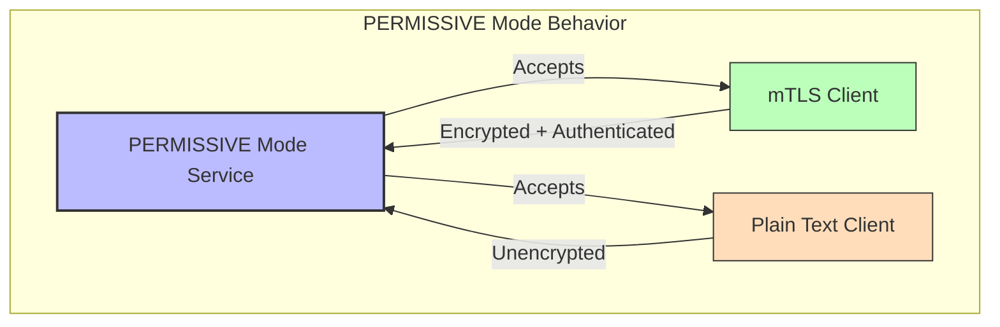
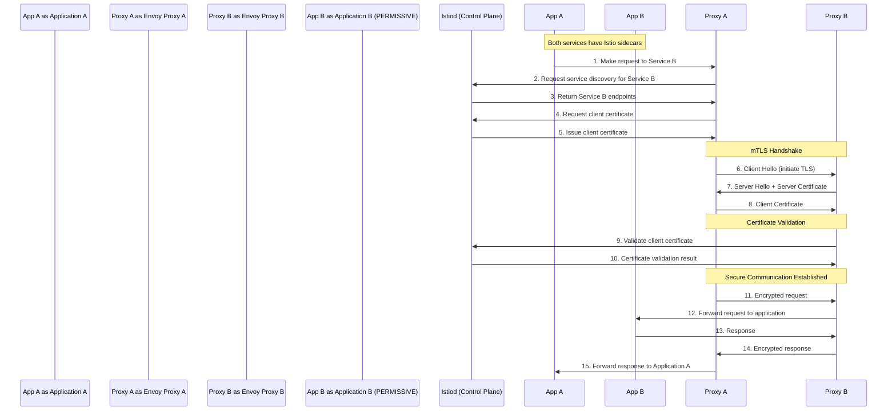
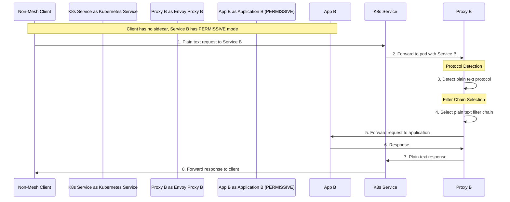
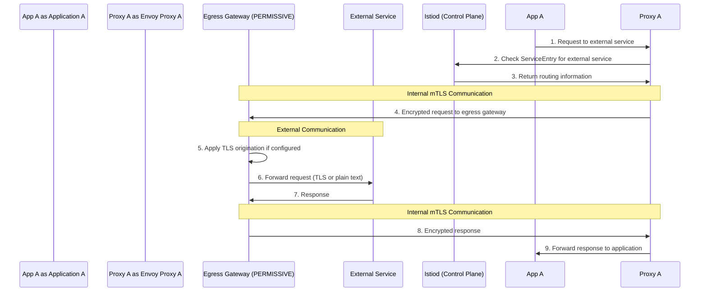
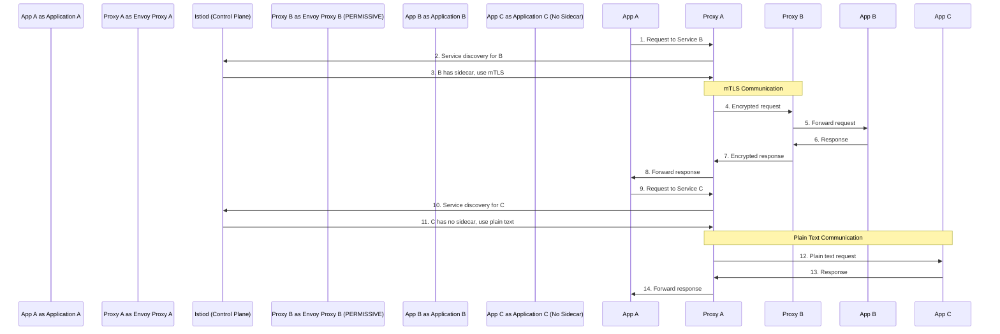
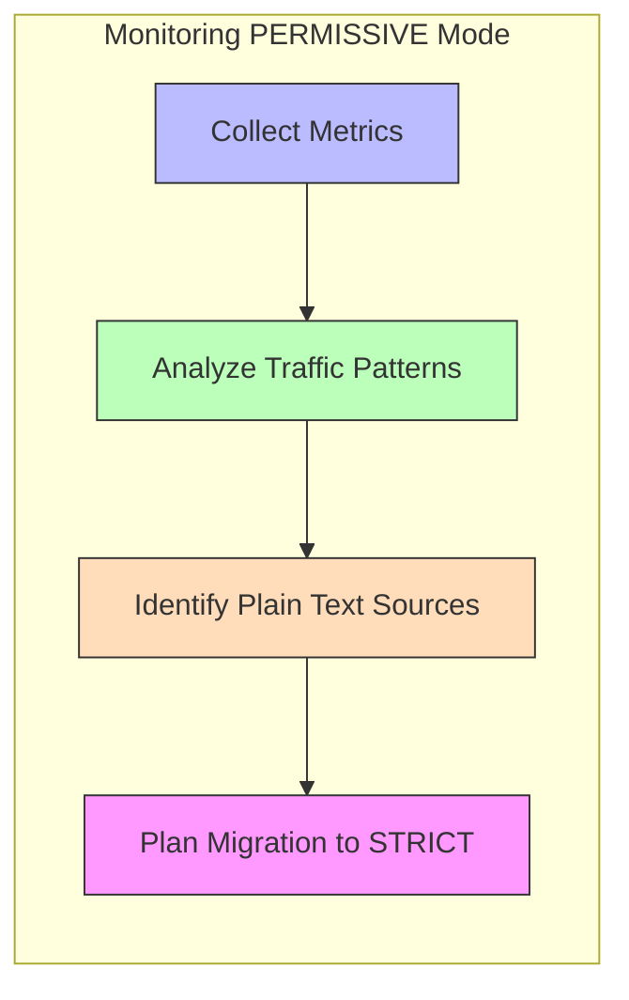
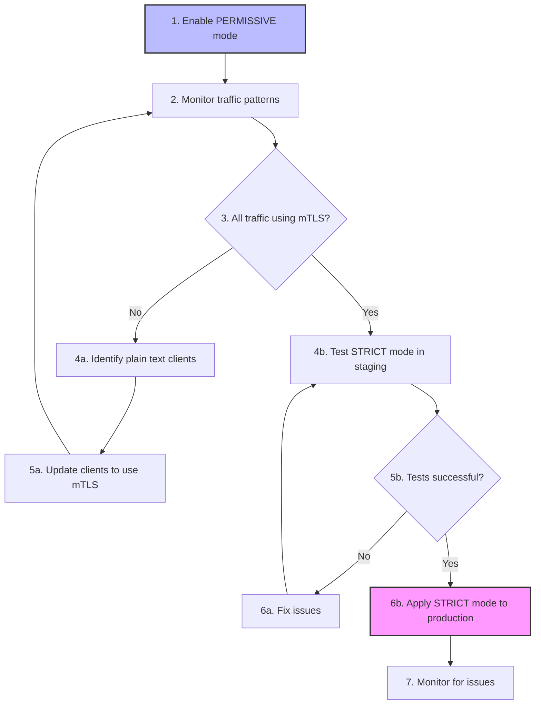

# Istio PERMISSIVE mTLS Mode: Detailed Request Flow

## Introduction

PERMISSIVE mode is one of Istio's mutual TLS (mTLS) configurations that allows services to accept both mTLS and plain text traffic simultaneously. This document provides an in-depth explanation of how PERMISSIVE mode works, with detailed flow diagrams showing exactly what happens when different types of clients make requests to a service configured with PERMISSIVE mode.

## What is PERMISSIVE Mode?

PERMISSIVE mode is a flexible mTLS configuration that:

- Accepts both encrypted mTLS traffic and unencrypted plain text traffic
- Allows services to communicate with both mesh and non-mesh clients
- Provides a transition path when migrating to mTLS
- Maintains backward compatibility while enabling security where possible



## Configuring PERMISSIVE Mode

PERMISSIVE mode is configured using the PeerAuthentication resource:

```yaml
apiVersion: security.istio.io/v1beta1
kind: PeerAuthentication
metadata:
  name: default
  namespace: your-namespace  # Apply to a namespace
spec:
  mtls:
    mode: PERMISSIVE
```

You can also apply it to specific workloads:

```yaml
apiVersion: security.istio.io/v1beta1
kind: PeerAuthentication
metadata:
  name: service-specific
  namespace: your-namespace
spec:
  selector:
    matchLabels:
      app: your-service
  mtls:
    mode: PERMISSIVE
```

## Detailed Request Flows in PERMISSIVE Mode

Let's examine in detail what happens when different types of clients make requests to a service configured with PERMISSIVE mode.

### Scenario 1: Mesh Client to PERMISSIVE Service (mTLS Flow)

When a client within the mesh (with an Istio sidecar) makes a request to a service configured with PERMISSIVE mode, the communication automatically uses mTLS:



**Key Points in this Flow:**

1. **Automatic mTLS Negotiation**: The client sidecar automatically attempts mTLS
2. **Certificate Exchange**: Both proxies exchange and validate certificates
3. **Identity Verification**: The service validates the client's identity
4. **Transparent to Applications**: Both applications are unaware of the mTLS process
5. **End-to-End Encryption**: All traffic between the proxies is encrypted

### Scenario 2: Non-Mesh Client to PERMISSIVE Service (Plain Text Flow)

When a client without an Istio sidecar makes a request to a service configured with PERMISSIVE mode:



**Key Points in this Flow:**

1. **Protocol Detection**: The service proxy detects that the incoming request is plain text
2. **Filter Chain Selection**: The proxy selects the appropriate filter chain for plain text
3. **No Authentication**: No client identity verification occurs
4. **No Encryption**: Traffic remains unencrypted
5. **Backward Compatibility**: The service can still handle legacy clients

### Scenario 3: Mesh Client to External Service via PERMISSIVE Egress

When a mesh service communicates with an external service through an egress gateway with PERMISSIVE mode:



**Key Points in this Flow:**

1. **Secure Internal Communication**: Traffic within the mesh uses mTLS
2. **Configurable External Security**: The egress gateway can be configured to use TLS for external communication
3. **Protocol Translation**: The gateway can translate between mTLS internally and other protocols externally
4. **Centralized External Access**: All external traffic goes through controlled gateways

### Scenario 4: Mixed Traffic with Auto mTLS

When auto mTLS is enabled with PERMISSIVE mode, Istio automatically detects whether the destination supports mTLS:



**Key Points in this Flow:**

1. **Automatic Protocol Selection**: Istio automatically chooses mTLS or plain text based on destination capabilities
2. **Dynamic Behavior**: The same client can use different security modes for different destinations
3. **Zero Configuration**: Developers don't need to specify the security mode for each destination
4. **Optimal Security**: Uses the highest security level supported by each service

## PERMISSIVE Mode Implementation Details

### Envoy Configuration

In PERMISSIVE mode, Istio configures the Envoy proxy with multiple filter chains to handle both mTLS and plain text traffic:

```yaml
# Simplified Envoy configuration (not directly user-configurable)
listener:
  filter_chains:
  # Filter chain for mTLS traffic
  - filter_chain_match:
      transport_protocol: "tls"
    transport_socket:
      name: envoy.transport_sockets.tls
      typed_config:
        "@type": type.googleapis.com/envoy.extensions.transport_sockets.tls.v3.DownstreamTlsContext
        require_client_certificate: true
        validation_context:
          trusted_ca:
            filename: /etc/certs/root-cert.pem
  
  # Filter chain for plain text traffic
  - filter_chain_match:
      transport_protocol: "raw_buffer"
    # Plain text configuration
```

### Protocol Detection

Envoy uses protocol detection to determine whether incoming traffic is TLS or plain text:

1. **Initial Bytes Examination**: Examines the first few bytes of the connection
2. **TLS Detection**: Looks for the TLS handshake signature (0x16 0x03 0x01)
3. **Filter Chain Selection**: Routes to the appropriate filter chain based on the detected protocol
4. **Fallback Mechanism**: If detection fails, defaults to the plain text filter chain

## Observability in PERMISSIVE Mode

### Monitoring mTLS vs Plain Text Traffic

In PERMISSIVE mode, it's important to monitor the ratio of mTLS to plain text traffic:



### Key Metrics to Monitor

1. **Connection Security Policy**:
   ```bash
   # Prometheus query to show ratio of mTLS vs plain text
   sum(istio_requests_total{connection_security_policy="mutual_tls"}) by (destination_service) / 
   sum(istio_requests_total) by (destination_service)
   ```

2. **TLS Handshake Errors**:
   ```bash
   # Prometheus query for TLS handshake failures
   sum(rate(envoy_cluster_ssl_handshake_error[5m])) by (pod)
   ```

### Visualization in Kiali

Kiali provides visual indicators for traffic security in PERMISSIVE mode:

- **Lock icons**: Show which connections are using mTLS
- **Color coding**: Different colors for secured vs unsecured connections
- **Security view**: Dedicated view showing the security status of all connections

## Use Cases for PERMISSIVE Mode

### 1. Gradual Migration to mTLS

```mermaid
graph LR
    A[Start: No mTLS] --> B[Deploy Istio]
    B --> C[Enable PERMISSIVE mode]
    C --> D[Monitor traffic patterns]
    D --> E[Update clients to use mTLS]
    E --> F[Verify all traffic uses mTLS]
    F --> G[Switch to STRICT mode]
    
    style A fill:#fdb,stroke:#333,stroke-width:1px
    style C fill:#bbf,stroke:#333,stroke-width:2px
    style G fill:#f9f,stroke:#333,stroke-width:1px
```



### 2. Mixed Environment with External Clients

PERMISSIVE mode allows services to accept traffic from both:
- Internal services within the mesh (using mTLS)
- External clients outside the mesh (using plain text)

This is useful for services that need to be accessible both internally and externally.

### 3. Compatibility with Legacy Systems

When integrating with legacy systems that cannot support mTLS, PERMISSIVE mode allows:
- Modern services to communicate securely with each other
- Legacy systems to continue functioning without modification

### 4. Development and Testing

During development and testing, PERMISSIVE mode provides flexibility:
- Developers can access services directly without mTLS configuration
- Test tools can probe services without complex certificate setup
- Production-like security can still be tested with mTLS clients

## Best Practices for PERMISSIVE Mode

### 1. Monitoring and Visibility

- **Track mTLS percentage**: Monitor the percentage of traffic using mTLS vs plain text
- **Set up alerts**: Create alerts for unexpected plain text traffic
- **Regular audits**: Periodically review which clients are using plain text

### 2. Client Configuration

- **Prefer mTLS for mesh clients**: Configure mesh clients to use mTLS when possible
- **Document exceptions**: Maintain documentation of clients that require plain text
- **Update clients incrementally**: Gradually update clients to support mTLS

### 3. Security Considerations

- **Treat as temporary**: Consider PERMISSIVE mode as a transitional state, not permanent
- **Limit scope**: Apply PERMISSIVE mode only where needed, not mesh-wide
- **Combine with other security**: Use additional security measures for sensitive services

### 4. Migration Planning

- **Set timeline**: Establish a timeline for transitioning to STRICT mode
- **Phased approach**: Migrate services to STRICT mode in phases
- **Test thoroughly**: Validate STRICT mode in non-production before applying to production

## Troubleshooting PERMISSIVE Mode

### Common Issues

1. **Inconsistent Security Behavior**:
   - **Symptom**: Some requests use mTLS, others don't, unpredictably
   - **Cause**: Misconfigured clients or auto mTLS issues
   - **Solution**: Check client DestinationRules and auto mTLS settings

2. **Performance Overhead**:
   - **Symptom**: Higher latency compared to plain text or STRICT mode
   - **Cause**: Protocol detection adds overhead
   - **Solution**: Monitor performance and consider moving to STRICT mode

3. **Certificate Errors with mTLS Clients**:
   - **Symptom**: mTLS clients fail with certificate errors
   - **Cause**: Certificate misconfiguration or trust issues
   - **Solution**: Check certificate validity and trust configuration

### Debugging Commands

```bash
# Check if traffic to a service is using mTLS
istioctl x describe service <service>.<namespace>

# View TLS configuration for a pod
istioctl proxy-config listener <pod-name>.<namespace> --port <port> -o json

# Check mTLS policy applied to a workload
istioctl x auth -n <namespace> <pod-name>

# View Envoy stats for TLS
kubectl exec <pod-name> -c istio-proxy -- pilot-agent request GET stats | grep ssl
```

## Transitioning from PERMISSIVE to STRICT Mode

### Step-by-Step Migration Plan



### Verification Before Switching

Before transitioning from PERMISSIVE to STRICT mode:

1. **Verify mTLS usage**: Ensure all traffic is already using mTLS
   ```bash
   # Check for any plain text traffic
   kubectl exec -it <pod-name> -c istio-proxy -- pilot-agent request GET stats | grep -E "ssl.handshake|http.inbound"
   ```

2. **Test with temporary policy**: Apply a temporary STRICT policy to a test service
   ```yaml
   apiVersion: security.istio.io/v1beta1
   kind: PeerAuthentication
   metadata:
     name: strict-test
     namespace: test
   spec:
     selector:
       matchLabels:
         app: test-service
     mtls:
       mode: STRICT
   ```

3. **Validate all clients**: Ensure all clients can still access the service

## Conclusion

PERMISSIVE mTLS mode in Istio provides a flexible approach to service mesh security, allowing services to accept both mTLS and plain text traffic. This flexibility is particularly valuable during migration to mTLS, in mixed environments, and when working with legacy systems.

Understanding the detailed request flows in PERMISSIVE mode helps you:
- Visualize how different types of clients interact with your services
- Plan your migration strategy to stronger security
- Troubleshoot issues that may arise during implementation
- Make informed decisions about your service mesh security configuration

While PERMISSIVE mode is an excellent transitional tool, the ultimate goal for most production environments should be to move to STRICT mode once all services and clients support mTLS, to ensure the highest level of security across your service mesh.

## Additional Resources

- [Istio Authentication Policy](https://istio.io/latest/docs/reference/config/security/peer_authentication/)
- [Mutual TLS Migration](https://istio.io/latest/docs/tasks/security/authentication/mtls-migration/)
- [Auto mTLS](https://istio.io/latest/docs/tasks/security/authentication/authn-policy/#auto-mutual-tls)
- [Secure Gateways](https://istio.io/latest/docs/tasks/security/gateway-api/)
