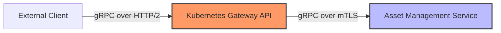
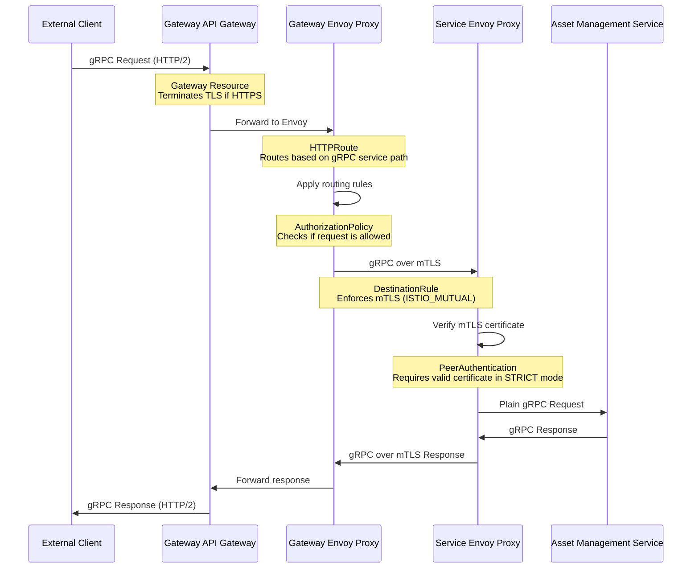
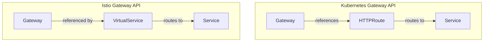

# gRPC Traffic Flow with Gateway API in Strict mTLS Mode

This document illustrates how gRPC traffic flows through the Kubernetes Gateway API to backend services in strict mTLS mode, using the asset-management service as an example.

## Architecture Overview



The diagram above shows the high-level architecture:
1. External clients connect to the Gateway using gRPC over HTTP/2
2. The Gateway forwards traffic to the internal service using gRPC over mTLS

## Detailed Traffic Flow



This sequence diagram shows the detailed request flow for gRPC:

1. **Client to Gateway**: External client sends gRPC request (over HTTP/2) to the Gateway
2. **Gateway Processing**: 
   - Gateway resource handles the connection
   - If HTTPS, TLS is terminated at this point
3. **HTTPRoute Routing**:
   - Gateway's Envoy proxy applies routing rules from the HTTPRoute
   - Matches based on the gRPC service path (e.g., `/asset.AssetService/GetAsset`)
4. **Authorization Check**:
   - AuthorizationPolicy determines if the request is allowed to proceed
5. **mTLS Communication**:
   - Gateway's Envoy proxy initiates mTLS connection to the service's Envoy proxy
   - DestinationRule enforces the use of mTLS
6. **Service-side Verification**:
   - Service's Envoy proxy verifies the mTLS certificate
   - In STRICT mode, requests without valid certificates are rejected
7. **Internal Communication**:
   - Service's Envoy proxy forwards the gRPC request to the service
   - Service processes the request and returns a response
8. **Response Path**:
   - Response follows the reverse path back to the client
   - mTLS between service and gateway
   - HTTP/2 between gateway and client

## Gateway API vs Istio Gateway for gRPC

The Kubernetes Gateway API is the newer, standardized approach for ingress that Istio also supports. For gRPC services, there are some key differences compared to the older Istio Gateway API:



### Key Differences

| Feature | Kubernetes Gateway API | Istio Gateway API |
|---------|------------------------|-------------------|
| **API Group** | gateway.networking.k8s.io | networking.istio.io |
| **Route Resource** | HTTPRoute | VirtualService |
| **Relationship** | HTTPRoute references Gateway | VirtualService references Gateway |
| **Path Matching** | Explicit path types (Exact, PathPrefix, RegularExpression) | Prefix, exact, or regex |
| **Header Matching** | Explicit header matching types | Similar capabilities |
| **Standardization** | Kubernetes standard | Istio-specific |

## gRPC-Specific Considerations

When routing gRPC traffic with the Gateway API, there are several important considerations:

### 1. Path Format

gRPC uses HTTP/2 paths in this format:
```
/[package].[service]/[method]
```

For example:
- `/asset.AssetService/GetAsset`
- `/asset.AssetService/ListAssets`

In your HTTPRoute, you typically match the service prefix:

```yaml
matches:
- path:
    type: PathPrefix
    value: /asset.AssetService
```

### 2. HTTP/2 Support

gRPC requires HTTP/2. Ensure your Gateway supports it:

```yaml
listeners:
- protocol: HTTPS  # HTTP/2 is supported over HTTPS
```

### 3. Load Balancing Configuration

gRPC's long-lived connections require special load balancing configuration in the DestinationRule:

```yaml
trafficPolicy:
  loadBalancer:
    simple: LEAST_CONN  # Better for gRPC
  connectionPool:
    http:
      http2MaxRequests: 1000
      maxRequestsPerConnection: 100  # Force connection cycling
```

## Example Configuration

Here's a complete example for routing gRPC traffic to the asset-management service:

### HTTPRoute for gRPC

```yaml
apiVersion: gateway.networking.k8s.io/v1
kind: HTTPRoute
metadata:
  name: asset-management-grpc-route
  namespace: default
spec:
  parentRefs:
  - name: public-api-gateway
    namespace: gateway
  hostnames:
  - "sit-gateway.tcex.com.vn"
  rules:
  - matches:
    - path:
        type: PathPrefix
        value: /asset.AssetService
    backendRefs:
    - name: asset-management
      port: 8080
```

### DestinationRule for gRPC

```yaml
apiVersion: networking.istio.io/v1alpha3
kind: DestinationRule
metadata:
  name: asset-management
  namespace: default
spec:
  host: asset-management.default.svc.cluster.local
  trafficPolicy:
    loadBalancer:
      simple: LEAST_CONN
    connectionPool:
      http:
        http2MaxRequests: 1000
        maxRequestsPerConnection: 100
    tls:
      mode: ISTIO_MUTUAL
```

### AuthorizationPolicy

```yaml
apiVersion: security.istio.io/v1beta1
kind: AuthorizationPolicy
metadata:
  name: asset-management-policy
  namespace: default
spec:
  selector:
    matchLabels:
      app.kubernetes.io/name: asset-management
  rules:
  - from:
    - source:
        principals: ["cluster.local/ns/gateway/sa/istio-ingressgateway-service-account"]
    to:
    - operation:
        paths: ["/asset.AssetService/*"]
```

## Testing gRPC Connectivity

You can test gRPC connectivity using tools like grpcurl:

```bash
# Install grpcurl
brew install grpcurl  # macOS
# or
go install github.com/fullstorydev/grpcurl/cmd/grpcurl@latest  # Go

# Test connection (replace with your actual method and parameters)
grpcurl -plaintext -authority=sit-gateway.tcex.com.vn \
  <ingress-gateway-ip>:80 \
  asset.AssetService/GetAsset
```

## Troubleshooting gRPC Connections

### 1. Connection Refused

If the connection is refused:
- Verify the Gateway is properly configured for HTTP/2
- Check that the HTTPRoute correctly references the Gateway
- Ensure the service port is correctly specified

### 2. "Unimplemented" gRPC Error

This usually means the path is incorrect:
- Verify the exact service name in your .proto file
- Check for typos in the service or method name
- Ensure the path in the HTTPRoute matches your service

### 3. Authorization Failures

If you receive permission errors:
- Check that the AuthorizationPolicy allows the Gateway's identity
- Verify the path pattern in the AuthorizationPolicy matches your gRPC service paths

### 4. mTLS Verification Failures

If mTLS fails:
- Confirm the DestinationRule has `mode: ISTIO_MUTUAL`
- Verify the service has Istio sidecar injection enabled
- Check Istio proxy logs for certificate validation errors

## Monitoring gRPC Traffic

You can monitor gRPC traffic using Istio's observability tools:

```bash
# View gRPC metrics in Prometheus
istioctl dashboard prometheus

# Query for gRPC request count
istio_requests_total{destination_service="asset-management.default.svc.cluster.local",grpc_response_status="0"}

# View traffic in Kiali
istioctl dashboard kiali
```

## Conclusion

Routing gRPC traffic through the Kubernetes Gateway API in strict mTLS mode requires proper configuration of HTTPRoutes, DestinationRules, and AuthorizationPolicies. The key considerations are:

1. Proper path matching for gRPC service paths
2. HTTP/2 support in the Gateway
3. Optimized load balancing settings for gRPC's long-lived connections
4. Correct authorization for the Gateway's identity

When properly configured, this setup provides secure, observable, and well-load-balanced gRPC communication between external clients and your internal services.
