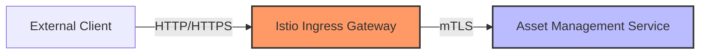
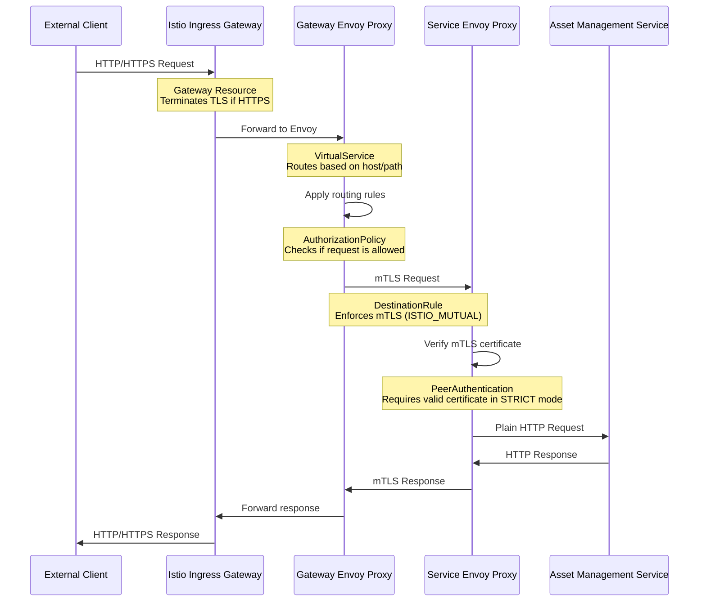
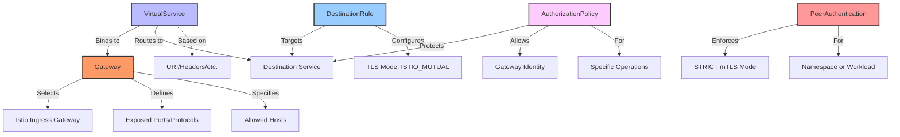

# Gateway Traffic Flow in Strict mTLS Mode

This document illustrates the traffic flow when accessing a service through an Istio Gateway in strict mTLS mode, using the asset-management service as an example.

## Architecture Overview



The diagram above shows the high-level architecture:
1. External clients connect to the Istio Ingress Gateway
2. The Gateway forwards traffic to the internal service using mTLS

## Detailed Traffic Flow



This sequence diagram shows the detailed request flow:

1. **Client to Gateway**: External client sends HTTP/HTTPS request to the Istio Ingress Gateway
2. **Gateway Processing**: 
   - Gateway resource handles the connection
   - If HTTPS, TLS is terminated at this point
3. **VirtualService Routing**:
   - Gateway's Envoy proxy applies routing rules from the VirtualService
   - Determines which internal service should receive the request
4. **Authorization Check**:
   - AuthorizationPolicy determines if the request is allowed to proceed
5. **mTLS Communication**:
   - Gateway's Envoy proxy initiates mTLS connection to the service's Envoy proxy
   - DestinationRule enforces the use of mTLS
6. **Service-side Verification**:
   - Service's Envoy proxy verifies the mTLS certificate
   - In STRICT mode, requests without valid certificates are rejected
7. **Internal Communication**:
   - Service's Envoy proxy forwards the request to the service as plain HTTP
   - Service is unaware of TLS/mTLS (handled by proxies)
8. **Response Path**:
   - Response follows the reverse path back to the client
   - mTLS between service and gateway
   - HTTP/HTTPS between gateway and client

## Istio Resources and Their Roles



This diagram shows how the different Istio resources work together:

### 1. Gateway
- Selects the Istio Ingress Gateway deployment
- Defines which ports and protocols are exposed
- Specifies which hostnames are allowed

### 2. VirtualService
- Binds to one or more Gateways
- Routes traffic to destination services
- Uses match conditions based on URI, headers, etc.

### 3. DestinationRule
- Targets a specific service
- Configures TLS settings (ISTIO_MUTUAL for mTLS)
- Can also define subsets and load balancing

### 4. AuthorizationPolicy
- Protects the destination service
- Allows traffic from the Gateway's identity
- Can restrict to specific operations (methods, paths)

### 5. PeerAuthentication
- Enforces STRICT mTLS mode for the namespace or workload
- Requires all incoming traffic to use mTLS

## Example Configuration

Here's how these resources are configured for the asset-management service:

### Gateway

```yaml
apiVersion: networking.istio.io/v1alpha3
kind: Gateway
metadata:
  name: asset-management-gateway
spec:
  selector:
    istio: ingressgateway
  servers:
  - port:
      number: 80
      name: http
      protocol: HTTP
    hosts:
    - "asset-management.example.com"
```

### VirtualService

```yaml
apiVersion: networking.istio.io/v1alpha3
kind: VirtualService
metadata:
  name: asset-management-vs
spec:
  hosts:
  - "asset-management.example.com"
  gateways:
  - asset-management-gateway
  http:
  - match:
    - uri:
        prefix: /
    route:
    - destination:
        host: asset-management
        port:
          number: 80
```

### DestinationRule

```yaml
apiVersion: networking.istio.io/v1alpha3
kind: DestinationRule
metadata:
  name: asset-management
spec:
  host: asset-management
  trafficPolicy:
    tls:
      mode: ISTIO_MUTUAL
```

### AuthorizationPolicy

```yaml
apiVersion: security.istio.io/v1beta1
kind: AuthorizationPolicy
metadata:
  name: asset-management-policy
spec:
  selector:
    matchLabels:
      app.kubernetes.io/name: asset-management
  rules:
  - from:
    - source:
        principals: ["cluster.local/ns/istio-system/sa/istio-ingressgateway-service-account"]
    to:
    - operation:
        methods: ["GET", "POST", "PUT", "DELETE", "PATCH"]
        paths: ["/*"]
```

### PeerAuthentication (Namespace-wide STRICT mode)

```yaml
apiVersion: security.istio.io/v1beta1
kind: PeerAuthentication
metadata:
  name: default
  namespace: default
spec:
  mtls:
    mode: STRICT
```

## Common Issues and Troubleshooting

### 1. 403 Forbidden Errors

If you receive 403 errors, check:
- AuthorizationPolicy is correctly configured to allow the Gateway's identity
- The principal name in the AuthorizationPolicy matches the Gateway's service account

### 2. Connection Refused or Timeout

If connections fail:
- Verify the Gateway is correctly configured and deployed
- Check that the VirtualService is bound to the correct Gateway
- Ensure the destination service name and port are correct

### 3. mTLS Verification Failures

If mTLS fails:
- Confirm the DestinationRule has `mode: ISTIO_MUTUAL`
- Verify the service has Istio sidecar injection enabled
- Check Istio proxy logs for certificate validation errors

## Verifying the Configuration

You can verify the mTLS configuration with:

```bash
# Check if mTLS is enabled between the gateway and service
istioctl x describe pod <asset-management-pod-name>

# View the AuthorizationPolicy applied to the service
kubectl get authorizationpolicy -n default

# Test the connection through the gateway
curl -v -H "Host: asset-management.example.com" http://<ingress-gateway-ip>
```

## Conclusion

In strict mTLS mode, all communication between services in the mesh must use mTLS. The Gateway acts as a bridge between external clients (using HTTP/HTTPS) and internal services (using mTLS). The combination of Gateway, VirtualService, DestinationRule, and AuthorizationPolicy resources ensures secure and properly routed communication.
