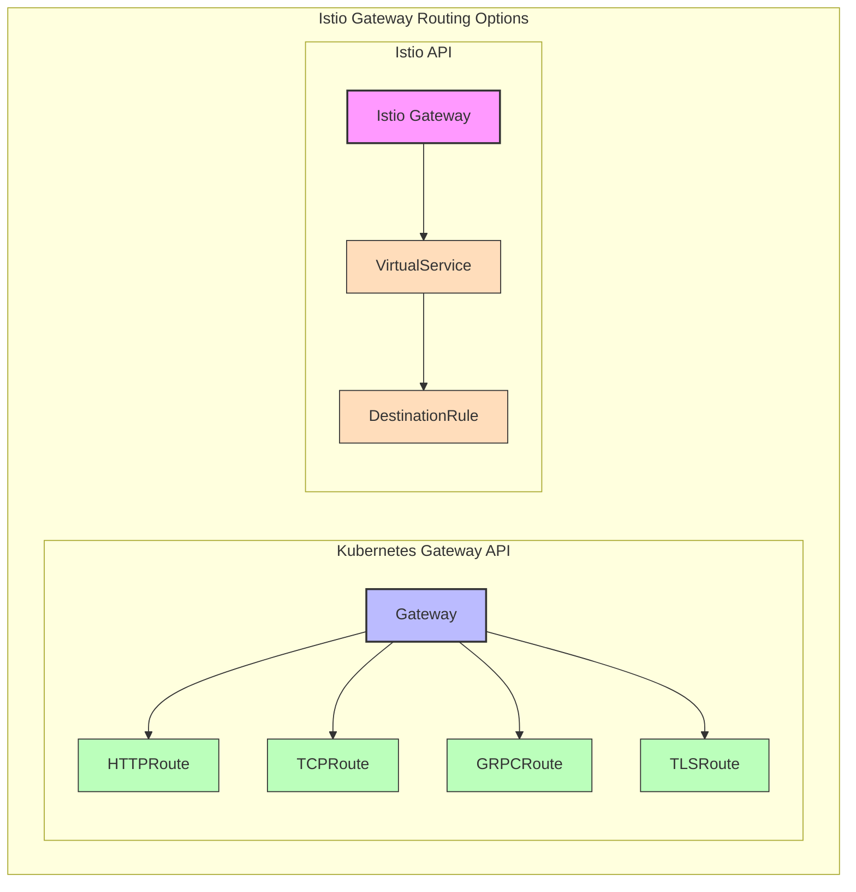
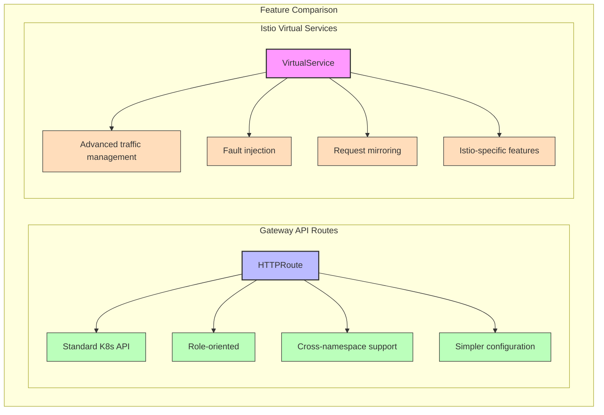

# Understanding Istio Gateway Routes

## Introduction

In Istio, routes define how traffic is directed to services within your mesh after it enters through a Gateway. Istio supports multiple routing mechanisms, including both the Kubernetes Gateway API routes and Istio's own Virtual Service resource.

This document focuses on routing configurations in Istio, explaining both approaches with practical examples.

## Routing Mechanisms in Istio

Istio supports two primary routing mechanisms:

1. **Kubernetes Gateway API Routes** (HTTPRoute, TCPRoute, etc.)
2. **Istio Virtual Services**



## Kubernetes Gateway API Routes

### HTTPRoute

HTTPRoute is the most commonly used route type for HTTP/HTTPS traffic.

#### Basic HTTPRoute Example

```yaml
apiVersion: gateway.networking.k8s.io/v1
kind: HTTPRoute
metadata:
  name: bookinfo-route
  namespace: default
spec:
  parentRefs:
  - name: bookinfo-gateway
    namespace: default
    kind: Gateway
  hostnames:
  - "bookinfo.example.com"
  rules:
  - matches:
    - path:
        type: PathPrefix
        value: /productpage
    backendRefs:
    - name: productpage
      port: 9080
```

#### Key Components of HTTPRoute

1. **parentRefs**: References the Gateway that this route attaches to
2. **hostnames**: Specifies which hostnames this route applies to
3. **rules**: Defines matching criteria and backends
   - **matches**: Conditions for when to apply this rule (paths, headers, query params)
   - **backendRefs**: Services to route matching traffic to

### Advanced HTTPRoute Features

#### Path Matching

HTTPRoute supports different path matching types:

```yaml
rules:
- matches:
  - path:
      type: Exact
      value: /api/v1
  # ...
- matches:
  - path:
      type: PathPrefix
      value: /api
  # ...
- matches:
  - path:
      type: RegularExpression
      value: "/user/[0-9]+"
  # ...
```

#### Header Matching

Match requests based on HTTP headers:

```yaml
rules:
- matches:
  - headers:
    - name: "user-agent"
      value: "Mozilla"
      type: RegularExpression
  # ...
```

#### Query Parameter Matching

Match requests based on query parameters:

```yaml
rules:
- matches:
  - queryParams:
    - name: "version"
      value: "v2"
  # ...
```

#### Method Matching

Match requests based on HTTP methods:

```yaml
rules:
- matches:
  - method: GET
  # ...
- matches:
  - method: POST
  # ...
```

#### Traffic Splitting

Split traffic between multiple backend services:

```yaml
rules:
- backendRefs:
  - name: service-v1
    port: 8080
    weight: 90
  - name: service-v2
    port: 8080
    weight: 10
```

#### Filters

Apply transformations to requests or responses:

```yaml
rules:
- filters:
  - type: RequestHeaderModifier
    requestHeaderModifier:
      add:
      - name: x-custom-header
        value: custom-value
      set:
      - name: user-agent
        value: "gateway-api-client"
      remove:
      - "x-deprecated-header"
  # ...
```

### Other Route Types

#### TCPRoute

For TCP traffic:

```yaml
apiVersion: gateway.networking.k8s.io/v1alpha2
kind: TCPRoute
metadata:
  name: tcp-example
spec:
  parentRefs:
  - name: example-gateway
  rules:
  - backendRefs:
    - name: tcp-service
      port: 8080
```

#### GRPCRoute

For gRPC traffic:

```yaml
apiVersion: gateway.networking.k8s.io/v1alpha2
kind: GRPCRoute
metadata:
  name: grpc-example
spec:
  parentRefs:
  - name: example-gateway
  hostnames:
  - "grpc.example.com"
  rules:
  - matches:
    - method:
        service: "EchoService"
        method: "Echo"
    backendRefs:
    - name: echo-service
      port: 9000
```

#### TLSRoute

For TLS passthrough:

```yaml
apiVersion: gateway.networking.k8s.io/v1alpha2
kind: TLSRoute
metadata:
  name: tls-example
spec:
  parentRefs:
  - name: example-gateway
  hostnames:
  - "secure.example.com"
  rules:
  - backendRefs:
    - name: secure-service
      port: 8443
```

## Istio Virtual Services

Istio's native routing mechanism uses VirtualService resources, which offer powerful traffic management capabilities.

### Basic VirtualService Example

```yaml
apiVersion: networking.istio.io/v1alpha3
kind: VirtualService
metadata:
  name: bookinfo
spec:
  hosts:
  - "bookinfo.example.com"
  gateways:
  - bookinfo-gateway
  http:
  - match:
    - uri:
        prefix: /productpage
    route:
    - destination:
        host: productpage
        port:
          number: 9080
```

### Key Components of VirtualService

1. **hosts**: Specifies which hostnames this virtual service applies to
2. **gateways**: References the Istio Gateway that this virtual service attaches to
3. **http/tcp/tls**: Protocol-specific routing rules
   - **match**: Conditions for when to apply this rule
   - **route**: Destinations to route matching traffic to

### Advanced VirtualService Features

#### Traffic Splitting

Split traffic between multiple versions of a service:

```yaml
http:
- route:
  - destination:
      host: reviews
      subset: v1
    weight: 75
  - destination:
      host: reviews
      subset: v2
    weight: 25
```

#### Fault Injection

Inject faults for testing resilience:

```yaml
http:
- fault:
    delay:
      percentage:
        value: 10
      fixedDelay: 5s
    abort:
      percentage:
        value: 5
      httpStatus: 500
  route:
  - destination:
      host: ratings
```

#### Timeouts and Retries

Configure timeouts and retry behavior:

```yaml
http:
- route:
  - destination:
      host: ratings
  timeout: 10s
  retries:
    attempts: 3
    perTryTimeout: 2s
    retryOn: gateway-error,connect-failure,refused-stream
```

#### Request Mirroring

Mirror traffic to another service for testing:

```yaml
http:
- route:
  - destination:
      host: reviews
      subset: v1
  mirror:
    host: reviews
    subset: v2
  mirrorPercentage:
    value: 100
```

#### URL Rewriting

Rewrite URLs before forwarding to the destination:

```yaml
http:
- match:
  - uri:
      prefix: /legacy
  rewrite:
    uri: /v2
  route:
  - destination:
      host: service
```

#### CORS Policy

Configure Cross-Origin Resource Sharing:

```yaml
http:
- route:
  - destination:
      host: ratings
  corsPolicy:
    allowOrigins:
    - exact: https://example.com
    allowMethods:
    - GET
    - POST
    allowCredentials: true
    maxAge: "24h"
```

## Destination Rules

DestinationRule resources complement VirtualServices by defining policies that apply after routing occurs:

```yaml
apiVersion: networking.istio.io/v1alpha3
kind: DestinationRule
metadata:
  name: reviews
spec:
  host: reviews
  trafficPolicy:
    loadBalancer:
      simple: RANDOM
  subsets:
  - name: v1
    labels:
      version: v1
  - name: v2
    labels:
      version: v2
    trafficPolicy:
      loadBalancer:
        simple: ROUND_ROBIN
```

Key components:
1. **host**: The service this rule applies to
2. **trafficPolicy**: Default policies for all subsets
3. **subsets**: Defines different versions of the service

## Comparing Gateway API Routes and Virtual Services



### Gateway API Routes Advantages

1. **Standard Kubernetes API**: Part of the Kubernetes ecosystem
2. **Role-oriented design**: Clear separation of concerns
3. **Cross-namespace support**: Better multi-team collaboration
4. **Future-proof**: Designed as the standard for Kubernetes networking

### Virtual Services Advantages

1. **Advanced traffic management**: More sophisticated routing capabilities
2. **Istio integration**: Tighter integration with other Istio features
3. **Mature implementation**: Well-tested in production environments
4. **Extended features**: Fault injection, request mirroring, etc.

## Best Practices for Istio Routes

### 1. Route Organization

- Group related routes together
- Use clear, descriptive names
- Consider namespace organization for multi-team environments

### 2. Traffic Management

- Start with simple routing rules and add complexity as needed
- Test traffic splitting configurations with small percentages first
- Use subsets for versioned deployments

### 3. Security

- Apply authentication and authorization policies
- Use TLS for all external traffic
- Implement rate limiting for public endpoints

### 4. Monitoring and Debugging

- Set up monitoring for route performance
- Use Kiali to visualize traffic flow
- Check route status regularly

```bash
# Check HTTPRoute status
kubectl get httproute <route-name> -o yaml

# Check VirtualService status
kubectl get virtualservice <vs-name> -o yaml

# Debug with Istio
istioctl analyze
```

## Common Use Cases and Examples

### 1. Canary Deployment

Using Gateway API HTTPRoute:

```yaml
apiVersion: gateway.networking.k8s.io/v1
kind: HTTPRoute
metadata:
  name: canary-route
spec:
  parentRefs:
  - name: example-gateway
  rules:
  - backendRefs:
    - name: service-stable
      port: 8080
      weight: 90
    - name: service-canary
      port: 8080
      weight: 10
```

Using Istio VirtualService:

```yaml
apiVersion: networking.istio.io/v1alpha3
kind: VirtualService
metadata:
  name: canary-vs
spec:
  hosts:
  - example.com
  gateways:
  - example-gateway
  http:
  - route:
    - destination:
        host: service-stable
      weight: 90
    - destination:
        host: service-canary
      weight: 10
```

### 2. Path-Based Routing

Using Gateway API HTTPRoute:

```yaml
apiVersion: gateway.networking.k8s.io/v1
kind: HTTPRoute
metadata:
  name: path-based-route
spec:
  parentRefs:
  - name: example-gateway
  rules:
  - matches:
    - path:
        type: PathPrefix
        value: /api
    backendRefs:
    - name: api-service
      port: 8080
  - matches:
    - path:
        type: PathPrefix
        value: /admin
    backendRefs:
    - name: admin-service
      port: 8080
```

Using Istio VirtualService:

```yaml
apiVersion: networking.istio.io/v1alpha3
kind: VirtualService
metadata:
  name: path-based-vs
spec:
  hosts:
  - example.com
  gateways:
  - example-gateway
  http:
  - match:
    - uri:
        prefix: /api
    route:
    - destination:
        host: api-service
  - match:
    - uri:
        prefix: /admin
    route:
    - destination:
        host: admin-service
```

### 3. Header-Based Routing

Using Gateway API HTTPRoute:

```yaml
apiVersion: gateway.networking.k8s.io/v1
kind: HTTPRoute
metadata:
  name: header-based-route
spec:
  parentRefs:
  - name: example-gateway
  rules:
  - matches:
    - headers:
      - name: "user-type"
        value: "premium"
    backendRefs:
    - name: premium-service
      port: 8080
  - backendRefs:
    - name: standard-service
      port: 8080
```

Using Istio VirtualService:

```yaml
apiVersion: networking.istio.io/v1alpha3
kind: VirtualService
metadata:
  name: header-based-vs
spec:
  hosts:
  - example.com
  gateways:
  - example-gateway
  http:
  - match:
    - headers:
        user-type:
          exact: premium
    route:
    - destination:
        host: premium-service
  - route:
    - destination:
        host: standard-service
```

## Troubleshooting Routes

### Common Issues and Solutions

1. **Route not taking effect**:
   - Check that the Gateway exists and is properly configured
   - Verify that the route references the correct Gateway
   - Ensure hostnames match between Gateway and Route

2. **Traffic not reaching the service**:
   - Verify the service exists and endpoints are healthy
   - Check that port numbers match
   - Confirm protocol compatibility

3. **Unexpected routing behavior**:
   - Review route precedence and ordering
   - Check for conflicting routes
   - Verify match conditions are correct

### Debugging Commands

```bash
# List all HTTPRoutes
kubectl get httproutes --all-namespaces

# List all VirtualServices
kubectl get virtualservices --all-namespaces

# Check Gateway status
kubectl get gateway <gateway-name> -o yaml

# View Istio proxy configuration
istioctl proxy-config routes <pod-name>.<namespace>

# Analyze Istio configuration
istioctl analyze

# Check Envoy logs
kubectl logs <gateway-pod> -n <gateway-namespace> -c istio-proxy
```

## Conclusion

Istio provides flexible and powerful routing capabilities through both the Kubernetes Gateway API and its own Virtual Service resources. The choice between them depends on your specific requirements:

- Use **Gateway API routes** for standard Kubernetes-native routing with good role separation
- Use **Virtual Services** for advanced Istio-specific traffic management features

As Istio continues to evolve, both routing mechanisms will be supported, with the Gateway API becoming the preferred approach for new deployments due to its standardization within the Kubernetes ecosystem.

## Additional Resources

- [Istio Traffic Management Documentation](https://istio.io/latest/docs/tasks/traffic-management/)
- [Kubernetes Gateway API Documentation](https://gateway-api.sigs.k8s.io/)
- [Istio Gateway API Support](https://istio.io/latest/docs/tasks/traffic-management/ingress/gateway-api/)
- [Istio Virtual Service Reference](https://istio.io/latest/docs/reference/config/networking/virtual-service/)
