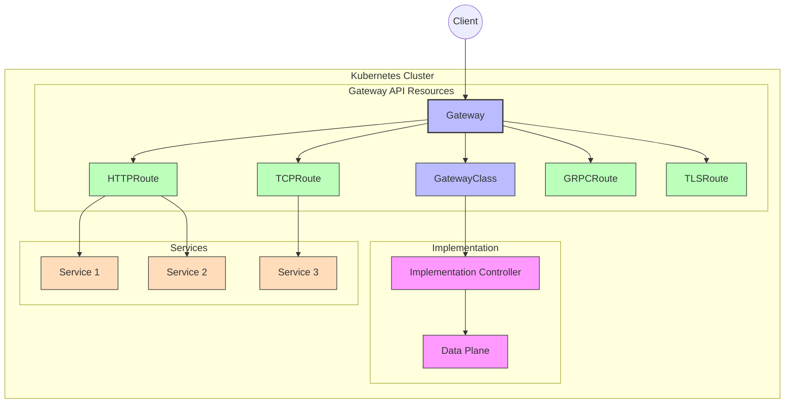
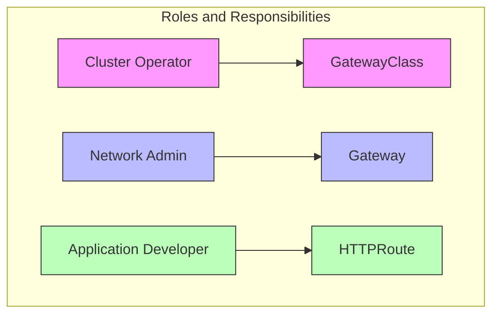
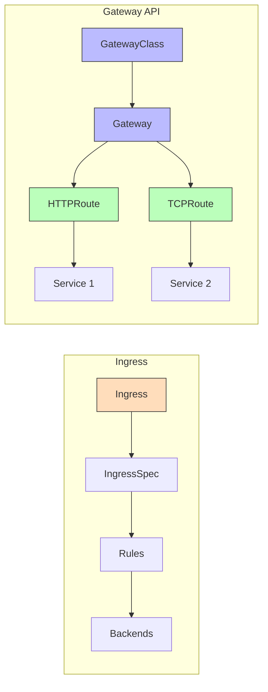
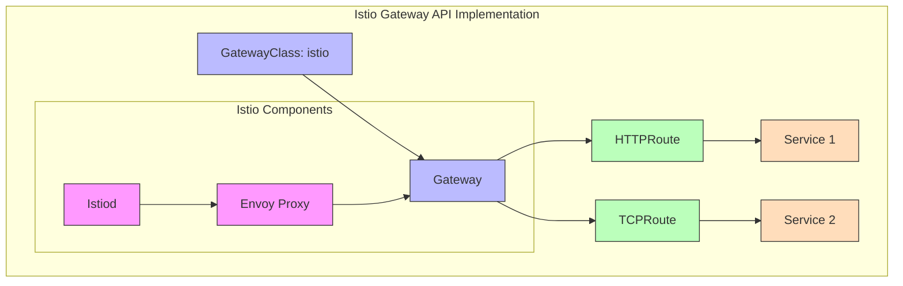

# Understanding the Kubernetes Gateway API

## Introduction

The Kubernetes Gateway API is a collection of resources that model service networking in Kubernetes. It expands upon the functionality of Ingress by providing a more expressive, extensible, and role-oriented API for managing traffic routing into and within Kubernetes clusters.



## Core Concepts

The Gateway API consists of several resource types that work together to define how traffic should be routed:

### GatewayClass

GatewayClass defines the implementation that should handle Gateways of this class. It's similar to the IngressClass resource but provides more configuration options.

```yaml
apiVersion: gateway.networking.k8s.io/v1
kind: GatewayClass
metadata:
  name: istio
spec:
  controllerName: istio.io/gateway-controller
```

- **Purpose**: Defines a type of Gateway with a specific implementation
- **Scope**: Cluster-wide resource
- **Ownership**: Typically managed by cluster operators

### Gateway

Gateway represents a specific instance of a traffic handling infrastructure. It defines listeners (ports, protocols, TLS settings) and is associated with a GatewayClass.

```yaml
apiVersion: gateway.networking.k8s.io/v1
kind: Gateway
metadata:
  name: example-gateway
  namespace: default
spec:
  gatewayClassName: istio
  listeners:
  - name: http
    port: 80
    protocol: HTTP
    allowedRoutes:
      namespaces:
        from: Same
```

- **Purpose**: Defines the actual infrastructure for traffic handling
- **Scope**: Namespace-scoped resource
- **Ownership**: Typically managed by platform or network administrators

### Routes

Routes define how traffic matching certain criteria should be directed to specific services. Different route types exist for different protocols:

#### HTTPRoute

```yaml
apiVersion: gateway.networking.k8s.io/v1
kind: HTTPRoute
metadata:
  name: example-route
  namespace: default
spec:
  parentRefs:
  - name: example-gateway
    kind: Gateway
  hostnames:
  - "example.com"
  rules:
  - matches:
    - path:
        type: PathPrefix
        value: /api
    backendRefs:
    - name: api-service
      port: 8080
```

- **Purpose**: Routes HTTP/HTTPS traffic based on host, path, headers, etc.
- **Scope**: Namespace-scoped resource
- **Ownership**: Typically managed by application developers

Other route types include:
- **TCPRoute**: For TCP traffic
- **GRPCRoute**: For gRPC traffic
- **TLSRoute**: For TLS traffic
- **UDPRoute**: For UDP traffic

## Role-Oriented Design

One of the key advantages of the Gateway API is its role-oriented design:



1. **Cluster Operators**: Manage GatewayClasses and the underlying infrastructure
2. **Network Administrators**: Configure Gateways, defining how traffic enters the cluster
3. **Application Developers**: Create Routes that direct traffic to their services

This separation of concerns allows each role to focus on their area of expertise without needing to understand the entire system.

## Gateway API vs. Ingress

The Gateway API offers significant improvements over the traditional Ingress resource:



### Advantages over Ingress:

1. **Protocol Support**: Gateway API supports multiple protocols (HTTP, TCP, UDP, TLS, gRPC), while Ingress is primarily designed for HTTP.

2. **Expressiveness**: Gateway API provides more detailed configuration options for routing, header manipulation, traffic splitting, etc.

3. **Role-Based Design**: Clear separation of concerns between different roles (cluster operators, network admins, application developers).

4. **Extensibility**: Designed to be extended with custom resources and implementation-specific features.

5. **Multi-Cluster Support**: Better support for multi-cluster scenarios through consistent abstractions.

## Advanced Features

### Traffic Splitting

The Gateway API allows for sophisticated traffic splitting, enabling canary deployments and A/B testing:

```yaml
apiVersion: gateway.networking.k8s.io/v1
kind: HTTPRoute
metadata:
  name: traffic-split-example
spec:
  parentRefs:
  - name: example-gateway
  rules:
  - backendRefs:
    - name: service-v1
      port: 8080
      weight: 90
    - name: service-v2
      port: 8080
      weight: 10
```

### Header Manipulation

You can modify request and response headers:

```yaml
apiVersion: gateway.networking.k8s.io/v1
kind: HTTPRoute
metadata:
  name: header-modification-example
spec:
  parentRefs:
  - name: example-gateway
  rules:
  - matches:
    - path:
        type: PathPrefix
        value: /api
    filters:
    - type: RequestHeaderModifier
      requestHeaderModifier:
        add:
        - name: x-custom-header
          value: custom-value
    backendRefs:
    - name: api-service
      port: 8080
```

### Cross-Namespace Routing

Gateway API supports routing traffic across namespaces with explicit permission controls:

```yaml
apiVersion: gateway.networking.k8s.io/v1
kind: Gateway
metadata:
  name: cross-namespace-gateway
  namespace: gateway-namespace
spec:
  gatewayClassName: istio
  listeners:
  - name: http
    port: 80
    protocol: HTTP
    allowedRoutes:
      namespaces:
        from: Selector
        selector:
          matchLabels:
            expose-services: "true"
```

## Implementations

Several implementations of the Gateway API exist:

1. **Istio**: Provides a robust implementation of the Gateway API, integrating with its service mesh capabilities.

2. **Contour**: A Kubernetes ingress controller that supports the Gateway API.

3. **Kong**: Offers Gateway API support through its Kubernetes ingress controller.

4. **Traefik**: Implements the Gateway API as part of its Kubernetes integration.

5. **Nginx**: Provides Gateway API support in its Kubernetes Ingress Controller.

## Gateway API in Istio

Istio provides a comprehensive implementation of the Gateway API, which integrates with its service mesh capabilities:



### Istio Gateway API Example

```yaml
# GatewayClass
apiVersion: gateway.networking.k8s.io/v1
kind: GatewayClass
metadata:
  name: istio
spec:
  controllerName: istio.io/gateway-controller
---
# Gateway
apiVersion: gateway.networking.k8s.io/v1
kind: Gateway
metadata:
  name: istio-gateway
  namespace: istio-system
spec:
  gatewayClassName: istio
  listeners:
  - name: http
    port: 80
    protocol: HTTP
---
# HTTPRoute
apiVersion: gateway.networking.k8s.io/v1
kind: HTTPRoute
metadata:
  name: bookinfo
  namespace: default
spec:
  parentRefs:
  - name: istio-gateway
    namespace: istio-system
  hostnames:
  - "bookinfo.example.com"
  rules:
  - matches:
    - path:
        type: PathPrefix
        value: /productpage
    backendRefs:
    - name: productpage
      port: 9080
```

## Best Practices

### 1. Namespace Isolation

Use namespaces to isolate Gateway resources:
- Place Gateways in dedicated namespaces (e.g., `ingress-system`)
- Use `allowedRoutes` to control which namespaces can attach routes

### 2. Security Considerations

- Implement TLS for all external-facing Gateways
- Use `ReferenceGrant` resources to explicitly allow cross-namespace references
- Apply RBAC rules to limit who can create/modify Gateway API resources

### 3. Monitoring and Observability

- Set up monitoring for Gateway resources
- Use status fields to track the health of Gateways and Routes
- Implement logging for troubleshooting

### 4. Gradual Migration

When migrating from Ingress:
- Start with simple HTTP routes
- Gradually move more complex configurations
- Use both Ingress and Gateway API during transition

## Troubleshooting

### Common Issues

1. **Route not attaching to Gateway**:
   - Check that the parentRef correctly references the Gateway
   - Verify namespace permissions with allowedRoutes
   - Look for ReferenceGrant if cross-namespace

2. **Traffic not reaching service**:
   - Verify the service exists and is healthy
   - Check that port numbers match
   - Confirm protocol compatibility

3. **TLS issues**:
   - Verify certificate and key are correctly configured
   - Check certificate validity and expiration
   - Ensure proper SNI configuration

### Debugging Commands

```bash
# Check Gateway status
kubectl get gateway <gateway-name> -o yaml

# Check HTTPRoute status
kubectl get httproute <route-name> -o yaml

# View events related to Gateway resources
kubectl get events --field-selector involvedObject.kind=Gateway

# Check implementation-specific logs (e.g., for Istio)
kubectl logs -n istio-system -l app=istio-ingressgateway
```

## Conclusion

The Kubernetes Gateway API represents a significant advancement in how traffic is managed in Kubernetes environments. Its role-oriented design, extensibility, and rich feature set make it a powerful tool for managing ingress traffic in modern cloud-native applications.

As the API continues to evolve and gain adoption, it's becoming the standard way to handle traffic routing in Kubernetes, replacing the more limited Ingress resource for complex scenarios.

## Additional Resources

- [Official Gateway API Documentation](https://gateway-api.sigs.k8s.io/)
- [Gateway API GitHub Repository](https://github.com/kubernetes-sigs/gateway-api)
- [Istio Gateway API Documentation](https://istio.io/latest/docs/tasks/traffic-management/ingress/gateway-api/)
- [Gateway API Concepts](https://gateway-api.sigs.k8s.io/concepts/api-overview/)
- [Gateway API Guides](https://gateway-api.sigs.k8s.io/guides/)
