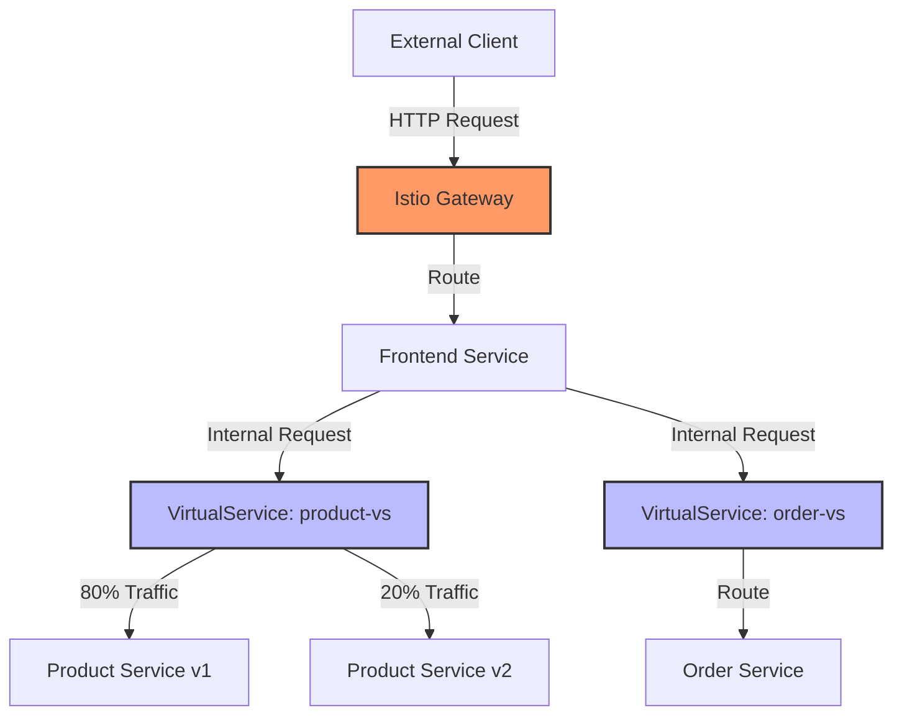
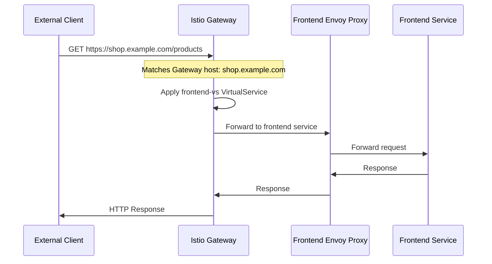
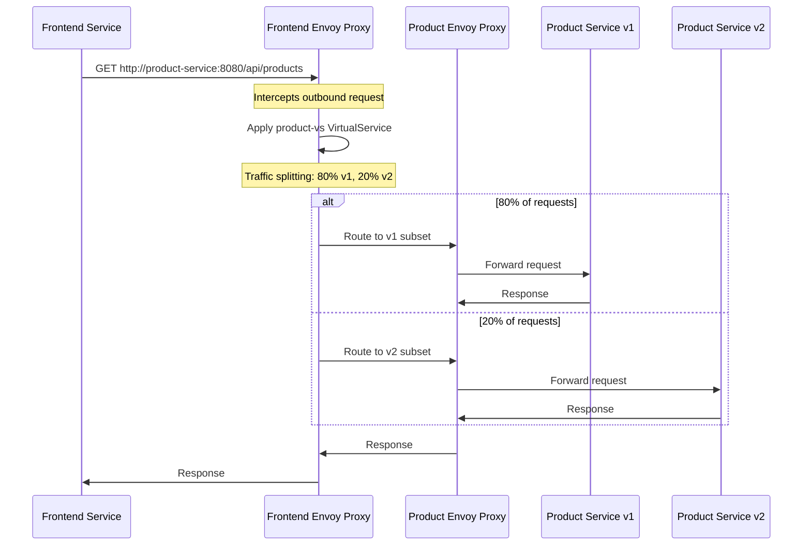

# Client-to-Service Communication Using Istio VirtualService: A Detailed Example

This document provides a comprehensive, step-by-step example of how a client communicates with a service in an Istio service mesh using VirtualService. We'll cover both in-mesh communication and external access patterns.

## Scenario Overview

We'll use a practical e-commerce application with the following components:

- **Frontend Service**: User interface
- **Product Service**: Product catalog with two versions (v1 and v2)
- **Order Service**: Order processing
- **External Client**: Mobile app or browser



## 1. Kubernetes Resources Setup

First, let's set up our Kubernetes resources:

### Product Service Deployment (Two Versions)

```yaml
# product-service-v1.yaml
apiVersion: apps/v1
kind: Deployment
metadata:
  name: product-service-v1
spec:
  replicas: 2
  selector:
    matchLabels:
      app: product-service
      version: v1
  template:
    metadata:
      labels:
        app: product-service
        version: v1
    spec:
      containers:
      - name: product-service
        image: example/product-service:v1
        ports:
        - containerPort: 8080
---
# product-service-v2.yaml
apiVersion: apps/v1
kind: Deployment
metadata:
  name: product-service-v2
spec:
  replicas: 2
  selector:
    matchLabels:
      app: product-service
      version: v2
  template:
    metadata:
      labels:
        app: product-service
        version: v2
    spec:
      containers:
      - name: product-service
        image: example/product-service:v2
        ports:
        - containerPort: 8080
```

### Product Service Kubernetes Service

```yaml
# product-service.yaml
apiVersion: v1
kind: Service
metadata:
  name: product-service
spec:
  ports:
  - port: 8080
    name: http
  selector:
    app: product-service  # Note: no version selector here
```

### Frontend Service

```yaml
# frontend-service.yaml
apiVersion: apps/v1
kind: Deployment
metadata:
  name: frontend
spec:
  replicas: 3
  selector:
    matchLabels:
      app: frontend
  template:
    metadata:
      labels:
        app: frontend
    spec:
      containers:
      - name: frontend
        image: example/frontend:latest
        ports:
        - containerPort: 80
---
apiVersion: v1
kind: Service
metadata:
  name: frontend
spec:
  ports:
  - port: 80
    name: http
  selector:
    app: frontend
```

## 2. Istio Configuration

Now, let's configure Istio resources to manage traffic:

### DestinationRule for Product Service

```yaml
# product-destination-rule.yaml
apiVersion: networking.istio.io/v1alpha3
kind: DestinationRule
metadata:
  name: product-service
spec:
  host: product-service  # Matches the Kubernetes service name
  subsets:
  - name: v1
    labels:
      version: v1      # Matches deployment labels
  - name: v2
    labels:
      version: v2
  trafficPolicy:
    connectionPool:
      http:
        maxRequestsPerConnection: 10
```

### VirtualService for Product Service (Internal Traffic)

```yaml
# product-virtualservice.yaml
apiVersion: networking.istio.io/v1alpha3
kind: VirtualService
metadata:
  name: product-vs
spec:
  hosts:
  - product-service    # Kubernetes service name for internal routing
  http:
  - route:
    - destination:
        host: product-service
        subset: v1     # Defined in DestinationRule
      weight: 80       # 80% of traffic
    - destination:
        host: product-service
        subset: v2
      weight: 20       # 20% of traffic
    timeout: 5s        # 5 second timeout
    retries:
      attempts: 3
      perTryTimeout: 2s
      retryOn: "gateway-error,connect-failure,refused-stream"
```

### Gateway for External Access

```yaml
# gateway.yaml
apiVersion: networking.istio.io/v1alpha3
kind: Gateway
metadata:
  name: ecommerce-gateway
spec:
  selector:
    istio: ingressgateway  # Use the default Istio ingress gateway
  servers:
  - port:
      number: 80
      name: http
      protocol: HTTP
    hosts:
    - "shop.example.com"
```

### VirtualService for Frontend (External Traffic)

```yaml
# frontend-virtualservice.yaml
apiVersion: networking.istio.io/v1alpha3
kind: VirtualService
metadata:
  name: frontend-vs
spec:
  hosts:
  - "shop.example.com"    # External hostname
  gateways:
  - ecommerce-gateway     # Reference to the Gateway
  http:
  - match:
    - uri:
        prefix: /
    route:
    - destination:
        host: frontend    # Kubernetes service name
        port:
          number: 80
```

## 3. Traffic Flow: Step-by-Step Walkthrough

Now let's trace how a request flows through the system:

### External Client to Frontend



1. **External client** makes a request to `https://shop.example.com/products`
2. Request arrives at the **Istio Gateway** (running on the Istio ingress gateway pod)
3. Gateway checks its configuration and finds a match in the `ecommerce-gateway` resource
4. Gateway then checks VirtualServices bound to it and finds `frontend-vs`
5. Based on the routing rules, the request is forwarded to the **Frontend service**
6. The request first goes to the **Envoy sidecar proxy** of a frontend pod
7. The proxy forwards the request to the **Frontend application container**
8. The response follows the reverse path back to the client

### Frontend to Product Service (Internal Communication)



1. **Frontend service** needs product data, so it makes a request to `http://product-service:8080/api/products`
2. This request is intercepted by the **Frontend's Envoy sidecar proxy**
3. The proxy checks for VirtualServices that apply to the `product-service` host and finds `product-vs`
4. Based on the traffic splitting rule (80/20), the proxy selects either v1 or v2
5. The request is forwarded to the **Envoy sidecar proxy** of the selected product service version
6. That proxy forwards the request to the **Product service container**
7. The response follows the reverse path back to the Frontend service

## 4. Detailed Request Processing

Let's examine what happens at each step in more detail:

### DNS Resolution

When the Frontend service makes a request to `product-service`:

1. Kubernetes DNS resolves `product-service` to the ClusterIP of the product-service Kubernetes Service
2. However, the request never actually reaches that IP because it's intercepted by the Envoy proxy

### Traffic Interception

The Envoy sidecar intercepts traffic through iptables rules that:

1. Capture all outbound traffic from the pod
2. Redirect it to the Envoy proxy's outbound port (typically 15001)

### VirtualService Evaluation

When the Frontend's Envoy proxy receives the intercepted request:

1. It contacts the **Istio Pilot** (istiod) to get routing configurations
2. It identifies the destination host as `product-service`
3. It finds the VirtualService `product-vs` that applies to this host
4. It evaluates the routing rules in order

### Traffic Splitting Decision

For our 80/20 traffic split:

1. Envoy uses a consistent hash algorithm to determine which subset to route to
2. For 80% of requests, it selects the v1 subset
3. For 20% of requests, it selects the v2 subset

### Destination Selection

Once a subset is selected:

1. Envoy looks up the **DestinationRule** for `product-service`
2. It finds the subset definition (v1 or v2)
3. It uses the subset's labels to identify which pods to route to
4. It selects a specific pod based on the load balancing policy (default is round-robin)

### Request Forwarding

The request is then forwarded:

1. Frontend's Envoy proxy sends the request to the selected Product service pod's IP and port
2. This request is intercepted by the **Product service's Envoy proxy**
3. The Product service's Envoy proxy forwards it to the local application container
4. The application processes the request and returns a response

### Response Processing

The response follows the reverse path:

1. Product service container sends response to its local Envoy proxy
2. Product service's Envoy proxy forwards it to the Frontend's Envoy proxy
3. Frontend's Envoy proxy forwards it to the Frontend container

### Retry and Timeout Handling

If the Product service fails to respond:

1. After 2 seconds (perTryTimeout), the Frontend's Envoy proxy will retry the request
2. It will retry up to 3 times (attempts)
3. If all retries fail or the total time exceeds 5 seconds (timeout), an error is returned

## 5. Observing the Traffic Flow

You can observe this traffic flow using Istio's observability tools:

### Kiali Visualization

Kiali will show:
- The traffic graph with connections between services
- The traffic split between product-service v1 and v2 (80/20)
- Health metrics for each service

### Viewing Envoy Configuration

To see how Envoy is configured for routing:

```bash
# View routes for the frontend pod
istioctl proxy-config routes <frontend-pod-name> --name "8080" -o json

# View clusters (destinations) for the frontend pod
istioctl proxy-config cluster <frontend-pod-name> -o json
```

### Viewing Real-time Traffic

To see the actual traffic split in action:

```bash
# Generate traffic
for i in {1..100}; do curl -s -o /dev/null "https://shop.example.com/products"; done

# Check Prometheus metrics
istio_requests_total{destination_service="product-service.default.svc.cluster.local", destination_version="v1"}
istio_requests_total{destination_service="product-service.default.svc.cluster.local", destination_version="v2"}
```

## 6. Modifying the Traffic Flow

Let's say you want to update the traffic split to 50/50:

```yaml
# Updated product-virtualservice.yaml
apiVersion: networking.istio.io/v1alpha3
kind: VirtualService
metadata:
  name: product-vs
spec:
  hosts:
  - product-service
  http:
  - route:
    - destination:
        host: product-service
        subset: v1
      weight: 50       # Changed from 80% to 50%
    - destination:
        host: product-service
        subset: v2
      weight: 50       # Changed from 20% to 50%
```

Apply the change:

```bash
kubectl apply -f product-virtualservice.yaml
```

The change takes effect immediately:
1. Istio Pilot (istiod) processes the updated VirtualService
2. It pushes the new configuration to all affected Envoy proxies
3. The Frontend's Envoy proxy updates its routing table
4. New requests will be split 50/50 between v1 and v2

## 7. Advanced Scenario: Header-Based Routing

Let's extend our example to route specific users to v2 regardless of the traffic split:

```yaml
# Advanced product-virtualservice.yaml
apiVersion: networking.istio.io/v1alpha3
kind: VirtualService
metadata:
  name: product-vs
spec:
  hosts:
  - product-service
  http:
  - match:
    - headers:
        user-type:
          exact: "premium"
    route:
    - destination:
        host: product-service
        subset: v2
    # No weight needed - 100% of matching requests go to v2
  
  - route:
    - destination:
        host: product-service
        subset: v1
      weight: 80
    - destination:
        host: product-service
        subset: v2
      weight: 20
```

Now:
1. If the request has a header `user-type: premium`, it always goes to v2
2. All other requests follow the 80/20 split between v1 and v2

The Frontend service can control this by adding the appropriate header:

```javascript
// Frontend code example
if (user.isPremium) {
  headers['user-type'] = 'premium';
}
fetch('http://product-service:8080/api/products', { headers });
```

## 8. External Service Integration

Let's add an external payment service to our application:

```yaml
# payment-serviceentry.yaml
apiVersion: networking.istio.io/v1alpha3
kind: ServiceEntry
metadata:
  name: payment-api
spec:
  hosts:
  - api.payment-provider.com
  ports:
  - number: 443
    name: https
    protocol: HTTPS
  resolution: DNS
  location: MESH_EXTERNAL
---
# payment-virtualservice.yaml
apiVersion: networking.istio.io/v1alpha3
kind: VirtualService
metadata:
  name: payment-vs
spec:
  hosts:
  - api.payment-provider.com
  http:
  - timeout: 10s
    retries:
      attempts: 3
      perTryTimeout: 2s
      retryOn: "connect-failure,refused-stream,gateway-error,5xx"
    route:
    - destination:
        host: api.payment-provider.com
        port:
          number: 443
```

Now when the Order service calls the external payment API:
1. The request is intercepted by the Order service's Envoy proxy
2. The proxy identifies the destination as an external service defined in the ServiceEntry
3. It applies the VirtualService rules (timeout and retry policy)
4. The request is sent to the external API with the configured policies

## Conclusion

This detailed example demonstrates how Istio VirtualServices control traffic flow in a service mesh:

1. **External traffic** enters through the Istio Gateway and is routed to services based on hostnames and paths
2. **Internal traffic** between services is intercepted by Envoy proxies and routed according to VirtualService rules
3. **Traffic management policies** like splitting, timeouts, and retries are applied transparently
4. **Advanced routing** based on headers allows for targeted testing and personalization
5. **External services** can be integrated into the mesh with ServiceEntry and managed with the same policies

The power of Istio's traffic management comes from its ability to control all aspects of service-to-service communication without changing application code. By configuring VirtualServices, you can implement sophisticated traffic patterns like canary deployments, A/B testing, and fault tolerance.

## Additional Resources

- [Istio Traffic Management Documentation](https://istio.io/latest/docs/concepts/traffic-management/)
- [VirtualService API Reference](https://istio.io/latest/docs/reference/config/networking/virtual-service/)
- [DestinationRule API Reference](https://istio.io/latest/docs/reference/config/networking/destination-rule/)
- [ServiceEntry API Reference](https://istio.io/latest/docs/reference/config/networking/service-entry/)
