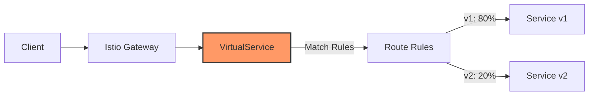

# Istio VirtualService: A Comprehensive Guide

This guide provides an in-depth explanation of Istio's VirtualService resource, including its purpose, configuration options, and best practices for traffic management in a service mesh.

## Introduction to VirtualService

VirtualService is one of the core traffic management resources in Istio that defines how requests are routed to a service within the mesh. Unlike Kubernetes Services which simply provide basic load balancing, VirtualServices offer sophisticated routing capabilities including:

- Request matching based on various criteria
- Traffic splitting across different service versions
- Fault injection for testing resilience
- Request timeouts and retries
- Traffic mirroring for testing
- Header manipulation



## VirtualService Anatomy

A VirtualService resource consists of several key components:

### Basic Structure

```yaml
apiVersion: networking.istio.io/v1alpha3
kind: VirtualService
metadata:
  name: my-service-routes
spec:
  hosts:
    - my-service  # Service name or external hostname
  gateways:
    - my-gateway  # Optional: Gateway name for ingress traffic
  http:
    - match:        # Request matching rules
      route:        # Routing destination
      redirect:     # HTTP redirection
      rewrite:      # URL rewriting
      timeout:      # Request timeout
      retries:      # Retry policy
      fault:        # Fault injection
      mirror:       # Traffic mirroring
      corsPolicy:   # CORS policy
  tcp:              # TCP routing rules
  tls:              # TLS routing rules
```

### Key Fields Explained

#### `hosts`

The `hosts` field defines which hostnames or service names this VirtualService applies to. This can be:

- A Kubernetes service name (e.g., `my-service`)
- A fully qualified domain name (e.g., `my-service.namespace.svc.cluster.local`)
- An external domain (e.g., `api.example.com`)
- A wildcard domain (e.g., `*.example.com`)

```yaml
hosts:
  - my-service          # Short name (same namespace)
  - my-service.test     # Service in another namespace
  - api.example.com     # External domain
```

#### `gateways`

The `gateways` field specifies which gateways this VirtualService applies to:

```yaml
gateways:
  - my-gateway          # For ingress traffic
  - mesh                # For in-mesh traffic
```

Special values:
- `mesh`: Applies to all sidecars in the mesh (internal traffic)
- Omitting this field: Defaults to `mesh` (internal traffic only)

#### `http` Section

The `http` section contains an array of HTTP routing rules that are evaluated in order:

```yaml
http:
  - name: "my-route"    # Optional name for the route
    match:              # Conditions to match this route
    route:              # Destination for matched requests
```

## Request Matching

VirtualService offers powerful request matching capabilities through the `match` field:

### URI Matching

```yaml
match:
  - uri:
      exact: /api/v1/products      # Exact match
  - uri:
      prefix: /api/v1/             # Prefix match
  - uri:
      regex: "/api/v[0-9]+/.*"     # Regex match
```

### HTTP Method Matching

```yaml
match:
  - method:
      exact: GET                   # Match GET requests
```

### Header Matching

```yaml
match:
  - headers:
      user-agent:
        regex: ".*Mobile.*"        # Match mobile browsers
      cookie:
        regex: "^(.*?;)?(user=john)(;.*)?$"  # Match specific cookie
```

### Query Parameter Matching

```yaml
match:
  - queryParams:
      version:
        exact: v2                  # Match specific query parameter
```

### Combined Matching

Multiple conditions within a single match entry use AND logic:

```yaml
match:
  - uri:
      prefix: /api
    method:
      exact: POST
    headers:
      content-type:
        exact: application/json    # Matches POST /api with JSON content
```

Multiple match entries use OR logic:

```yaml
match:
  - uri:
      prefix: /api/v1              # Match v1 API
  - uri:
      prefix: /api/v2              # OR match v2 API
```

## Traffic Routing

The `route` field defines where matching traffic should be sent:

### Basic Routing

```yaml
route:
  - destination:
      host: my-service
      port:
        number: 8080
```

### Subset Routing (with DestinationRule)

```yaml
route:
  - destination:
      host: my-service
      subset: v1                   # Subset defined in DestinationRule
```

### Traffic Splitting

```yaml
route:
  - destination:
      host: my-service
      subset: v1
    weight: 80                     # 80% of traffic
  - destination:
      host: my-service
      subset: v2
    weight: 20                     # 20% of traffic
```

### Header Manipulation

```yaml
route:
  - destination:
      host: my-service
    headers:
      request:
        set:                       # Set request headers
          x-request-id: "123"
        add:                       # Add headers (if not present)
          x-api-version: "v1"
        remove:                    # Remove headers
          - x-legacy-header
      response:
        set:                       # Set response headers
          cache-control: "no-cache"
```

## Advanced Features

### Timeouts

Set request timeouts to control how long to wait for responses:

```yaml
http:
  - route:
      - destination:
          host: my-service
    timeout: 5s                    # 5 second timeout
```

### Retries

Configure automatic retries for failed requests:

```yaml
http:
  - route:
      - destination:
          host: my-service
    retries:
      attempts: 3                  # Number of retry attempts
      perTryTimeout: 2s            # Timeout per retry
      retryOn: "gateway-error,connect-failure,refused-stream"
```

Common `retryOn` values:
- `5xx`: Retry on all 5xx response codes
- `gateway-error`: Retry on 502, 503, 504
- `connect-failure`: Retry on connection failures
- `refused-stream`: Retry if server refuses the stream

### Fault Injection

Inject artificial faults for testing resilience:

```yaml
http:
  - route:
      - destination:
          host: my-service
    fault:
      delay:
        percentage:
          value: 10                # Apply to 10% of requests
        fixedDelay: 5s             # 5 second delay
      abort:
        percentage:
          value: 5                 # Apply to 5% of requests
        httpStatus: 500            # Return HTTP 500
```

### Traffic Mirroring (Shadow Traffic)

Send a copy of traffic to another service for testing:

```yaml
http:
  - route:
      - destination:
          host: my-service-v1      # Primary destination
    mirror:
      host: my-service-v2          # Mirror destination
    mirrorPercentage:
      value: 100                   # Mirror 100% of traffic
```

### URL Rewriting

Rewrite the URL path or host before forwarding:

```yaml
http:
  - match:
      - uri:
          prefix: /api/legacy
    rewrite:
      uri: /api/v2                 # Rewrite path
    route:
      - destination:
          host: my-service
```

### Redirects

Configure HTTP redirects:

```yaml
http:
  - match:
      - uri:
          prefix: /old-path
    redirect:
      uri: /new-path
      authority: new.example.com
      redirectCode: 301            # Permanent redirect
```

### CORS Policy

Configure Cross-Origin Resource Sharing:

```yaml
http:
  - route:
      - destination:
          host: my-service
    corsPolicy:
      allowOrigins:
        - exact: https://example.com
      allowMethods:
        - GET
        - POST
      allowCredentials: true
      allowHeaders:
        - X-Custom-Header
      maxAge: "24h"
```

## TCP and TLS Routing

### TCP Routing

For TCP traffic, configure routing based on ports:

```yaml
tcp:
  - match:
      - port: 3306                 # MySQL port
    route:
      - destination:
          host: mysql
          port:
            number: 3306
```

### TLS Routing

For TLS traffic, route based on SNI (Server Name Indication):

```yaml
tls:
  - match:
      - sniHosts:
          - secure.example.com
    route:
      - destination:
          host: secure-service
          port:
            number: 443
```

## Common Use Cases

### Canary Deployments

Gradually shift traffic from one version to another:

```yaml
http:
  - route:
      - destination:
          host: my-service
          subset: v1
        weight: 90                 # 90% to stable version
      - destination:
          host: my-service
          subset: v2
        weight: 10                 # 10% to canary version
```

### A/B Testing

Route traffic based on user characteristics:

```yaml
http:
  - match:
      - headers:
          user-agent:
            regex: ".*iPhone.*"    # Match iPhone users
    route:
      - destination:
          host: my-service
          subset: experiment       # Send to experimental version
  - route:
      - destination:
          host: my-service
          subset: stable           # All other users to stable
```

### Blue-Green Deployment

Switch traffic between two identical environments:

```yaml
http:
  - route:
      - destination:
          host: my-service-green   # Currently active environment
```

To switch to blue:

```yaml
http:
  - route:
      - destination:
          host: my-service-blue    # Switch all traffic to blue
```

### API Versioning

Route based on API version in the URL or header:

```yaml
http:
  - match:
      - uri:
          prefix: /api/v1
    route:
      - destination:
          host: my-service
          subset: v1
  - match:
      - uri:
          prefix: /api/v2
    route:
      - destination:
          host: my-service
          subset: v2
  - match:
      - headers:
          x-api-version:
            exact: v3
    route:
      - destination:
          host: my-service
          subset: v3
```

## Best Practices

### 1. Order Matters

Rules are evaluated in order, with the first match being applied. Put more specific rules before general ones:

```yaml
http:
  - match:
      - uri:
          exact: /api/special      # Specific rule first
    route:
      - destination:
          host: special-service
  - match:
      - uri:
          prefix: /api             # General rule second
    route:
      - destination:
          host: api-service
```

### 2. Use Meaningful Names

Give your VirtualServices descriptive names:

```yaml
metadata:
  name: frontend-routing           # Better than "my-virtualservice"
```

### 3. Separate Ingress and Mesh Traffic

Use separate VirtualServices for external and internal traffic:

```yaml
# For external traffic
apiVersion: networking.istio.io/v1alpha3
kind: VirtualService
metadata:
  name: my-service-external
spec:
  hosts:
    - api.example.com
  gateways:
    - ingress-gateway
  http:
    # External routing rules
---
# For internal traffic
apiVersion: networking.istio.io/v1alpha3
kind: VirtualService
metadata:
  name: my-service-internal
spec:
  hosts:
    - my-service
  http:
    # Internal routing rules
```

### 4. Set Appropriate Timeouts

Always configure timeouts to prevent cascading failures:

```yaml
http:
  - route:
      - destination:
          host: my-service
    timeout: 10s                   # Default is 15s
```

### 5. Use Subsets with DestinationRules

Define subsets in DestinationRules and reference them in VirtualServices:

```yaml
# DestinationRule
apiVersion: networking.istio.io/v1alpha3
kind: DestinationRule
metadata:
  name: my-service
spec:
  host: my-service
  subsets:
    - name: v1
      labels:
        version: v1
    - name: v2
      labels:
        version: v2
---
# VirtualService
apiVersion: networking.istio.io/v1alpha3
kind: VirtualService
metadata:
  name: my-service
spec:
  hosts:
    - my-service
  http:
    - route:
        - destination:
            host: my-service
            subset: v1
```

### 6. Implement Circuit Breaking

Combine VirtualServices with DestinationRules for circuit breaking:

```yaml
# DestinationRule with circuit breaker
apiVersion: networking.istio.io/v1alpha3
kind: DestinationRule
metadata:
  name: my-service
spec:
  host: my-service
  trafficPolicy:
    connectionPool:
      tcp:
        maxConnections: 100
      http:
        http1MaxPendingRequests: 10
        maxRequestsPerConnection: 10
    outlierDetection:
      consecutiveErrors: 5
      interval: 30s
      baseEjectionTime: 30s
```

### 7. Start with Simple Configurations

Begin with simple routing rules and gradually add complexity:

```yaml
# Start simple
http:
  - route:
      - destination:
          host: my-service

# Then add more features as needed
http:
  - route:
      - destination:
          host: my-service
    timeout: 5s
    retries:
      attempts: 3
      perTryTimeout: 2s
```

## Troubleshooting VirtualServices

### Common Issues and Solutions

#### 1. Routes Not Applied

**Symptoms**: Traffic doesn't follow VirtualService rules

**Possible causes**:
- Incorrect host name
- Missing or incorrect gateway reference
- More specific rule in another VirtualService

**Debugging**:
```bash
# Check if VirtualService is recognized
istioctl x describe service my-service

# Validate configuration
istioctl analyze

# Check Envoy configuration
istioctl proxy-config routes <pod-name> -o json
```

#### 2. Order of Operations

**Symptoms**: Unexpected routing behavior

**Possible causes**:
- Multiple VirtualServices for the same host
- Rule order within a VirtualService

**Solution**: Consolidate rules into a single VirtualService when possible, or ensure consistent ordering.

#### 3. Regex Issues

**Symptoms**: Regex matching not working as expected

**Solution**: Test your regex patterns separately and ensure they're compatible with Envoy's regex engine (RE2).

#### 4. Subset Not Found

**Symptoms**: "subset not found" errors

**Possible causes**:
- Subset defined in VirtualService but not in DestinationRule
- Labels don't match any pods

**Debugging**:
```bash
# Check DestinationRule configuration
kubectl get destinationrule my-service -o yaml

# Check if pods match the subset labels
kubectl get pods -l version=v1
```

## Complete Examples

### Example 1: Comprehensive Routing

```yaml
apiVersion: networking.istio.io/v1alpha3
kind: VirtualService
metadata:
  name: comprehensive-example
spec:
  hosts:
    - api.example.com
  gateways:
    - api-gateway
  http:
    - match:
        - uri:
            prefix: /api/v2
          headers:
            x-debug:
              exact: "true"
      route:
        - destination:
            host: api-service
            subset: debug
            port:
              number: 8080
      timeout: 30s
    
    - match:
        - uri:
            prefix: /api/v2
      route:
        - destination:
            host: api-service
            subset: v2
      timeout: 5s
      retries:
        attempts: 3
        perTryTimeout: 2s
        retryOn: "gateway-error,connect-failure,refused-stream"
    
    - match:
        - uri:
            prefix: /api/v1
      route:
        - destination:
            host: api-service
            subset: v1
      fault:
        delay:
          percentage:
            value: 5
          fixedDelay: 1s
    
    - route:
        - destination:
            host: api-service
            subset: v1
      corsPolicy:
        allowOrigins:
          - exact: https://example.com
        allowMethods:
          - GET
          - POST
          - PUT
        allowHeaders:
          - X-Custom-Header
        maxAge: "24h"
```

### Example 2: Canary Deployment with Header-Based Routing

```yaml
apiVersion: networking.istio.io/v1alpha3
kind: VirtualService
metadata:
  name: canary-deployment
spec:
  hosts:
    - my-service
  http:
    # Internal testing with header
    - match:
        - headers:
            x-canary:
              exact: "true"
      route:
        - destination:
            host: my-service
            subset: v2
    
    # Percentage-based canary
    - route:
        - destination:
            host: my-service
            subset: v1
          weight: 90
        - destination:
            host: my-service
            subset: v2
          weight: 10
```

## Integration with Other Istio Resources

VirtualServices work best when combined with other Istio resources:

### With Gateway

```yaml
apiVersion: networking.istio.io/v1alpha3
kind: Gateway
metadata:
  name: my-gateway
spec:
  selector:
    istio: ingressgateway
  servers:
    - port:
        number: 80
        name: http
        protocol: HTTP
      hosts:
        - api.example.com
---
apiVersion: networking.istio.io/v1alpha3
kind: VirtualService
metadata:
  name: api-routes
spec:
  hosts:
    - api.example.com
  gateways:
    - my-gateway
  http:
    - route:
        - destination:
            host: api-service
```

### With DestinationRule

```yaml
apiVersion: networking.istio.io/v1alpha3
kind: DestinationRule
metadata:
  name: my-service
spec:
  host: my-service
  trafficPolicy:
    loadBalancer:
      simple: LEAST_CONN
  subsets:
    - name: v1
      labels:
        version: v1
    - name: v2
      labels:
        version: v2
---
apiVersion: networking.istio.io/v1alpha3
kind: VirtualService
metadata:
  name: my-service-routes
spec:
  hosts:
    - my-service
  http:
    - route:
        - destination:
            host: my-service
            subset: v1
```

### With ServiceEntry

```yaml
apiVersion: networking.istio.io/v1alpha3
kind: ServiceEntry
metadata:
  name: external-api
spec:
  hosts:
    - api.external-service.com
  ports:
    - number: 443
      name: https
      protocol: HTTPS
  resolution: DNS
  location: MESH_EXTERNAL
---
apiVersion: networking.istio.io/v1alpha3
kind: VirtualService
metadata:
  name: external-api-routes
spec:
  hosts:
    - api.external-service.com
  http:
    - timeout: 10s
      retries:
        attempts: 3
        perTryTimeout: 2s
      route:
        - destination:
            host: api.external-service.com
            port:
              number: 443
```

## Conclusion

Istio's VirtualService is a powerful resource for controlling how traffic flows within your service mesh. By mastering its configuration options, you can implement sophisticated traffic management patterns like canary deployments, A/B testing, and fault tolerance.

Remember these key points:
1. VirtualServices define routing rules for one or more service hosts
2. Rules are evaluated in order, with the first match being applied
3. Combine VirtualServices with DestinationRules for complete traffic management
4. Use separate VirtualServices for external and internal traffic
5. Always configure appropriate timeouts and retries

With these practices, you can build a resilient, flexible service mesh that supports modern deployment patterns and provides robust traffic control.

## Additional Resources

- [Istio Traffic Management Documentation](https://istio.io/latest/docs/concepts/traffic-management/)
- [VirtualService API Reference](https://istio.io/latest/docs/reference/config/networking/virtual-service/)
- [DestinationRule API Reference](https://istio.io/latest/docs/reference/config/networking/destination-rule/)
- [Istio Gateway API Reference](https://istio.io/latest/docs/reference/config/networking/gateway/)
