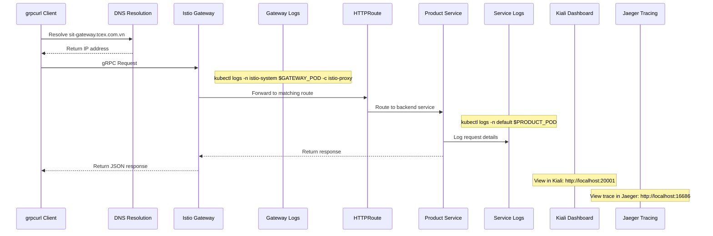

# Debugging gRPC Requests in Istio Service Mesh

This guide explains how to check logs and debug gRPC requests when using `grpcurl` to send requests through your Istio service mesh.

## Checking Logs for a gRPC Request

When you execute:
```bash
grpcurl -d '{"product_id": "123"}' -plaintext sit-gateway.tcex.com.vn:443 product.ProductService/GetProduct
```

You can trace this request through each component in the service mesh by checking logs at various points.

### 1. Ingress Gateway Logs

The first point of contact for your request is the Istio Ingress Gateway:

```bash
# Get the ingress gateway pod name
GATEWAY_POD=$(kubectl get pod -l app=istio-ingressgateway -n istio-system -o jsonpath='{.items[0].metadata.name}')

# View recent logs
kubectl logs -n istio-system $GATEWAY_POD -c istio-proxy --tail=100

# Stream logs in real-time (run this before making your request)
kubectl logs -n istio-system $GATEWAY_POD -c istio-proxy -f

# Filter for specific request (after making the request)
kubectl logs -n istio-system $GATEWAY_POD -c istio-proxy | grep product.ProductService/GetProduct
```

Look for entries containing:
- Your request path (`/product.ProductService/GetProduct`)
- HTTP status codes
- Response times

### 2. Product Service Logs

Next, check the logs of your product service:

```bash
# Get the product service pod name
PRODUCT_POD=$(kubectl get pod -l app=product-service -n default -o jsonpath='{.items[0].metadata.name}')

# View application logs
kubectl logs -n default $PRODUCT_POD -c product-service --tail=100

# Stream application logs in real-time
kubectl logs -n default $PRODUCT_POD -c product-service -f

# View Istio sidecar proxy logs
kubectl logs -n default $PRODUCT_POD -c istio-proxy --tail=100

# Stream sidecar logs in real-time
kubectl logs -n default $PRODUCT_POD -c istio-proxy -f
```

### 3. Enhanced Logging with JSON Output

For more detailed analysis, you can use JSON output:

```bash
# Get detailed JSON logs from gateway
kubectl logs -n istio-system $GATEWAY_POD -c istio-proxy --tail=100 -o json

# Get detailed JSON logs from product service sidecar
kubectl logs -n default $PRODUCT_POD -c istio-proxy --tail=100 -o json
```

## Using Istio Debug Tools

Istio provides several tools to help debug requests:

### 1. Request Tracing with `istioctl proxy-config`

```bash
# Check how the gateway routes your request
istioctl proxy-config route $GATEWAY_POD.istio-system --name http.80 -o json

# Check how the service receives your request
istioctl proxy-config listener $PRODUCT_POD.default --port 50051 -o json
```

### 2. Enabling Debug Logging

For more verbose logs, you can temporarily increase the log level:

```bash
# Increase log level for gateway
kubectl exec -n istio-system $GATEWAY_POD -c istio-proxy -- curl -X POST localhost:15000/logging?level=debug

# Increase log level for product service sidecar
kubectl exec -n default $PRODUCT_POD -c istio-proxy -- curl -X POST localhost:15000/logging?level=debug

# Return to normal logging when done
kubectl exec -n istio-system $GATEWAY_POD -c istio-proxy -- curl -X POST localhost:15000/logging?level=info
kubectl exec -n default $PRODUCT_POD -c istio-proxy -- curl -X POST localhost:15000/logging?level=info
```

## Using Kiali for Visual Debugging

If you have Kiali installed:

```bash
# Port-forward Kiali
kubectl port-forward svc/kiali -n istio-system 20001:20001
```

Then access `http://localhost:20001` in your browser to:
1. View the service graph
2. See traffic flow in real-time
3. Inspect request details and response codes

## Using Jaeger for Distributed Tracing

If you have Jaeger installed:

```bash
# Port-forward Jaeger
kubectl port-forward svc/jaeger-query -n istio-system 16686:16686
```

Then access `http://localhost:16686` in your browser to:
1. Search for traces containing your request
2. View the complete request flow across services
3. Analyze timing and latency

## Debugging Common gRPC Issues

### 1. Authentication Failures

If you see "Unauthenticated" errors:

```bash
# Check authentication policies
kubectl get peerauthentication -n default -o yaml

# Verify TLS settings
istioctl authn tls-check $PRODUCT_POD.default.svc.cluster.local
```

### 2. Connection Issues

If the connection fails:

```bash
# Check if the service is reachable
kubectl exec -it $GATEWAY_POD -n istio-system -c istio-proxy -- curl -v telnet://product-service.default.svc.cluster.local:50051

# Check if the route exists
kubectl get httproute product-service-grpc-route -n default -o yaml
```

### 3. Protocol Errors

For protocol-related errors:

```bash
# Check if HTTP/2 is enabled
kubectl exec -it $GATEWAY_POD -n istio-system -c istio-proxy -- curl -s localhost:15000/config_dump | grep -A 5 '"name": "product-service'

# Verify protocol selection
istioctl proxy-config cluster $GATEWAY_POD.istio-system -o json | jq '.[] | select(.name | contains("product-service"))'
```

## Complete Request Flow Visualization



## Debugging Script

Here's a script to help you debug your gRPC requests:

```bash
#!/bin/bash
# debug-grpc-request.sh

echo "=== Debugging gRPC Request ==="
echo "Request: grpcurl -d '{\"product_id\": \"123\"}' -plaintext sit-gateway.tcex.com.vn:443 product.ProductService/GetProduct"

# Get pod names
GATEWAY_POD=$(kubectl get pod -l app=istio-ingressgateway -n istio-system -o jsonpath='{.items[0].metadata.name}')
PRODUCT_POD=$(kubectl get pod -l app=product-service -n default -o jsonpath='{.items[0].metadata.name}')

echo -e "\n=== Gateway Pod: $GATEWAY_POD ==="
echo -e "\n=== Product Service Pod: $PRODUCT_POD ==="

echo -e "\n=== Checking HTTPRoute Configuration ==="
kubectl get httproute product-service-grpc-route -n default -o yaml

echo -e "\n=== Checking DestinationRule Configuration ==="
kubectl get destinationrule product-service-mtls -n default -o yaml

echo -e "\n=== Making gRPC Request ==="
grpcurl -d '{"product_id": "123"}' -plaintext -v sit-gateway.tcex.com.vn:443 product.ProductService/GetProduct

echo -e "\n=== Gateway Logs (Last 10 entries) ==="
kubectl logs -n istio-system $GATEWAY_POD -c istio-proxy --tail=10

echo -e "\n=== Product Service Logs (Last 10 entries) ==="
kubectl logs -n default $PRODUCT_POD --tail=10

echo -e "\n=== Product Service Sidecar Logs (Last 10 entries) ==="
kubectl logs -n default $PRODUCT_POD -c istio-proxy --tail=10

echo -e "\n=== Debug Complete ==="
```

Save this script and run it with:

```bash
chmod +x debug-grpc-request.sh
./debug-grpc-request.sh
```

This will give you a comprehensive view of your gRPC request's journey through the service mesh.
