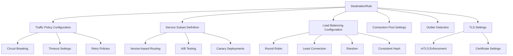
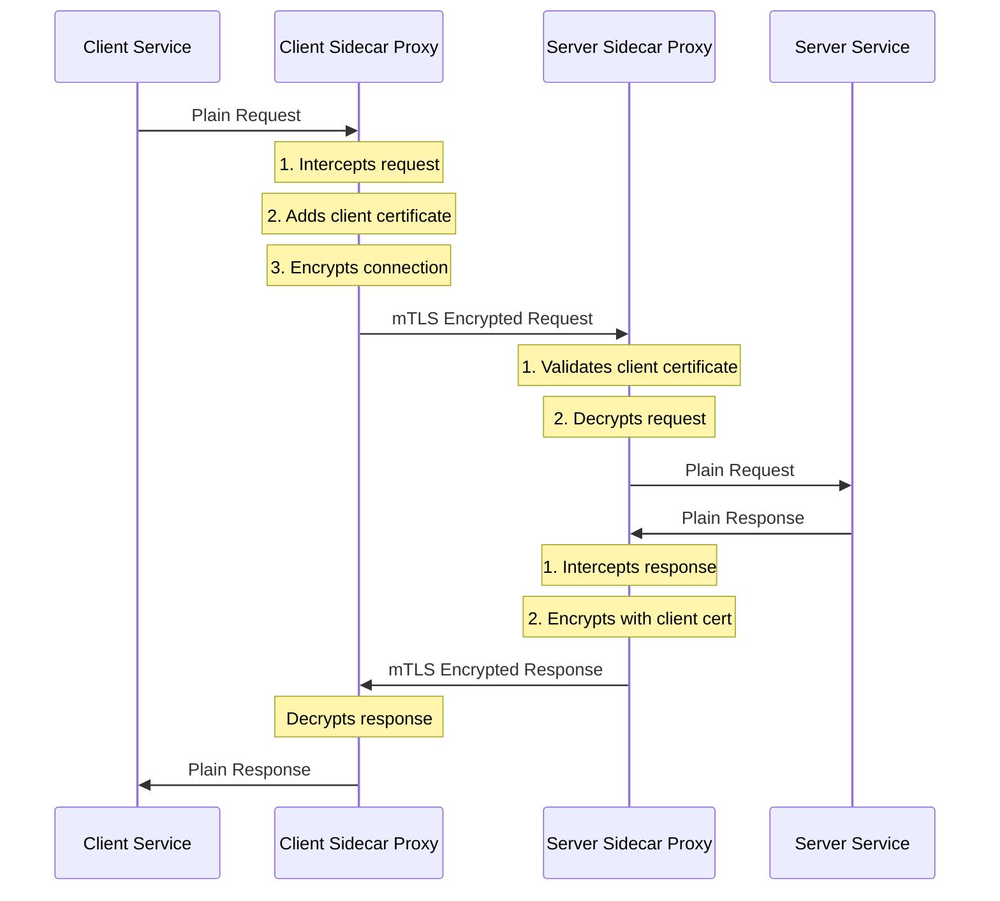
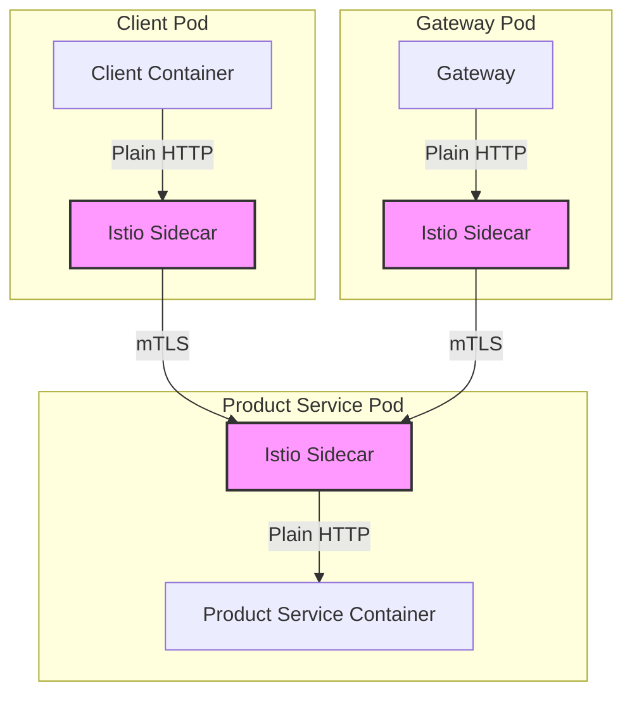
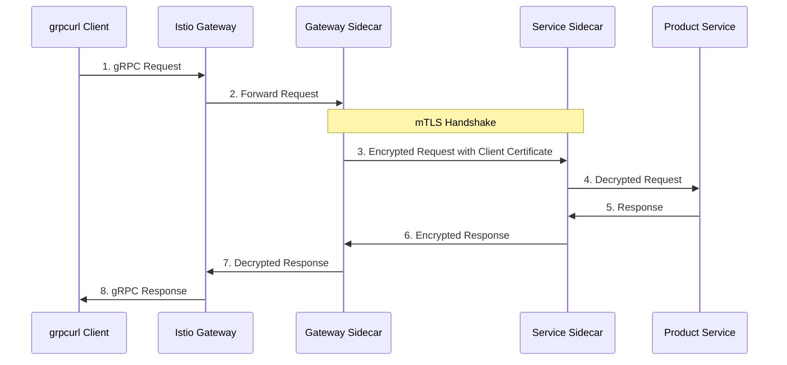
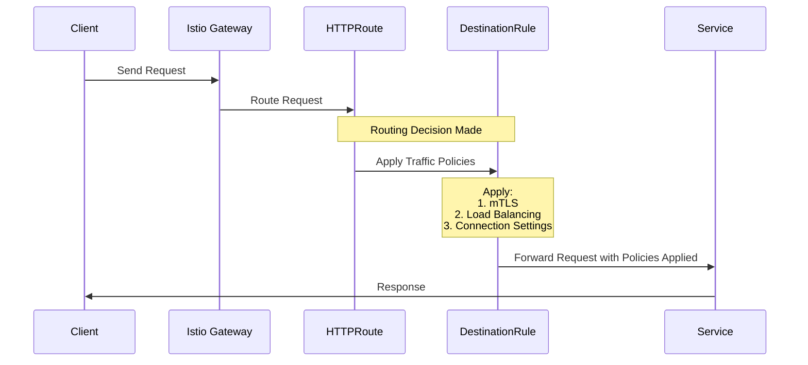

# DestinationRule in Istio Service Mesh

## Purpose of DestinationRule

A DestinationRule in Istio defines policies that apply to traffic intended for a service after routing has occurred. While other resources like HTTPRoute or VirtualService control **how traffic is routed**, DestinationRule controls **what happens to the traffic** once it's been routed to a service.

## Key Functions of DestinationRule



### 1. Traffic Management Policies

DestinationRule configures how traffic behaves once it reaches a service:

```yaml
trafficPolicy:
  connectionPool:
    http:
      http2MaxRequests: 1000
      maxRequestsPerConnection: 100
  loadBalancer:
    simple: LEAST_CONN
  outlierDetection:
    consecutive5xxErrors: 5
    interval: 30s
    baseEjectionTime: 30s
```

### 2. Security Configuration (TLS)

One of the most important functions is configuring TLS settings between services:

```yaml
trafficPolicy:
  tls:
    mode: ISTIO_MUTUAL  # Enforces mTLS between services
```

#### Understanding TLS Modes in Istio

Istio offers several TLS modes that control how services communicate securely:

| Mode | Description | Certificate Management | Use Case |
|------|-------------|------------------------|----------|
| `DISABLE` | No TLS encryption | None | Development/Testing only |
| `SIMPLE` | One-way TLS (client verifies server) | Server provides certificate | Basic encryption needs |
| `MUTUAL` | Two-way TLS with application-provided certificates | Application manages certificates | Custom certificate requirements |
| `ISTIO_MUTUAL` | Two-way TLS with Istio-managed certificates | Istio manages all certificates | Most production scenarios |

#### How ISTIO_MUTUAL Works



#### ISTIO_MUTUAL in Your Service Mesh

When you specify `mode: ISTIO_MUTUAL` in your DestinationRule:

1. **All Traffic is Secured**: Any service communicating with your product-service must use mTLS, including:
   - Gateway to service communication
   - Service to service communication within the mesh
   - Sidecar-to-sidecar communication

2. **Automatic Certificate Management**: Istio:
   - Generates unique certificates for each service
   - Handles certificate rotation
   - Manages the entire PKI infrastructure

3. **Transparent to Applications**: Your application code doesn't need to implement TLS:
   - The client-side Envoy proxy initiates the TLS connection
   - The server-side Envoy proxy terminates the TLS connection
   - Applications communicate with their local proxies using plain HTTP



#### mTLS Flow in Your gRPC Request



### 3. Service Subsets

DestinationRule allows you to define logical subsets of a service based on labels:

```yaml
subsets:
- name: v1
  labels:
    version: v1
- name: v2
  labels:
    version: v2
```

These subsets can then be targeted by VirtualService or HTTPRoute for traffic splitting:

```yaml
http:
- route:
  - destination:
      host: my-service
      subset: v1
    weight: 90
  - destination:
      host: my-service
      subset: v2
    weight: 10
```

### 4. Load Balancing Algorithms

DestinationRule configures how traffic is distributed across instances:

```yaml
trafficPolicy:
  loadBalancer:
    simple: LEAST_CONN  # Options: ROUND_ROBIN, LEAST_CONN, RANDOM, PASSTHROUGH
```

For more advanced scenarios, you can use consistent hash-based load balancing:

```yaml
trafficPolicy:
  loadBalancer:
    consistentHash:
      httpHeaderName: x-user-id  # Route based on header value
```

### 5. Connection Pool Settings

Controls the volume of connections to a service:

```yaml
trafficPolicy:
  connectionPool:
    tcp:
      maxConnections: 100
      connectTimeout: 30ms
    http:
      http2MaxRequests: 1000
      maxRequestsPerConnection: 10
```

## DestinationRule in Your gRPC Flow

In your gRPC service flow, the DestinationRule plays these critical roles:

1. **Enforcing mTLS**: Secures communication between services
2. **Optimizing Load Balancing**: Uses LEAST_CONN to distribute traffic efficiently
3. **Connection Pooling**: Manages HTTP/2 connections for gRPC traffic



## Common Use Cases

1. **Blue-Green Deployments**: Define blue and green subsets, then switch traffic between them
2. **Canary Releases**: Gradually shift traffic from one version to another
3. **Circuit Breaking**: Prevent cascading failures by limiting connections
4. **Security Enforcement**: Ensure all service-to-service communication is encrypted

## DestinationRule vs. VirtualService/HTTPRoute

| Feature | DestinationRule | VirtualService/HTTPRoute |
|---------|----------------|------------------------|
| Purpose | Post-routing traffic policies | Traffic routing rules |
| Timing | Applied after routing decision | Applied to determine routing |
| Focus | How traffic behaves | Where traffic goes |
| Examples | TLS settings, load balancing | URL matching, service selection |

## Example: Your Product Service DestinationRule

```yaml
apiVersion: networking.istio.io/v1alpha3
kind: DestinationRule
metadata:
  name: product-service-mtls
  namespace: default
spec:
  host: product-service.default.svc.cluster.local
  trafficPolicy:
    tls:
      mode: ISTIO_MUTUAL # Enforces mTLS for this service
    loadBalancer:
      simple: LEAST_CONN
    connectionPool:
      http:
        http2MaxRequests: 1000
        maxRequestsPerConnection: 100
```

This configuration:
1. Enforces mutual TLS for all traffic to the product service
2. Distributes requests using the least connections algorithm
3. Optimizes HTTP/2 connection pooling for gRPC traffic
