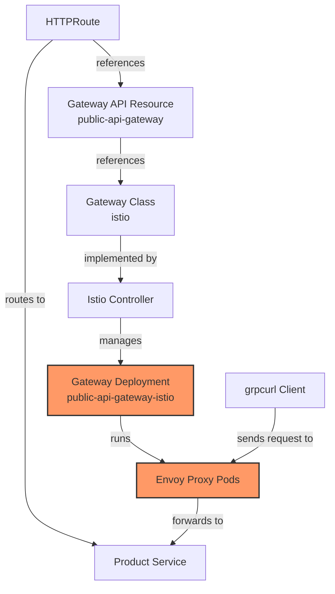

# Understanding Gateway Implementation and Logging Issues

## Why You Don't See a Sidecar in the Gateway

Looking at your Gateway deployment configuration, I can now provide a more precise explanation:

1. **Explicit Sidecar Injection Disabled** - Your Gateway deployment has the annotation:
   ```yaml
   sidecar.istio.io/inject: "false"
   ```
   This explicitly tells Istio not to inject a sidecar into the Gateway pods.

2. **Gateway IS the Proxy** - The Gateway itself is running Envoy directly as its main container. Looking at the container args:
   ```yaml
   args:
   - proxy
   - router
   ```
   This shows it's running the Istio proxy in router mode, which is the Envoy configuration used for gateways.

3. **Gateway vs. Gateway API Resource** - There's an important distinction:
   - The `Gateway` resource you showed earlier is a Kubernetes Gateway API resource
   - The actual implementation is the `public-api-gateway-istio` deployment in the `gateway` namespace
   - The connection is shown by the label: `gateway.networking.k8s.io/gateway-name: public-api-gateway`

## Why You Don't See Logs When Using grpcurl

Looking at your Gateway configuration, I can see the specific log level settings:

```yaml
- --proxyLogLevel
- warning
- --proxyComponentLogLevel
- misc:error
- --log_output_level
- default:info
```

These settings explain why you're not seeing logs for your grpcurl requests:

1. **Log Level Configuration** - Your Gateway is configured with:
   - `proxyLogLevel: warning` - Only logs warnings and errors, not regular requests
   - `default:info` - The default log level is info, but HTTP requests might not be logged at this level

2. **Looking in the Right Place** - You should check logs in your specific Gateway deployment:
   ```bash
   # For your custom gateway deployment
   kubectl logs -n gateway -l app=public-api-gateway-istio
   ```

3. **Increasing Log Verbosity** - To see your grpcurl requests, you need to increase the log level:
   ```bash
   # Get your gateway pod name
   GATEWAY_POD=$(kubectl get pod -l app=public-api-gateway-istio -n gateway -o jsonpath='{.items[0].metadata.name}')
   
   # Increase log level
   kubectl exec -n gateway $GATEWAY_POD -- curl -X POST localhost:15000/logging?level=debug
   ```

3. **Request Not Reaching Gateway** - Your request might not be reaching the gateway at all:
   - DNS resolution issues
   - Network connectivity problems
   - TLS handshake failures

4. **Request Format Issues** - The `-plaintext` flag with a TLS endpoint can cause issues:
   ```bash
   # Try without -plaintext since your gateway uses TLS
   grpcurl -d '{"product_id": "123"}' sit-gateway.tcex.com.vn:443 product.ProductService/GetProduct
   ```

## Diagnosing the Issue

Based on your Gateway configuration, here's a tailored diagnostic approach:

### 1. Verify the Gateway Implementation

```bash
# Check your specific gateway deployment
kubectl get deployment -n gateway -l app=public-api-gateway-istio

# Check if pods are running
kubectl get pods -n gateway -l app=public-api-gateway-istio

# Check the gateway service
kubectl get service -n gateway -l app=public-api-gateway-istio
```

### 2. Test Basic Connectivity

```bash
# Test DNS resolution
nslookup sit-gateway.tcex.com.vn

# Test TCP connectivity
nc -zv sit-gateway.tcex.com.vn 443
```

### 3. Check Gateway Logs with Increased Verbosity

```bash
# Get your specific gateway pod name
GATEWAY_POD=$(kubectl get pod -l app=public-api-gateway-istio -n gateway -o jsonpath='{.items[0].metadata.name}')

# Check current log level settings
kubectl exec -n gateway $GATEWAY_POD -- curl -X GET localhost:15000/logging

# Increase log level to see HTTP requests
kubectl exec -n gateway $GATEWAY_POD -- curl -X POST localhost:15000/logging?level=debug
kubectl exec -n gateway $GATEWAY_POD -- curl -X POST "localhost:15000/logging?http=debug"

# Stream logs
kubectl logs -n gateway $GATEWAY_POD -f
```

After making your grpcurl request, you can reset the log level:

```bash
kubectl exec -n gateway $GATEWAY_POD -- curl -X POST localhost:15000/logging?level=warning
kubectl exec -n gateway $GATEWAY_POD -- curl -X POST "localhost:15000/logging?http=warning"
```

### 4. Test with curl (HTTP) First

Before testing with grpcurl, test basic HTTP connectivity:

```bash
# Test HTTPS connectivity
curl -v https://sit-gateway.tcex.com.vn/healthz
```

### 5. Modify Your grpcurl Command

Try these variations:

```bash
# Without -plaintext (recommended for TLS endpoints)
grpcurl -d '{"product_id": "123"}' sit-gateway.tcex.com.vn:443 product.ProductService/GetProduct

# With explicit TLS
grpcurl -d '{"product_id": "123"}' -insecure sit-gateway.tcex.com.vn:443 product.ProductService/GetProduct

# With verbose output
grpcurl -d '{"product_id": "123"}' -v sit-gateway.tcex.com.vn:443 product.ProductService/GetProduct
```

## Understanding Your Specific Gateway Architecture



Your specific Gateway implementation:

1. **Direct Envoy Configuration**: Your Gateway pods are running Envoy directly with these settings:
   ```yaml
   - proxy
   - router
   - --proxyLogLevel
   - warning  # This is why you don't see regular requests
   ```

2. **No Sidecar Injection**: The annotation `sidecar.istio.io/inject: "false"` explicitly disables sidecar injection

3. **Managed by Istio**: The label `gateway.istio.io/managed: istio.io-gateway-controller` shows it's managed by Istio's gateway controller

4. **Associated with Gateway Resource**: The label `gateway.networking.k8s.io/gateway-name: public-api-gateway` links this deployment to your Gateway API resource

The key to seeing your grpcurl requests in the logs is to increase the log level as shown in the diagnostic steps above.
