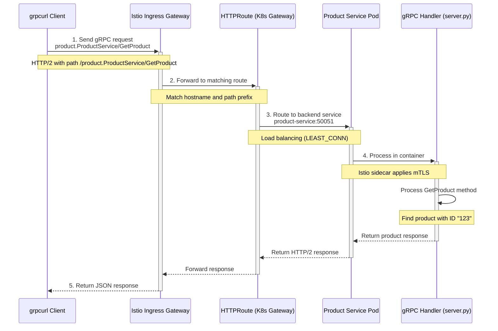

# gRPC Request Flow Through Istio Service Mesh

This document explains the complete flow of a gRPC request from a client through the Istio service mesh to your product service and back.

## Command Example

```bash
grpcurl -d '{"product_id": "123"}' -plaintext sit-gateway.tcex.com.vn:443 product.ProductService/GetProduct
```

## Request Flow Diagram



## Detailed Flow Explanation

### 1. Client Request Initiation

When you run the grpcurl command:

```bash
grpcurl -d '{"product_id": "123"}' -plaintext sit-gateway.tcex.com.vn:443 product.ProductService/GetProduct
```

The following happens:

- `-d '{"product_id": "123"}'` - Specifies the request payload in JSON format
- `-plaintext` - Indicates an unencrypted connection (no TLS)
- `sit-gateway.tcex.com.vn:443` - The target hostname and port
- `product.ProductService/GetProduct` - The fully qualified service and method name

The grpcurl client:
1. Converts the JSON request to the appropriate protobuf message
2. Creates an HTTP/2 request with path `/product.ProductService/GetProduct`
3. Sets the content-type to `application/grpc`
4. Sends the request to `sit-gateway.tcex.com.vn:443`

### 2. Ingress Gateway Processing

The request arrives at the Istio Ingress Gateway:

1. The Ingress Gateway receives the HTTP/2 request
2. It examines the hostname (`sit-gateway.tcex.com.vn`) and path (`/product.ProductService/GetProduct`)
3. Based on these, it looks for a matching route configuration
4. The request is forwarded to the appropriate Kubernetes Gateway API resource

### 3. HTTPRoute Handling

The HTTPRoute resource processes the request:

```yaml
apiVersion: gateway.networking.k8s.io/v1
kind: HTTPRoute
metadata:
  name: product-service-grpc-route
  namespace: default
spec:
  parentRefs:
  - name: public-api-gateway
    namespace: gateway
  hostnames:
  - "sit-gateway.tcex.com.vn"
  rules:
  - matches:
    - path:
        type: PathPrefix
        value: /product.ProductService
    backendRefs:
    - name: product-service
      port: 50051
      kind: Service
```

1. The HTTPRoute matches the path prefix `/product.ProductService`
2. It routes the request to the `product-service` on port `50051`
3. The request is forwarded to the Kubernetes Service

### 4. Service to Pod Routing

The Kubernetes Service routes the request:

1. The Service `product-service` receives the request
2. It load-balances the request to one of the available pods based on the configured policy (LEAST_CONN)
3. The request is forwarded to the selected pod
4. The pod's Istio sidecar proxy (Envoy) intercepts the incoming request
5. The sidecar applies any configured policies (mTLS, retries, timeouts)
6. The request is forwarded to the container on port 50051

### 5. gRPC Service Processing and Response

Inside the product service container:

1. The gRPC server (in server.py) receives the request
2. It deserializes the protobuf message
3. The `GetProduct` method is called with the request parameter `{"product_id": "123"}`
4. The method processes the request and generates a response
5. The response is serialized to protobuf format
6. The response is sent back through the same path in reverse:
   - Container → Istio sidecar → Service → HTTPRoute → Ingress Gateway → grpcurl client
7. grpcurl receives the response, converts it to JSON, and displays it to the user

## Security Considerations

In this flow, several security mechanisms are in place:

1. **mTLS** - Mutual TLS is enforced between services within the mesh via the DestinationRule:
   ```yaml
   trafficPolicy:
     tls:
       mode: ISTIO_MUTUAL # Enforces mTLS for this service
   ```

2. **Connection Pooling** - Limits and manages connections for stability:
   ```yaml
   connectionPool:
     http:
       http2MaxRequests: 1000
       maxRequestsPerConnection: 100
   ```

3. **Load Balancing** - Distributes traffic efficiently:
   ```yaml
   loadBalancer:
     simple: LEAST_CONN
   ```

## Troubleshooting

If the request fails, you can debug at various points:

1. **Client-side issues**:
   - Check if grpcurl can resolve the hostname
   - Verify the correct service and method names
   - Ensure the request payload matches the expected format

2. **Gateway issues**:
   - Check Ingress Gateway logs: `kubectl logs -n istio-system -l app=istio-ingressgateway`
   - Verify the HTTPRoute is correctly configured

3. **Service issues**:
   - Check if the service exists: `kubectl get svc product-service`
   - Verify the service selector matches pod labels

4. **Pod issues**:
   - Check pod status: `kubectl get pods -l app=product-service`
   - Examine pod logs: `kubectl logs <pod-name>`
   - Check Envoy sidecar logs: `kubectl logs <pod-name> -c istio-proxy`

## Testing with Different Parameters

You can modify the grpcurl command to test different scenarios:

```bash
# Test with TLS
grpcurl -d '{"product_id": "123"}' sit-gateway.tcex.com.vn:443 product.ProductService/GetProduct

# Test with reflection (no proto file needed)
grpcurl -plaintext sit-gateway.tcex.com.vn:443 list

# Test the ListProducts method
grpcurl -d '{"page_size": 10, "page_number": 1}' -plaintext sit-gateway.tcex.com.vn:443 product.ProductService/ListProducts
```
