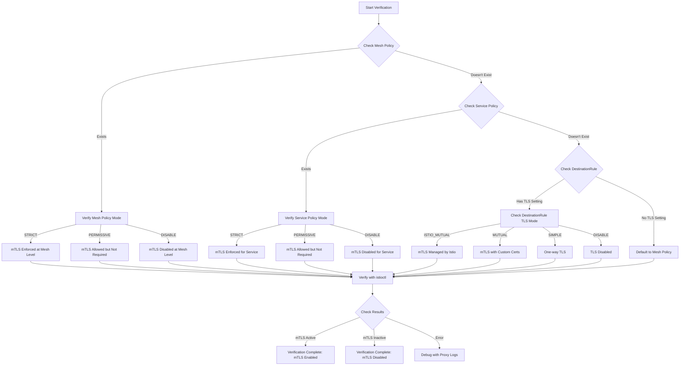

# Verifying mTLS Configuration in Istio

This guide explains how to check and verify that mTLS is properly configured between your gateway and services in an Istio service mesh.

## How Gateway Knows to Use mTLS

The gateway's communication with backend services follows Istio's mTLS configuration through several mechanisms:

1. **DestinationRule Configuration**: When you set `mode: ISTIO_MUTUAL` in a DestinationRule for a service, Istio configures all clients (including the gateway) to use mTLS when communicating with that service.

2. **Mesh-wide Policy**: Istio can have a mesh-wide mTLS policy that applies to all services unless overridden.

3. **PeerAuthentication**: This resource can enforce mTLS requirements for incoming connections to services.

## Commands to Verify mTLS Configuration

### 1. Check Mesh-wide mTLS Policy

```bash
# Check if there's a mesh-wide policy
kubectl get peerauthentication -n istio-system

# View the details of a mesh-wide policy
kubectl get peerauthentication -n istio-system -o yaml
```

### 2. Check Service-specific mTLS Policy

```bash
# Check if there's a service-specific policy
kubectl get peerauthentication -n default

# View the details of a service-specific policy
kubectl get peerauthentication -n default -o yaml
```

### 3. Check DestinationRule for Your Service

```bash
# List all DestinationRules
kubectl get destinationrule -n default

# View your product-service DestinationRule
kubectl get destinationrule product-service-mtls -n default -o yaml
```

### 4. Verify mTLS in Action

#### Using istioctl

```bash
# Install istioctl if not already installed
# curl -L https://istio.io/downloadIstioctl | sh -

# Check mTLS status for your service
istioctl authn tls-check product-service.default.svc.cluster.local

# Check mTLS status between gateway and your service
istioctl authn tls-check istio-ingressgateway.istio-system.svc.cluster.local product-service.default.svc.cluster.local
```

#### Using Kiali Dashboard (if installed)

Kiali provides a visual representation of mTLS status:

```bash
# Port-forward Kiali dashboard
kubectl port-forward svc/kiali -n istio-system 20001:20001

# Access in browser: http://localhost:20001
```

### 5. Check Actual TLS Handshake

```bash
# Check Envoy proxy configuration in gateway
kubectl exec -it -n istio-system $(kubectl get pod -l app=istio-ingressgateway -n istio-system -o jsonpath='{.items[0].metadata.name}') -c istio-proxy -- pilot-agent request GET clusters | grep product-service

# Check Envoy proxy configuration in your service
kubectl exec -it -n default $(kubectl get pod -l app=product-service -n default -o jsonpath='{.items[0].metadata.name}') -c istio-proxy -- pilot-agent request GET clusters | grep inbound
```

## Debugging mTLS Issues

### 1. Temporarily Disable mTLS for Testing

If you suspect mTLS issues, you can temporarily disable it for debugging:

```yaml
apiVersion: networking.istio.io/v1alpha3
kind: DestinationRule
metadata:
  name: product-service-disable-mtls
  namespace: default
spec:
  host: product-service.default.svc.cluster.local
  trafficPolicy:
    tls:
      mode: DISABLE
```

Apply this with:
```bash
kubectl apply -f product-service-disable-mtls.yaml
```

### 2. Check for Certificate Issues

```bash
# Check certificate validity in gateway
kubectl exec -it -n istio-system $(kubectl get pod -l app=istio-ingressgateway -n istio-system -o jsonpath='{.items[0].metadata.name}') -c istio-proxy -- pilot-agent request GET certs

# Check certificate validity in service
kubectl exec -it -n default $(kubectl get pod -l app=product-service -n default -o jsonpath='{.items[0].metadata.name}') -c istio-proxy -- pilot-agent request GET certs
```

### 3. Check Istio Proxy Logs

```bash
# Check gateway proxy logs
kubectl logs -n istio-system $(kubectl get pod -l app=istio-ingressgateway -n istio-system -o jsonpath='{.items[0].metadata.name}') -c istio-proxy

# Check service proxy logs
kubectl logs -n default $(kubectl get pod -l app=product-service -n default -o jsonpath='{.items[0].metadata.name}') -c istio-proxy
```

## Visual Representation of mTLS Verification



## Understanding the Results

When mTLS is properly configured:

1. The `istioctl authn tls-check` command will show:
   ```
   HOST:PORT                                     STATUS     SERVER     CLIENT     AUTHN POLICY     DESTINATION RULE
   product-service.default.svc.cluster.local     OK         STRICT     ISTIO      default/         default/product-service-mtls
   ```

2. In the Envoy configuration, you'll see:
   ```
   product-service.default.svc.cluster.local:50051::
     added_via_api: true
     ssl_context:
       common_tls_context:
         alpn_protocols: h2
         tls_certificate_sds_secret_configs:
         - name: default
           sds_config: {...}
         validation_context_sds_secret_config:
           name: ROOTCA
           sds_config: {...}
   ```

This confirms that the gateway is correctly configured to use mTLS when communicating with your product service.
