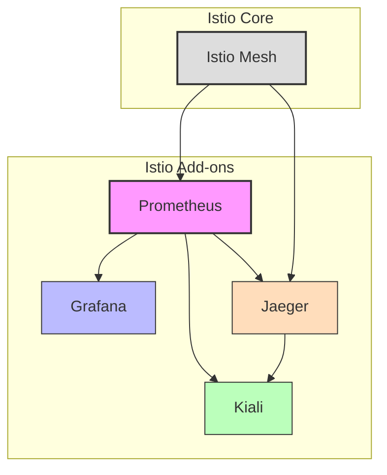

# Installing Istio Add-ons Using Helm Charts

This guide explains how to deploy Istio add-ons (Kiali, Prometheus, Grafana, and Jaeger) using Helm charts. These add-ons provide essential observability and visualization capabilities for your Istio service mesh.

## Prerequisites

Before installing Istio add-ons, ensure you have:

- A Kubernetes cluster with Istio installed
- [Helm](https://helm.sh/docs/intro/install/) (version 3.2 or later) installed
- `kubectl` configured to access your cluster
- Cluster administrator access

## Overview of Istio Add-ons

Istio integrates with several observability tools:

1. **Prometheus**: Metrics collection and storage
2. **Grafana**: Metrics visualization and dashboards
3. **Kiali**: Service mesh visualization and management
4. **Jaeger** or **Zipkin**: Distributed tracing



## Add Istio Helm Repository

First, add the Istio Helm repository:

```bash
helm repo add istio https://istio-release.storage.googleapis.com/charts
helm repo update
```

## Create Namespace for Add-ons

Create a dedicated namespace for the add-ons:

```bash
kubectl create namespace istio-addons
```

## Option 1: Installing Add-ons Using Official Istio Helm Charts

### Step 1: Install Prometheus

```bash
helm install prometheus istio/prometheus \
  --namespace istio-addons \
  --set prometheus.service.nodePort=30090 \
  --set prometheus.service.type=NodePort
```

### Step 2: Install Grafana

```bash
helm install grafana istio/grafana \
  --namespace istio-addons \
  --set grafana.service.nodePort=30091 \
  --set grafana.service.type=NodePort \
  --set grafana.datasources."datasources\\.yaml".datasources[0].url="http://prometheus:9090"
```

### Step 3: Install Kiali

```bash
helm install kiali istio/kiali \
  --namespace istio-addons \
  --set auth.strategy="anonymous" \
  --set deployment.ingress.enabled=false \
  --set external_services.prometheus.url="http://prometheus:9090" \
  --set external_services.tracing.in_cluster_url="http://jaeger-query.istio-addons:16686" \
  --set external_services.grafana.url="http://grafana:3000"
```

### Step 4: Install Jaeger

```bash
helm install jaeger istio/jaeger \
  --namespace istio-addons
```

## Option 2: Installing Add-ons Using the Istio Samples

Istio provides sample YAML files for add-ons that can be installed using Helm:

### Step 1: Download Istio

If you haven't already downloaded Istio:

```bash
curl -L https://istio.io/downloadIstio | sh -
cd istio-*
```

### Step 2: Create Helm Charts from Sample Add-ons

Create Helm charts from the sample add-ons:

```bash
# Create a directory for the charts
mkdir -p helm-charts/istio-addons

# Create Helm charts for each add-on
for addon in samples/addons/*.yaml; do
  name=$(basename $addon .yaml)
  mkdir -p helm-charts/istio-addons/$name/templates
  cp $addon helm-charts/istio-addons/$name/templates/
  cat > helm-charts/istio-addons/$name/Chart.yaml << EOF
apiVersion: v2
name: $name
description: Istio $name add-on
type: application
version: 1.0.0
appVersion: 1.0.0
EOF
done
```

### Step 3: Install the Add-ons Using Helm

```bash
for addon in helm-charts/istio-addons/*; do
  name=$(basename $addon)
  helm install $name $addon --namespace istio-addons --create-namespace
done
```

## Option 3: Using Community Helm Charts

For more customization options, you can use community-maintained Helm charts:

### Step 1: Add Helm Repositories

```bash
# Add Prometheus community charts
helm repo add prometheus-community https://prometheus-community.github.io/helm-charts

# Add Grafana charts
helm repo add grafana https://grafana.github.io/helm-charts

# Add Jaeger charts
helm repo add jaegertracing https://jaegertracing.github.io/helm-charts

# Add Kiali charts
helm repo add kiali https://kiali.org/helm-charts

# Update repositories
helm repo update
```

### Step 2: Install Prometheus

```bash
helm install prometheus prometheus-community/prometheus \
  --namespace istio-addons \
  --set server.persistentVolume.enabled=false \
  --set alertmanager.enabled=false \
  --set pushgateway.enabled=false \
  --set kubeStateMetrics.enabled=false \
  --set nodeExporter.enabled=false
```

### Step 3: Install Grafana

```bash
helm install grafana grafana/grafana \
  --namespace istio-addons \
  --set persistence.enabled=false \
  --set datasources."datasources\\.yaml".apiVersion=1 \
  --set datasources."datasources\\.yaml".datasources[0].name=Prometheus \
  --set datasources."datasources\\.yaml".datasources[0].type=prometheus \
  --set datasources."datasources\\.yaml".datasources[0].url=http://prometheus-server \
  --set datasources."datasources\\.yaml".datasources[0].access=proxy \
  --set dashboardProviders."dashboardproviders\\.yaml".apiVersion=1 \
  --set dashboardProviders."dashboardproviders\\.yaml".providers[0].name="istio" \
  --set dashboardProviders."dashboardproviders\\.yaml".providers[0].orgId=1 \
  --set dashboardProviders."dashboardproviders\\.yaml".providers[0].type=file \
  --set dashboardProviders."dashboardproviders\\.yaml".providers[0].disableDeletion=false \
  --set dashboardProviders."dashboardproviders\\.yaml".providers[0].options.path="/var/lib/grafana/dashboards/istio"
```

### Step 4: Install Jaeger

```bash
helm install jaeger jaegertracing/jaeger \
  --namespace istio-addons \
  --set allInOne.enabled=true \
  --set storage.type=memory \
  --set agent.enabled=false \
  --set collector.enabled=false \
  --set query.enabled=false
```

### Step 5: Install Kiali

```bash
helm install kiali kiali/kiali-server \
  --namespace istio-addons \
  --set auth.strategy="anonymous" \
  --set deployment.ingress.enabled=false \
  --set external_services.prometheus.url="http://prometheus-server" \
  --set external_services.tracing.in_cluster_url="http://jaeger-query:16686" \
  --set external_services.grafana.url="http://grafana:3000"
```

## Customizing Add-on Installations

### Using Values Files

For more complex configurations, create values files for each add-on:

```yaml
# prometheus-values.yaml
server:
  persistentVolume:
    enabled: true
    size: 10Gi
  retention: 15d

# grafana-values.yaml
persistence:
  enabled: true
  size: 5Gi
admin:
  password: your-secure-password

# kiali-values.yaml
auth:
  strategy: "openid"
  openid:
    client_id: "kiali"
    issuer_uri: "https://your-identity-provider"
```

Install with values files:

```bash
helm install prometheus prometheus-community/prometheus \
  --namespace istio-addons \
  --values prometheus-values.yaml

helm install grafana grafana/grafana \
  --namespace istio-addons \
  --values grafana-values.yaml

helm install kiali kiali/kiali-server \
  --namespace istio-addons \
  --values kiali-values.yaml
```

## Accessing the Add-ons

### Method 1: Port Forwarding

```bash
# Access Kiali
kubectl port-forward svc/kiali 20001:20001 -n istio-addons

# Access Grafana
kubectl port-forward svc/grafana 3000:3000 -n istio-addons

# Access Prometheus
kubectl port-forward svc/prometheus-server 9090:9090 -n istio-addons

# Access Jaeger
kubectl port-forward svc/jaeger-query 16686:16686 -n istio-addons
```

Then access:
- Kiali: http://localhost:20001
- Grafana: http://localhost:3000
- Prometheus: http://localhost:9090
- Jaeger: http://localhost:16686

### Method 2: Using Istio Gateway

Create an Istio Gateway and VirtualServices for the add-ons:

```yaml
# addons-gateway.yaml
apiVersion: networking.istio.io/v1alpha3
kind: Gateway
metadata:
  name: addons-gateway
  namespace: istio-addons
spec:
  selector:
    istio: ingressgateway
  servers:
  - port:
      number: 80
      name: http
      protocol: HTTP
    hosts:
    - "kiali.example.com"
    - "grafana.example.com"
    - "prometheus.example.com"
    - "jaeger.example.com"
---
apiVersion: networking.istio.io/v1alpha3
kind: VirtualService
metadata:
  name: kiali-vs
  namespace: istio-addons
spec:
  hosts:
  - "kiali.example.com"
  gateways:
  - addons-gateway
  http:
  - route:
    - destination:
        host: kiali
        port:
          number: 20001
---
apiVersion: networking.istio.io/v1alpha3
kind: VirtualService
metadata:
  name: grafana-vs
  namespace: istio-addons
spec:
  hosts:
  - "grafana.example.com"
  gateways:
  - addons-gateway
  http:
  - route:
    - destination:
        host: grafana
        port:
          number: 3000
---
apiVersion: networking.istio.io/v1alpha3
kind: VirtualService
metadata:
  name: prometheus-vs
  namespace: istio-addons
spec:
  hosts:
  - "prometheus.example.com"
  gateways:
  - addons-gateway
  http:
  - route:
    - destination:
        host: prometheus-server
        port:
          number: 9090
---
apiVersion: networking.istio.io/v1alpha3
kind: VirtualService
metadata:
  name: jaeger-vs
  namespace: istio-addons
spec:
  hosts:
  - "jaeger.example.com"
  gateways:
  - addons-gateway
  http:
  - route:
    - destination:
        host: jaeger-query
        port:
          number: 16686
```

Apply the configuration:

```bash
kubectl apply -f addons-gateway.yaml
```

## Verifying the Installation

Verify that all add-on pods are running:

```bash
kubectl get pods -n istio-addons
```

Check the services:

```bash
kubectl get svc -n istio-addons
```

## Upgrading Add-ons

To upgrade the add-ons:

```bash
# Update Helm repositories
helm repo update

# Upgrade Prometheus
helm upgrade prometheus prometheus-community/prometheus \
  --namespace istio-addons

# Upgrade Grafana
helm upgrade grafana grafana/grafana \
  --namespace istio-addons

# Upgrade Kiali
helm upgrade kiali kiali/kiali-server \
  --namespace istio-addons

# Upgrade Jaeger
helm upgrade jaeger jaegertracing/jaeger \
  --namespace istio-addons
```

## Uninstalling Add-ons

To uninstall the add-ons:

```bash
# Uninstall Kiali
helm uninstall kiali -n istio-addons

# Uninstall Grafana
helm uninstall grafana -n istio-addons

# Uninstall Prometheus
helm uninstall prometheus -n istio-addons

# Uninstall Jaeger
helm uninstall jaeger -n istio-addons
```

## Troubleshooting

### Issue: Prometheus Cannot Scrape Istio Metrics

Ensure Prometheus has the correct service monitor configuration:

```yaml
# prometheus-servicemonitor.yaml
apiVersion: monitoring.coreos.com/v1
kind: ServiceMonitor
metadata:
  name: istio-component-monitor
  namespace: istio-system
spec:
  jobLabel: istio
  targetLabels:
  - app
  selector:
    matchExpressions:
    - {key: istio, operator: In, values: [pilot]}
  namespaceSelector:
    matchNames:
    - istio-system
  endpoints:
  - port: http-monitoring
    interval: 15s
```

Apply the configuration:

```bash
kubectl apply -f prometheus-servicemonitor.yaml
```

### Issue: Kiali Cannot Connect to Prometheus or Jaeger

Verify the service URLs in the Kiali configuration:

```bash
kubectl edit configmap kiali -n istio-addons
```

Ensure the URLs are correct:

```yaml
external_services:
  prometheus:
    url: http://prometheus-server:9090
  tracing:
    in_cluster_url: http://jaeger-query:16686
  grafana:
    url: http://grafana:3000
```

### Issue: Grafana Missing Istio Dashboards

Import Istio dashboards manually:

```bash
# Get Grafana pod name
GRAFANA_POD=$(kubectl get pods -n istio-addons -l app.kubernetes.io/name=grafana -o jsonpath='{.items[0].metadata.name}')

# Copy Istio dashboards to Grafana
kubectl cp istio-*/samples/addons/grafana/dashboards/istio-mesh-dashboard.json istio-addons/$GRAFANA_POD:/var/lib/grafana/dashboards/istio-mesh-dashboard.json
kubectl cp istio-*/samples/addons/grafana/dashboards/istio-service-dashboard.json istio-addons/$GRAFANA_POD:/var/lib/grafana/dashboards/istio-service-dashboard.json
kubectl cp istio-*/samples/addons/grafana/dashboards/istio-workload-dashboard.json istio-addons/$GRAFANA_POD:/var/lib/grafana/dashboards/istio-workload-dashboard.json
```

## Conclusion

You have successfully installed Istio add-ons using Helm charts. These add-ons provide essential observability and visualization capabilities for your Istio service mesh, helping you monitor, troubleshoot, and understand your microservices architecture.

## Additional Resources

- [Istio Add-ons Documentation](https://istio.io/latest/docs/ops/integrations/)
- [Prometheus Helm Chart](https://github.com/prometheus-community/helm-charts)
- [Grafana Helm Chart](https://github.com/grafana/helm-charts)
- [Kiali Helm Chart](https://github.com/kiali/helm-charts)
- [Jaeger Helm Chart](https://github.com/jaegertracing/helm-charts)
